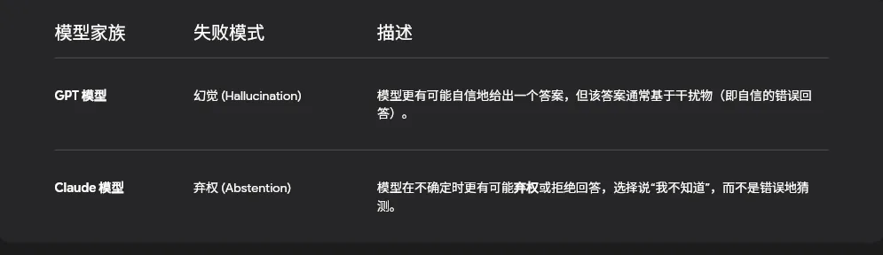

## 资料

### 原文

[https://research.trychroma.com/context-rot](https://research.trychroma.com/context-rot)

## 背景

“语境腐烂”是一种现象，指大型语言模型 (LLM) 的性能（准确性和可靠性）会随着输入上下文（提示词）长度的增加而显著下降，即使对于简单的任务也是如此。这与模型均匀处理所有语境的假设相悖。

### 什么是“上下文腐烂”？

由 Chroma 研究人员（Kelly Hong、Anton Troynikov 和 Jeff Huber）提出的“语境腐烂”，描述了 LLM
在处理越来越长的输入时，其利用上下文信息的能力会逐渐衰退。该报告测试了包括最新的 GPT、Claude 和 Gemini 在内的 18
个主流模型，并发现这种性能衰退普遍存在。

### 核心矛盾

许多现代 LLM 宣传其拥有巨大的上下文窗口（可达数百万个 Token），并且在简单的“大海捞针”（Needle in a Haystack,
NIAH）测试中表现出色。然而，“上下文”研究表明，当引入真实世界的复杂性，例如语义相似的“干扰信息”时，性能会急剧下降，而且这种情况远在达到
Token 限制之前就已发生。

![[Pasted image 13.png]](../image/14.png)

## 加速上下文腐烂的关键因素

### 干扰项如同毒药

“干扰项如同毒药”这一发现揭示了：当提示词中包含与正确答案语义相似但无关的信息时，大型语言模型 (LLM)
的准确率会急剧下降。这种“噪音”压倒了模型的检索能力，使其难以区分真正的目标信息和高度相关但错误的信息。

#### 干扰项实验设计与发现

Chroma 的研究人员在标准的“大海捞针” (NIAH) 基准测试中引入了干扰项。这些干扰项不是简单的随机文本，而是与“针”（正确答案）主题相关，但包含微小差异信息的段落，这些差异足以导致模型给出错误答案。

#### 实验核心结论

+ 性能急剧下降： 长上下文和干扰项数量的增加对所有 LLM 构成巨大挑战，导致准确率出现显著且不均匀的下降。
+ 现实世界影响： 这种情况高度贴合金融、法律文档分析等实际应用场景。在这些场景中，文档常常包含高度相似的模板化信息，只有细微的细节（如年份、名称、条款版本）有所不同。这些细微差异成为了强大的天然干扰项。

#### 模型行为：幻觉与弃权

当被干扰物混淆时，不同的模型表现出不同的失败行为，这是区分模型“个性”的关键发现：

### 上下文结构适得其反

“上下文结构适得其反”是上下文腐烂研究中最具反直觉的发现之一。它表明，将上下文信息以逻辑连贯的方式组织起来，反而可能导致大型语言模型 (
LLM) 的性能比随机打乱的文本更差。这挑战了开发者在 RAG (检索增强生成) 应用中优化文档结构的常见做法。

#### 实验：有序与随机上下文的对比

研究人员对比了两种语境输入方式：

1. 连贯上下文 (Coherent Context)： 文本段落按照逻辑顺序或叙事结构排列。
2. 随机上下文 (Shuffled Context)： 同样的文本段落被随机打乱顺序。

结果： 在执行需要精准信息检索的任务时（例如，从文档中找出特定数字），连贯上下文中的 LLM
准确率明显低于随机语境。这表明，当模型需要在长文本中定位特定信息时，叙事流程反而会成为障碍。

#### 为什么结构化信息会成为障碍？

研究人员提出了两个主要假设来解释这种反常现象：

1. 叙事结构陷阱 (Narrative Trap)

模型可能过于侧重于理解文本的整体流程和高层叙事，而不是像一个搜索引擎一样精确地进行信息定位。当文本逻辑连贯时，模型可能会尝试遵循这种连贯性，而非仅仅提取提示词所需的片段。

2. 语义距离的挑战如果查询（Query）与相关信息（Needle）在语义上存在一定的“距离”，即不完全匹配，模型将难以在长语境中进行有效检索。当文本有序时，模型似乎更依赖于局部邻近性，从而错过了位于语境中其他位置的正确信息。

### 输出长度限制导致失败

“输出长度限制导致失败”揭示了大型语言模型 (LLM) 在生成长篇输出时所面临的根本局限性。即使输入上下文简单，随着要求输出的
Token 数量增加，所有模型的性能都会急剧下降，通常表现为拒绝、截断或捏造信息。

#### 实验：复制任务中的性能崩溃

为了测试模型处理长输出的能力，研究人员设计了简单的复制任务，要求模型重复或重写一段很长的文本序列。这些任务几乎不涉及推理或知识，纯粹考验模型的记忆和输出能力。

观察到的主要失败模式：

1. 截断 (Truncation)： 模型突然停止输出，没有完成任务，只提供了一部分内容。
2. 拒绝 (Refusal)： 模型明确表示无法完成任务，例如回复“这太长了”或“我无法复制这么多文本”。
3. 信息捏造 (Token Invention)： 模型开始产生不准确、重复或完全虚构的 Token，破坏了输出的忠实度。

崩溃点： 报告显示，所有模型都在输入长度达到 2,500 到 5,000 个词（约 3,000 至 6,500 个 Token）时，其输出性能开始大幅下降。

#### 实际应用中的限制

这种输出限制对依赖 LLM 生成长篇内容的实际应用构成了挑战，包括：

• 长篇总结： 当要求模型对一个很长的文档进行详尽总结，且总结本身也需要很长篇幅时，模型的准确性和连贯性会受损。

• 代码和数据结构生成： 编写长代码文件或复杂数据结构（如大型 JSON 文件）时，模型可能会在中间失败或引入错误。

• 数据填充与格式化： 需要将大量数据从一个格式转移到另一个格式时，LLM 在处理长列表时性能下降。

## 对 AI 应用开发者的启示和解决方案

### 聚焦式检索：在 RAG 中精炼上下文

聚焦式检索是一种高级的检索增强生成 (RAG) 优化策略。它的核心目标是确保传递给大型语言模型 (LLM)
的上下文信息量最少、相关性最高，从而直接对抗“上下文腐烂”中的噪音和成本问题。它将 RAG 从简单的文档分块提取，提升为智能化的信息筛选。

#### 聚焦式检索 vs. 传统 RAG

传统的或“天真”的 RAG (Naive RAG) 通常只执行一次简单的向量搜索，将排名前 K 个文档片段直接作为上下文输入给
LLM。这种方法可能导致以下问题：

• 噪音过多： 检索到的片段中可能包含大量无关或语义相似的干扰信息。

• Token 冗余： 即使相关，文档片段也可能过长，不必要地消耗 LLM 的 Token 限制并增加成本（正如“上下文腐烂”报告所示）。

聚焦式检索旨在在检索和生成之间添加更多智能层，通过多步骤的优化流程，将 Token 数量减少到解决问题所需的最少限度，同时最大化准确性。

#### 实现聚焦式检索的关键技术

+ 查询重写与扩展

在进行检索之前，LLM 或专用模型首先对用户的原始问题进行重写或扩展。这有助于创建更精确、更符合知识库语境的搜索词，从而在向量数据库中找到更准确的匹配。

+ 重排序与过滤 (Re-ranking)上下文压缩与总结智能分块与元数据

初次检索通常会返回大量潜在相关的文档。重排序器（通常是另一个小型 LLM
或专用模型）会对这些结果进行二次评估，过滤掉质量差或不相关的片段，只保留语义最匹配且最能支持最终答案的少数几个片段。

+ 上下文压缩与总结

在将检索到的片段传递给最终的 LLM 之前，使用压缩算法或摘要模型对片段进行精简。这确保了只将核心事实和论点传递给模型，进一步减少了
Token 数量并降低了“上下文腐烂”的风险。

+ 智能分块与元数据

在数据索引阶段，不再使用简单的固定长度分块。而是使用语义分块或基于元数据的分块，确保每个块包含一个完整、连贯的上下文单元。元数据（如章节名、作者、日期）用于精确过滤。初次检索通常会返回大量潜在相关的文档。重排序器（通常是另一个小型
LLM 或专用模型）会对这些结果进行二次评估，过滤掉质量差或不相关的片段，只保留语义最匹配且最能支持最终答案的少数几个片段。

#### RAG 进阶方案

+ Agentic RAG (智能体 RAG)

探索 RAG 的最新发展，其中 LLM 充当“规划者”，自主决定何时检索、如何检索和检索哪些信息。

+ 混合搜索 (Hybrid Search)

了解如何结合传统的关键词搜索和现代的向量搜索，以最大化检索的召回率和准确率。

+ 图增强 RAG (Graph RAG)

探索如何利用知识图谱来捕捉信息间的复杂关系，为 LLM 提供更结构化的上下文。

### 压缩上下文的必要性

积极压缩上下文 (Context Compression)
是一种在检索和生成之间执行的关键步骤，旨在将检索到的文档内容精简到仅包含回答用户问题所需的核心事实。这能有效降低成本、减少无用信息，并防止“上下文腐烂”导致的准确性下降。

#### 压缩上下文的必要性

在高级 RAG 系统中，即使检索器找到了相关文档片段，这些片段通常仍然包含多余的 Token，比如介绍性句子、不相关的细节或冗长的段落。通过主动压缩，我们可以实现以下目标：

1. 消除干扰物 (Distractors)： 移除与查询语义相似但实际无关的“噪音” Token，提高模型准确性。
2. 优化 Token 效率： 将上下文窗口内宝贵的 Token 空间留给最关键的信息，从而降低 LLM 的推理成本。
3. 提升推理速度： 缩短提示词长度，加速模型的生成过程。

#### 核心上下文压缩技术

+ 查询聚焦式摘要

LLM 自我精炼 (Self-Refinement)使用一个小型 LLM
或摘要模型来阅读检索到的文档片段，并仅保留与用户查询最相关的事实。例如，如果查询是“新政策的生效日期”，摘要器会忽略政策背景和历史信息，只返回“生效日期为
2026 年 1 月 1 日”。

+ 句子窗口检索 (Sentence Window Retrieval)

这是一种简单但高效的 Token 剪枝方式。这是一种基于检索分数的上下文剪枝技术。首先，根据向量相似性检索到多个句子。然后，仅将分数最高的句子及其周围的几个句子（即一个“窗口”）发送给
LLM。这确保了核心信息得到保留，同时大大缩小了上下文长度。

+ 冗余文本剪枝LLM

在将整个检索片段发送给 LLM 之前，使用规则或另一个模型来识别并删除模板化或冗余的文本，例如文档页眉、页脚、版权声明或文档元数据。

+ 自我精炼 (Self-Refinement)

如果 LLM 的长语境窗口足够大，可以直接将检索到的片段传递给它，然后让 LLM
自己执行内部抽取和提炼。通过提示词指示模型“忽略所有无关信息，只提取和使用以下文本中的关键事实来回答问题”。

### 持续验证与衡量

LLM 验证的最佳实践是建立一套持续、自动化和多维度的评估体系，以监控 LLM
应用的性能，并在部署后捕捉细微的质量衰退。这对于识别像“上下文腐烂”和“幻觉”这类难以预测的系统性故障至关重要，确保模型的回答既准确又可靠。

#### 为什么需要持续验证？

与传统的软件测试不同，LLM 的失败模式具有高度的随机性和上下文依赖性。鲁棒的验证体系旨在识别以下核心问题：

1. 上下文腐烂与噪音敏感性： 验证系统在不同上下文长度和干扰项存在下的性能，以捕捉模型对噪音的敏感度。
2. 幻觉和不忠实性： 确保模型不会捏造事实，并且其输出严格基于提供的检索上下文。
3. 检索召回率和准确率： 独立评估 RAG 系统的检索器是否总能找到最相关的文档片段。
4. 模型漂移 (Model Drift)： 监控模型在长时间运行后，其输出质量是否随着时间或数据分布的变化而发生衰退。

#### 关键验证方法与技术

+ 黄金测试集 (Golden Dataset)

包含高质量的标准问题-标准答案-标准上下文三元组。这是验证的黄金标准，用于在系统更新时进行回归测试，确保功能没有退化。数据集应该涵盖常见的成功案例和已知的失败边缘案例。

+ 对抗性测试

通过系统地改变输入来测试模型的边界。例如，故意在提示词中添加大量干扰信息、改变相关信息的位置（“大海捞针”测试）、或故意提出歧义问题，以探测系统的弱点。

+ 持续的生产数据监控

将 LLM 系统的运行日志（包括用户查询、检索到的上下文和模型输出）与人工标注结果进行对比。在生产环境中，持续抽样并让人类专家对模型输出的准确性和相关性进行评分。

## 结论

文章指出，尽管模型支持超长上下文，但在实际应用（如
RAG、智能体任务、长文档摘要）中，单纯增加上下文长度并不可靠。随着输入变长，模型处理信息的可靠性会降低，尤其是在面对复杂的语义理解和干扰信息时。

简而言之，这篇文章揭示了长上下文窗口并不等于完美的长上下文理解能力，并在真实应用场景下对开发者提出了警示。

