<!-- 这是一张图片，ocr 内容为：PROMPT CACHING: WITHOUT CACHING WITH PROMPT CACHING UNLOCK AI PERFORMANCE (SLOW&EXPENSIVE) (FAST&EFFICIENT) NEW QUERY ONLY MASSIVE PRE- REPETITIVE COMPUTED CONTEXT CACHE JILINSSG PRE-COMPUTED CACHE HIGH LATENCY MAX SAVINGS INSTANT RESPONSE RISING COSTS -->
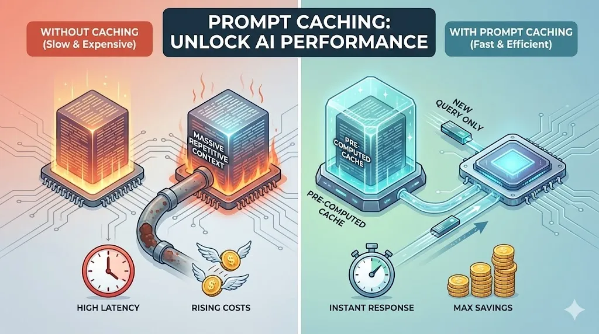

### 前言
对于每一位构建AI应用的开发者而言，大型语言模型API的成本和延迟是两座绕不开的大山。每一次用户交互都可能意味着一笔不小的开销和数秒的等待，这不仅侵蚀着利润，也损害着用户体验。当我们在绞尽脑汁优化模型选择、精简提示词时，却可能忽略了模型服务商内置的一个强大性能加速器，这个工具就是“提示词缓存（Prompt Caching）”。

本文档的目标是为开发人员和技术决策者提供一份全面、深入的指南。我们将详细阐述提示词缓存的技术原理、具体实现方式、灵活的定价模型以及一系列最佳实践。无论您是希望优化现有应用，还是在构建全新的AI驱动解决方案，本文都将为您提供充分利用这一功能所需的全部知识。

  

<!-- 这是一张图片，ocr 内容为：每个API调用都是一次从零开始的昂贵计算 您的许多提示都包含重复内容,如系统指令和通用说明.每次从头处理这些内容都会导致不必要的 延迟和成本. 处理核心 重复的指令 (PROCESSING CORE) 重复的上下文一今 每次都完整处理 A NOTEBOOKLM -->
<!-- 这是一张图片，ocr 内容为：揭秘缓存机制:四步高速处理流程 缓存路由(CACHE ROUTING) 根据提示初始前缀(通常为前256个 TOKEN)的哈希值将请求路由到特定机器. 缓存查找(CACHELOOKUP) 2 系统在选定的机器上检查提示的前缀是否 存在于缓存中. 不匹配(NOMATCH) 匹配(MATCH) 缓存命中(CACHEHIT) 缓存未命中(CACHE MISS) 3 找到匹配项.系统使用缓存的结果,显著 未找到匹配项.系统处理完整提示,然 降低延迟和成本. 后将前放存入缓存以备后用. NOTEBOOKLM -->
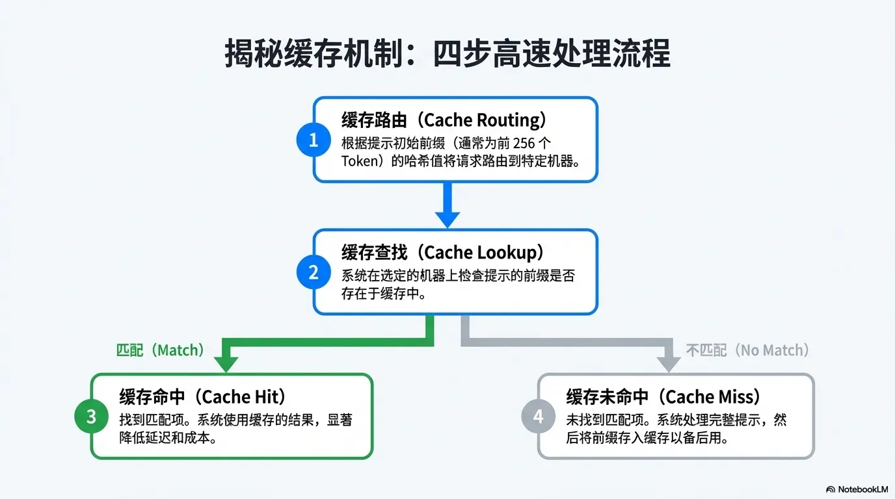<!-- 这是一张图片，ocr 内容为：精细化路由控制,提升高流量场景命中率 CONCEPT 当多个请求共享一个很长的前缀时,使用 团团团队 PROMPT_CACHE_KEY 参数可以帮助您主动影响 路由,确保请求被发送到同一台缓存机器. PROMPT_CACHE_KEY: "USER_A" MACHINE 1 HOW IT WORKS PROMPT_CACHE_KEY 与前缀哈希值结合,共同 REQUEST 决定路由. PRO-TIP PROMPT_CACHE_KEY:"USER_B" 为避免缓存溢出,请确保每个唯一的"前缀+ MACHINE 2 PROMPT_CACHE_KEY"组合的请求速率保持在 每分钟约15次请求以下. A NOTEBOOKLM -->
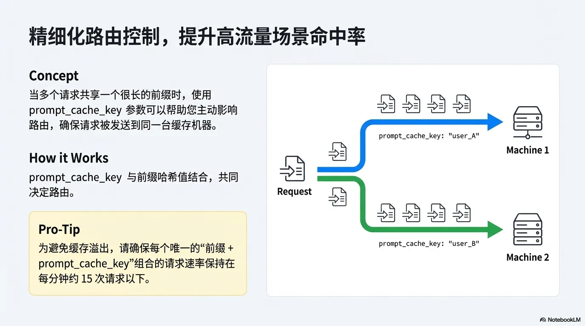

  

### 缓存范围与结构
理解缓存的对象和结构至关重要。提示词缓存功能引用的对象是整个提示词前缀，这意味着从提示词的开端直到您显式指定的缓存断点为止的所有内容。

缓存内容的构建遵循一个固定的层级顺序，这一点对于后续的缓存失效规则至关重要：

`tools` -> `system` -> `messages`（其中tools和system顺序会有先后）

这个结构意味着，工具（`tools`）的定义总是最先被考虑，其次是系统提示（`system`），最后是用户与模型的对话消息（`messages`）。上层内容的任何变动都会影响到其自身及所有下层内容的缓存有效性。

基于这一机制，我们可以得出一个简单而关键的最佳实践：将静态、重复的内容放在提示词的最前面，将动态、变化的内容放在最后面。

  

<!-- 这是一张图片，ocr 内容为：CACHE HIT ORIGINAL PROMPT CACHE MISS -->
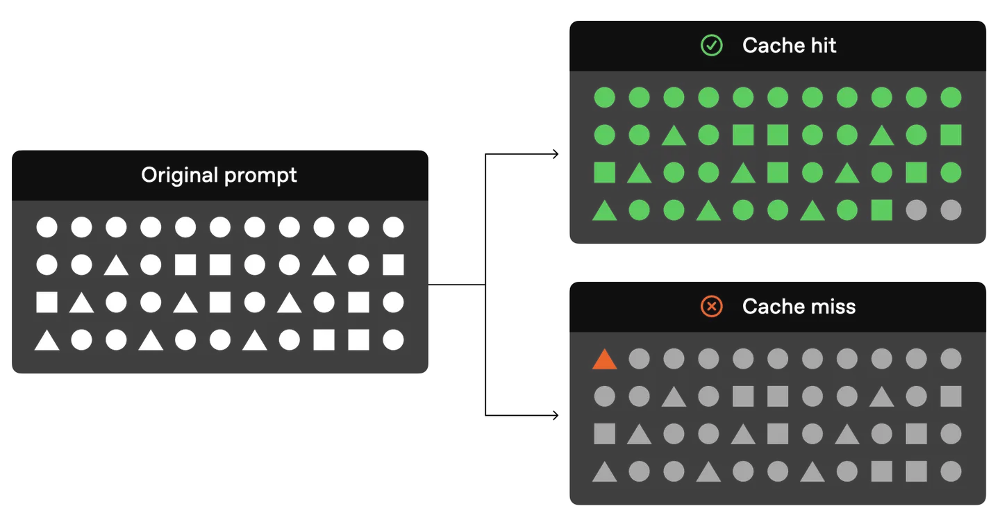<!-- 这是一张图片，ocr 内容为：缓存成功的唯一关键:严格的前缀匹配 只有当提示的开头部分完全相同时,缓存才会命中.因此,将静态内容放在前面,动态内容放在后面至关重要. 缓存命中区域(CACHE HIT ZONE) 非缓存区域(NON-CACHED ZONE) 静态前缀(STATIC PREFIX) 动态后缀(DYNAMIC SUFFIX) 包含:系统提示,指令,示例,工具定义 包含:用户特定问题,变量数据 这同样适用于图像和工具--它们在请求之间也必须完全相同. A) NOTEBOOKLM -->
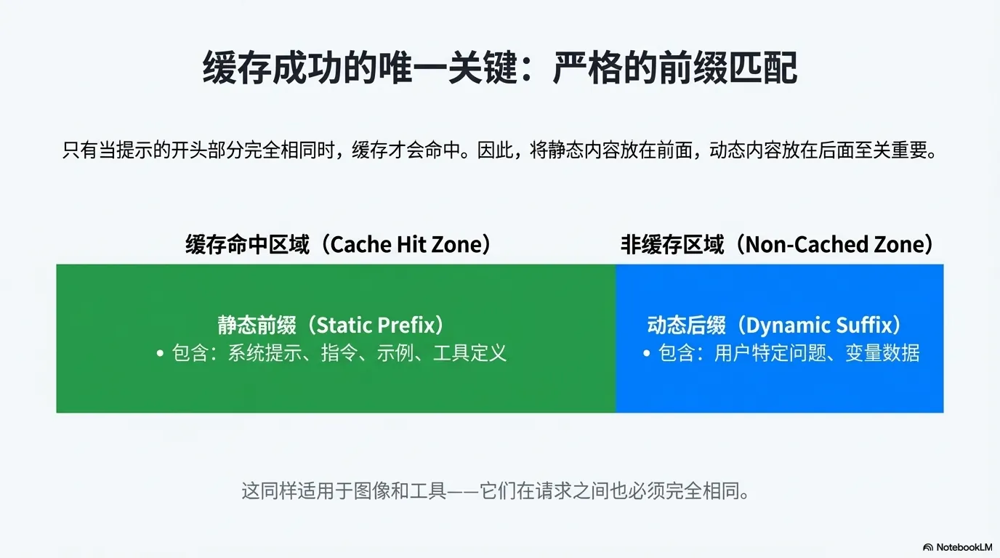

  

### 缓存生命周期 (TTL)
缓存的内容并非永久有效，其存在时间由生命周期（Time-To-Live, TTL）决定。提示词缓存可以使用内存中或扩展保留策略。当可用时，扩展提示缓存旨在将缓存保留更长时间，以便后续请求更有可能与缓存匹配。

  

<!-- 这是一张图片，ocr 内容为：选择最适合您场景的缓存保留策略 内存中(IN-MEMORY) (EXTENDED-*24H') 扩展(E 默认策略 非活跃5-10分钟后通常会逐出,最长可 保留时间 最长可达24小时. 达1小时. (RETENTION TIME) 当内存占满时,将键/值张量(KEY/VALUE 机制 缓存仅保留在易失性GPU内存中. TENSORS)卸载到GPU本地存储,大幅增加 缓存容量. 适用模型 所有支持提示缓存的模型. .1等 GPT-5.1,GPT-5,GPT-4.1 NOTEBOOKLM -->
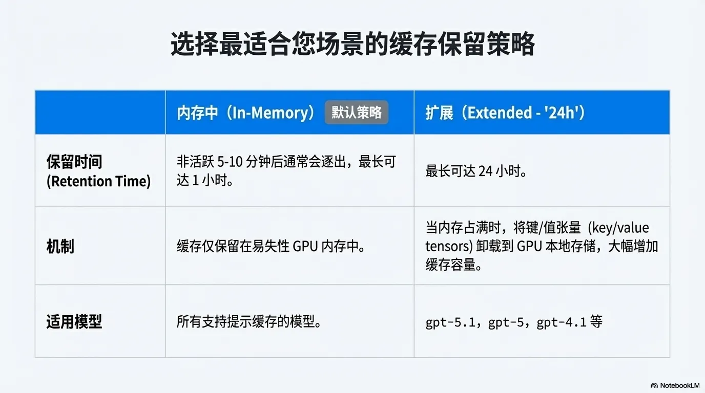

### 内存中提示词缓存保留
**默认生命周期**：默认情况下，缓存条目的生命周期为 **5-10分钟**。一个关键特性是，每次成功使用（即缓存命中）该缓存内容时，其生命周期会以**零额外成本**自动刷新，重新开始计时。

### 延长提示词缓存保留
**扩展生命周期：**延长的提示词缓存保留使缓存的前缀保持活动状态的时间更长，最长可达 24 小时。扩展提示词缓存的工作原理是，当内存已满时，将键/值张量卸载到 GPU 本地存储，从而显著增加可用于缓存的存储容量。键/值张量是预填充期间生成的模型注意层的中间表示。只有键/值张量可以持久保存在本地存储中；原始客户内容（例如提示文本）仅保留在内存中。

### 可以缓存什么
+ 消息：完整的消息数组，包括系统、用户和AI交互。
+ 图像：用户消息中包含的图像（作为链接或作为 Base64 编码数据）以及可以发送多个图像。确保详细参数设置相同，因为它会影响图像标记化。
+ 工具使用：消息数组和可用 `tools` 列表都可以缓存，从而满足最低 1024 个令牌要求。
+ 结构化输出：结构化输出模式充当系统消息的前缀，并且可以缓存。

  

<!-- 这是一张图片，ocr 内容为：缓存的触发条件与适用范围 关键要求 什么内容可以被缓存? 消息(MESSAGES):完整的消息数组 最小长度:提示必须包含1024或更多 TOKEN 才能启用缓存. (SYSTEM, USER, ASSISTANT) 图像(IMAGES):用户消息中的图像(链接 命中增量:缓存命中以128个TOKEN 为增 量单位进行计算(例如 1024,1152 或BASE64),'DETAIL,参数也需保持一 致. 1280...). 工具使用(TOOLUSE):消息数组和,TOOLS' 列表. 好 结构化输出(STRUCTURED OUTPUTS):输出 模式(SCHEMA)作为系统消息的前缀. A) NOTEBOOKLM -->
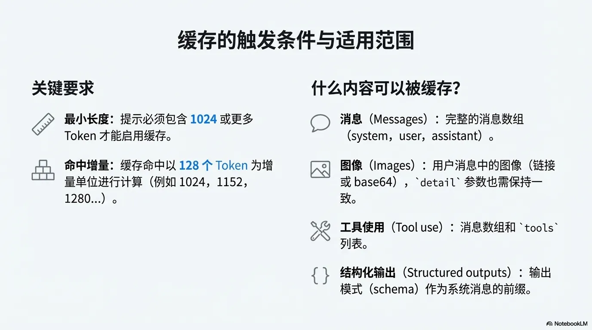

### 最佳实践
核心建议非常直接：**将静态、可重用的内容置于提示词的开头，并将 cache_control 参数标记在这些可重用内容的末尾。（cache_control是Claude等厂商特有的）**

+ **优先缓存稳定内容**：将系统指令、背景信息、大型上下文文档或频繁使用的工具定义等稳定、可重用的内容作为首要缓存对象。
+ **将缓存内容置于开头**：为了获得最佳性能和最高的缓存命中可能性，请始终将计划缓存的内容块放置在提示词的起始部分。
+ **战略性使用缓存断点**：利用断点将提示词的不同逻辑部分（如工具定义、系统角色、上下文）分离开，以便进行独立的缓存管理。
+ **在关键位置设置断点**：在长对话的末尾和任何可能被用户编辑的内容之前设置缓存断点，这可以最大化后续交互的缓存命中率
+ • **使用确定性序列化：** 在进行工具调用（Tool Calling）时，你可能会将一个JSON对象序列化为字符串。请务必使用`sort_keys=True`（或类似功能）。即使两个JSON对象在语义上完全相同，但如果键的顺序不同，生成的字符串就不同，哈希值也随之不同，缓存将直接失效。
+ **保持上下文“只增不减”：**动态截断消息历史中的工具输出。这看似是在优化，实则频繁地破坏了前缀的稳定性，导致缓存完全无法命中。正确的做法是，优先保持上下文的只增不减（append-only），以充分享受缓存带来的成本和延迟优势。
+ **持续分析与调整**：定期通过监控API响应中的 `usage` 指标来分析缓存命中率，并根据数据反馈持续调整和优化您的缓存策略。
+ **最小令牌长度**：并非所有长度的提示词都可以被缓存。系统对可缓存的提示词前缀设有最小令牌数阈值，低于该阈值的提示词即使标记了 `cache_control` 也无法被缓存。

<!-- 这是一张图片，ocr 内容为：用数据验证您的优化成果 每次API调用返回的'USAGE'对象都包含 PROMPT_TOKENS_DETAILS'字段,明确 显示了有多少TOKEN命中了缓存. "USAGE":{ "PROMPT_TOKENS":2006, "COMPLETION_TOKENS":300, "TOTAL_TOKENS":2306, "PROMPT_TOKENS_DETAILS': CACHED_TOKENS会显示实际从缓存 中读取的 TOKEN 数量.对于不足1024 "CACHED_TOKENS":1920 TOKEN 的请求,此值为0. AL NOTEBOOKLM -->
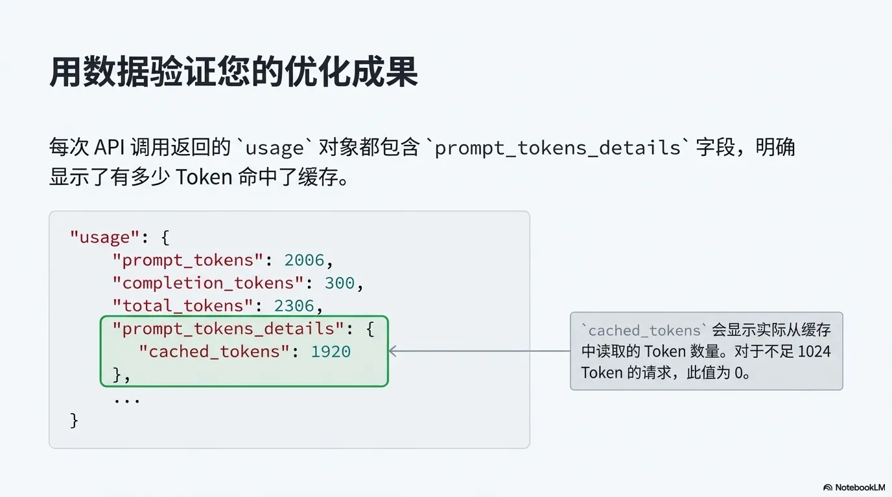<!-- 这是一张图片，ocr 内容为：您的提示缓存优化手册 固化提示前缀:将静态,重复的内容置于提示的开头.这是最重要的 第一步. 善用 PROMPT_CACHE_KEY':对共享长前缀的请求使用一致的键,以 稳定路由并提高命中率. 监控性能指标:密切关注缓存命中率,延迟和缓存TOKEN的比例, 并据此调整策略. 保持稳定请求流:持续发送具有相同前缀的请求,以最大限度减少缓 存被逐出的可能性. AN NOTEBOOKLM -->
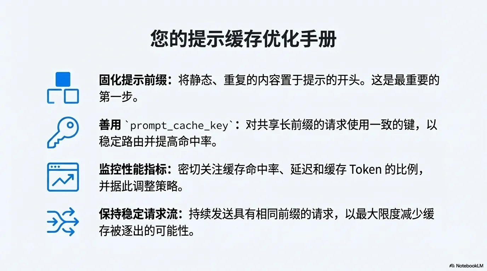

  

### 原理（**Paged Attention**）
### **解决方案源自50年前的操作系统设计**
传统的KV缓存机制面临着严重的内存管理难题。为每个请求预留一块连续的内存会导致大量的内存碎片（内部和外部），并且造成巨大的冗余——假如有100个请求使用了相同的系统提示，那么在内存中就会存在100份完全相同的缓存数据。

业界领先的推理引擎vLLM通过其核心技术PagedAttention，巧妙地借鉴了操作系统在几十年前发明的**“分页内存管理”**思想。

  

<!-- 这是一张图片，ocr 内容为：第一个优化:KV缓存通过存储键/值张量来消除冗余计算 1.预填充(PREFILL) 2.解码(DECODE) 在每一步,只为新的TOKEN 计算KV张量,并将其附加 计算并缓存整个输入提示词的KV张量. 到缓存中.模型通过"缓存中的前缀+新TOKEN"来重建 完整上下文. 使用缓存 (WITH CACHE) 无缓存 (NO CACHE) 缓存持有[THE...PARIS WHICH HAS]的K/V [PARIS] [THE] [HAS] [THE] [IS] [OF] [RHE] [WHICH] [FRANCE] [CAPITAL] 模型视角 模型视角 为所有9个 TOKEN 计算 K/V 仅为1个 TOKEN 计算 K/V (MODEL VIEW): (MODEL VIEW): (COMPUTE K/V FOR ALL 9 TOKENS) (COMPUTE K/V FOR 1 TOKEN) 影响:解码的每一步都变成了0(1)操作,大大降低了延迟,尤其是在输入远大于输出的场景中. NOTEBOOKLM -->
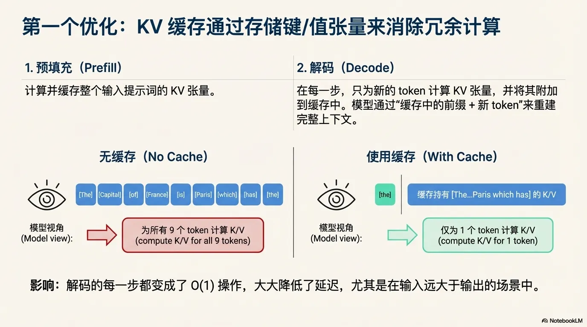

这个类比如下：

• vLLM不再为每个请求分配一大块连续内存，而是将整个GPU显存预先划分为许多固定大小的“块（blocks）”**，就像操作系统将物理内存划分为**“页（pages）”。

• 一个长提示的KV缓存可以存储在多个非连续的“块”中。

• 系统通过一张“块表（block table）”来记录逻辑顺序和物理块之间的映射关系，这与操作系统的“页表”如出一辙。

这个类比的精妙之处在于，它不仅让一个前沿的AI技术变得通俗易懂，更彰显了计算机科学基本原理的持久生命力。一个诞生于半个世纪前的设计思想，如今正在解决最先进AI模型的核心性能瓶颈。

  

<!-- 这是一张图片，ocr 内容为：分页注意力机制以固定大小的"块"来管理KV缓存 突破口: 1.预分配块池:YLLM在启动时预先分配一个由固定大小(例如,每个块存储16个TOKEN)的物理内存块组成的池. 2.透粗到物理的映射:请来的TOKEN,序列被遭短上划分为决.一个"块表(ELOCKTABLE"负责将这些逻辑块射到物理内存池中的物理决. 3.按需分配:只有在需要时才分配物理块,从而消除了内部碎片化. 4.非连续存储:块可以存储在物理内存的任何位置,从而消除了外部碎片化. 分页注意力机制(PAGED ATTENTION) 传统方式(TRADITIONAL) 请求A 物理块池 请求A 外部碎片化 (EXTERNAL FRAGMENTATION) 请求B 请求B OOO 外部碎片化 (EXTERNAL FRAGMENTATION) 请求C 请求C NOTEBOOKLM -->
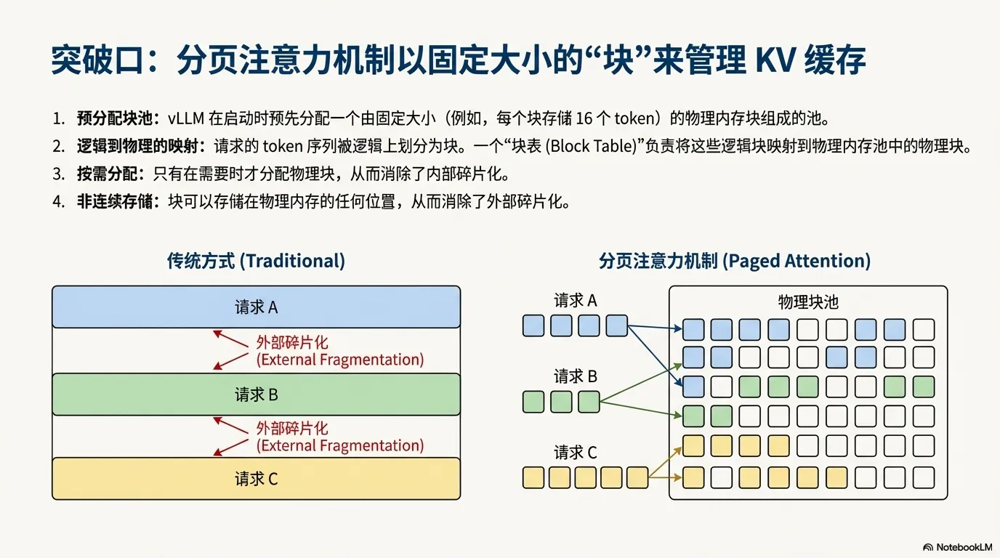

### **稳定前缀的“铁律”背后是一条加密哈希链**
所有API文档都在强调“保持尽可能长的稳定前缀”，但为什么前缀**必须**一模一样，一个token都不能差？答案隐藏在一个优雅的加密设计中。为了能以O(1)的效率快速查找和复用缓存块，vLLM并不会逐一比较token序列，而是对每个块的内容进行哈希计算（例如SHA256）。

这里的关键设计在于，这个哈希计算是“链式”的。计算第N个块的哈希值时，它会将第N-1个块的哈希值作为输入的一部分。其公式可以简化为： `hash(块N) = sha256(hash(块N-1), 块N的token序列)`

这种链式设计带来了决定性的后果：**只要前缀中的任何一个token发生改变，就会导致从那个点开始的所有后续哈希值全部改变，从而“打破”整条哈希链，使得后续所有缓存块全部失效。**

这个设计还隐藏了一个高级功能：通过在哈希计算中加入一个额外的`cache_salt`参数（即OpenAI中的`prompt_key`），vLLM可以为不同的用户或租户创建独立的缓存命名空间，从而在共享的硬件上实现缓存隔离。这展示了该系统在多租户生产环境中的设计远见。

这就是为什么API文档总是强调“稳定前缀”的根本技术原因。这并非一个空泛的“最佳实践”，而是由底层哈希链机制决定的、一个字符都不能错的硬性约束。

  

<!-- 这是一张图片，ocr 内容为：实现共享的关键:通过链式哈希实现内容寻址的块 机制:块哈希(MECHANISM:BLOCK HASHING) [BLOCK 0 TOKENS] SHA256 VLLM为每个逻辑块计算一个基于其内容的哈希值.这个哈希值 被用作在全局缓存中查找和复用现有物理块的键. HASH_0 关键细节:链式哈希(THE CRUCIAL DETAIL:CHAINED HASHING) [BLOCK 1 TOKENS] SHA256 HASH(块N)  SHA256(HASH(块N-1),块N的TOKEN,其他元数据) HASH_1 "父块的哈希"被包含在内,以确保块N的哈希值能编码从块0到 N-1的全部历史.这是因为在因果自注意力机制中,第N个块的 [BLOCK 2 TOKENS] SHA256 KV张量依赖于所有前面的TOKEN.如果块N的哈希值匹配,就保 证了整个前缀都是相同的. THASH_2 NOTEBOOKLM -->
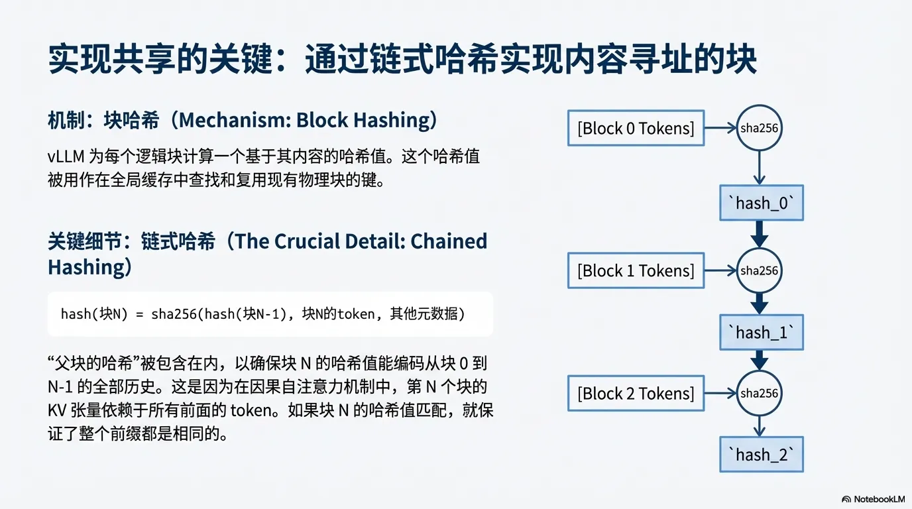<!-- 这是一张图片，ocr 内容为：跨请求缓存实战:分页注意力机制实现了并发请求间的无缝KV缓存共享 物理块池(PHYSICAL BLOCK POOL) T1:请求2 (用户 B)到达 T0:请求1(用户A)到达 1 0 [系统提示词 BLOCK 0] 0 [系统提示词 BLOCK 0] REF_CNT:1 REF_CNT: 2 [系统提示词 BLOCK 1] [系统提示词 BLOCK 1] 3 2 1 REF_CNT: 2 REF_CNT:1 [系统提示词 BLOCK 2] [系统提示词 BLOCK 2] 5 6 4 REF_CNT: 2 REF_CNT:1 7 [用户输入 BLOCK 3] [用户输入 BLOCK 4] 6 8 REF_CNT:1 REF_CNT:1 请求1(用户 A)到达.系统计算并缓存了它 请求2(用户 B)到达,它拥有相同的前缀. 的前缀(例如,一个共享的系统提示词), 请求2的前缓块哈希在缓存中立即命中.它 直接复用物理块[0,1,2],并只为自己的新 对应物理块[0,1,2].请求1进入解码阶 TOKEN 计算 KV 值.用户 B受益于用户 A缓 段. 存的块. A NOTEBOOKLM -->
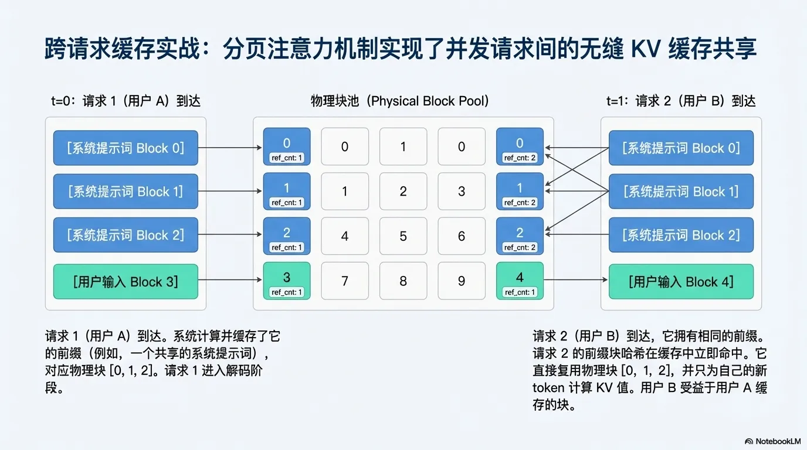

  

### 结论
提示词缓存功能不仅是一项技术更新，更是优化大规模语言模型应用性能和成本效益的关键工具。它为开发者提供了一种精细、高效的方式来管理和复用计算资源。

通过智能地复用提示词前缀，该功能的核心优势得以彰显：它能够**显著降低API调用的延迟**，为用户带来更流畅的交互体验；它能够**大幅节约令牌处理成本**，使大规模、长上下文的应用在经济上更具可行性；同时，它也**解锁了处理复杂指令集和海量上下文的新可能性**，推动了AI应用能力的边界。

### 资料
OpenAI: [https://platform.openai.com/docs/guides/prompt-caching#how-it-works](https://platform.openai.com/docs/guides/prompt-caching#how-it-works)

Claude: [https://platform.claude.com/docs/zh-CN/build-with-claude/prompt-caching](https://platform.claude.com/docs/zh-CN/build-with-claude/prompt-caching)

更多博客（如果对您有帮助谢谢给我点个🌟）：[https://github.com/BaqiF2/ydc_ai_dev](https://github.com/BaqiF2/ydc_ai_dev)

