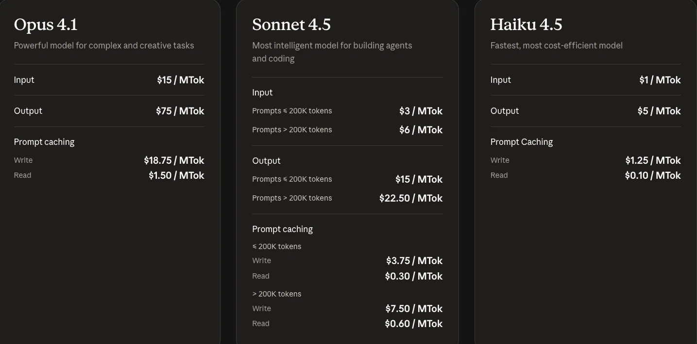
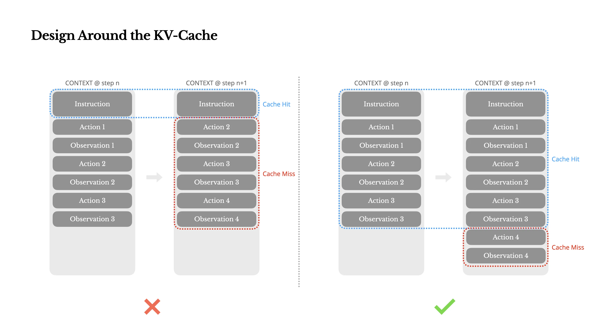
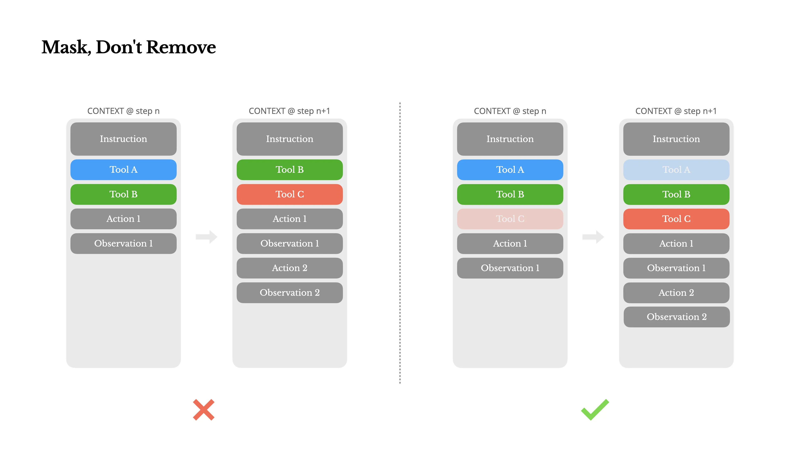
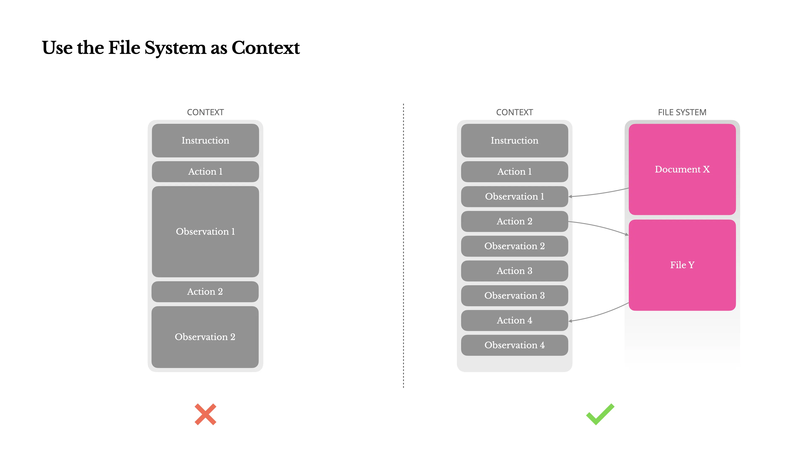
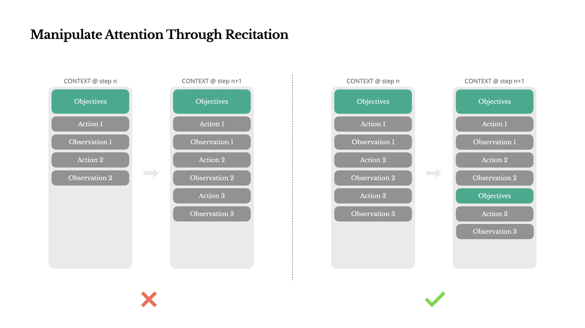
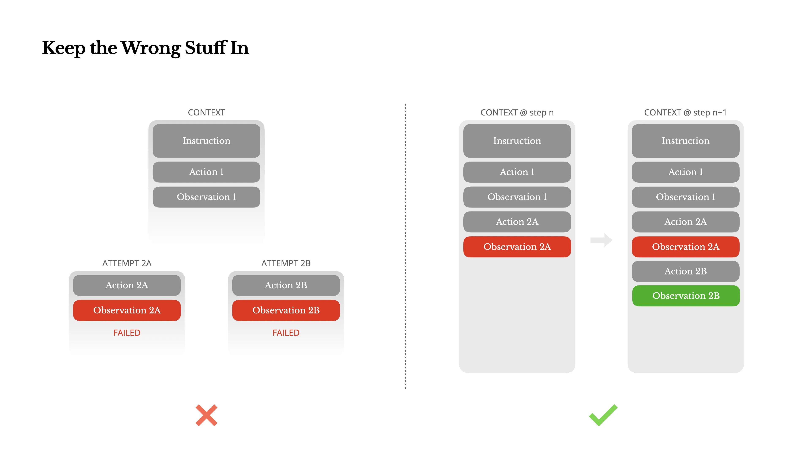
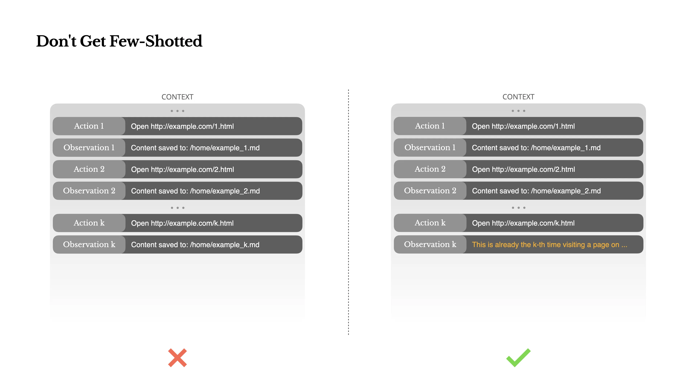

原文：[https://manus.im/zh-cn/blog/Context-Engineering-for-AI-Agents-Lessons-from-Building-Manus](https://manus.im/zh-cn/blog/Context-Engineering-for-AI-Agents-Lessons-from-Building-Manus)

## 文章中的一些概念
### kv-cache
#### 什么是kv-cache
KV-Cache 是一种用于加速大模型自回归生成（逐词输出）过程的关键技术，它通过缓存之前已计算过的中间结果，来避免在生成新词时进行重复计算。

类比：就像你看一本书，看到第 100 页时，你不需要从第 1 页开始一个字一个字重新读，因为你大脑里已经对前面的内容有了“记忆”（缓存）。KV 缓存就是模型的“记忆”。

#### 为什么需要 KV-Cache
在 Transformer 模型中，计算的核心是自注意力机制。为了计算第 `t` 个 token 的输出，模型需要关注序列中从第 `1` 个到第 `t` 个的所有 token。


问题所在：巨大的重复计算，在计算第二个词“时，模型需要重新处理前面已经处理过的这些 token。在计算第三个词时，又要再次处理前面所有的 token。这意味着，越往后生成，重复计算的次数就越多，计算量急剧增加，导致生成速度非常慢。

#### 核心原理
在自注意力机制中，每个 token 都会被转换成三个向量：

+ Query：用于“询问”其他 token 的重要性。
+ Key：用于“回答”其他 token 的询问，代表自己的身份信息。
+ Value：包含 token 的实际内容信息。

注意力分数的计算就是：`当前Token的Query` 与 `序列中所有Token的Key` 进行匹配，然后对 `所有Token的Value` 进行加权求和。


**关键洞察：**  
当生成第 `t` 个新 token 时，之前所有 `t-1` 个 token 的 Key 和 Value 向量其实在之前的计算中都已经算过了！ 唯一新的是当前这个新 token 的 Query 向量。


**KV-Cache 的做法：**

1. 缓存：在生成第 `t` 个 token 时，将计算得到的第 `t` 个 token 的 Key 和 Value 向量存储下来。这个存储空间就是 KV-Cache。
2. 复用：当生成第 `t+1` 个 token 时，我们不需要重新计算前 `t` 个 token 的 Key 和 Value，而是直接从 KV-Cache 中读取它们。
3. 计算：我们只需要计算第 `t+1` 个新 token 的 Query，然后用这个 Query 去和 Cache 中所有的 Key（包括前 t 个和当前新算的）进行匹配，再对 Cache 中所有的 Value 进行加权求和。


KV-Cache 是推理加速中一个“用空间换时间”的经典策略，它是所有现代大语言模型能够实现流畅对话和文本生成不可或缺的底层技术。

### 自回归
自回归 指的是一个模型在生成序列（如一句话、一段代码）时，将其视为一个顺序生成的过程。在生成序列中的每一个新单元（通常是词或Token）时，模型会将之前已经生成的所有单元作为输入条件。

用公式可以简洁地表示为：  
`P(序列) = P(词1) * P(词2 | 词1) * P(词3 | 词1, 词2) * ... * P(词n | 词1, 词2, ..., 词n-1)`

可以把它理解为一种“逐步推进、依赖上文”的生成模式。它让LLM从一个简单的“下一个词预测器”，进化成了能够进行复杂创作和推理的智能体。

### 缓存断点
一个手动插入的标记，用于在不支持自动增量缓存的系统中，显式地控制 KV 缓存的复用和重置。目的是在保证生成正确性的前提下，最大化缓存复用率，从而降低计算开销、提高推理速度。核心策略为将永不变化的核心上下文（如系统提示） 放在第一个缓存断点之前，使其被永久缓存。后续的每一轮动态内容（用户输入、模型回复）则放在断点之后，按需计算和缓存。


### 约束解码
#### 含义
约束解码是一种在大型语言模型生成文本（解码）过程中，强制其输出符合特定格式或规则的技术。

常见的技术：  


1. 正则表达式/文法约束： 定义一个正式文法（如JSON Schema）或正则表达式，生成过程必须严格匹配该模式。
2. 前缀树约束： 将所有有效的工具名称和关键字构建成一棵前缀树，解码时只允许生成能在这棵树中找到的路径。


#### 约束解码是如何工作的
从技术上讲，它通过修改模型在每一步生成时的“概率分布”来实现。通常，模型会计算一个所有可能词汇的概率分布，然后选择概率最高的那个（或通过采样）。约束解码会在这个概率分布上施加一个“掩码”，将不符合规则的词的概率设置为零或负无穷，从而让模型根本无法选择它们。

#### 例子：
假设我们只定义了两个工具：`get_weather` 和 `send_email`。

没有约束解码的情况：  
模型可能会生成：

+ `“我想播放一首音乐。”` -> 幻觉了一个不存在的工具 `play_music`。
+ `“获取天气”` -> 没有按照要求的JSON格式。
+ `{"name": "get_weathr", ...}` -> 拼写错误。

有约束解码的情况：  
在生成“动作”步骤时，约束解码器会严格限制模型：

1. 第一个词（或token）只能是 `{"name": "`。
2. 接下来的部分，模型只能从 `["get_weather", "send_email"]` 中选择。它绝不可能生成 `"play_music"` 或 `"get_weathr"`。
3. 选择工具名后，后续的生成会被约束为必须生成该工具所要求的参数格式（例如，`get_weather` 后面必须跟 `"location"` 字段）。

这样，最终的输出就被“约束”在了 `{"name": "get_weather", "parameters": {"location": "北京"}}` 这样的正确格式内。  


## 经验一：围绕着K-V cache进行设计
### 保证KV-cache命中率


#### 背景
在接收用户输入后，Agent通过一系列工具使用链来完成任务。在每次迭代中，模型根据当前上下文从预定义的动作范围中选择一个动作。然后在环境中执行该动作（例如：Manus的虚拟机沙盒）以产生观察结果。动作和观察结果被附加到上下文中，形成下一次迭代的输入。这个循环持续进行，直到任务完成。 

结果就是随着每一步的推进，上下文不断增长，而输出—通常是结构化的函数调用—保持相对简短。这使得Agent相比聊天机器人的预填充和解码比例高度倾斜。例如在Manus中，平均输入与输出的token比例约为100:1。


同时模型厂商是双向收费的：  



#### 使用KV-cache的好处
相同前缀的上下文可以利用KV缓存，这大大减少了首个token的生成时间(TTFT)和推理成本——无论你是使用自托管模型还是调用推理API。不是小幅度的节省：例如使用Claude Sonnet时，缓存的输入token成本为0.30美元/百万token，而未缓存的成本为3美元/百万token-相差10倍。


简而言之：既能保证智能体的执行效率，又大大节约了模型的成本


#### 如何保持KV-cache缓存有效


**不要尝试修改上下文内容，可能会导致KV缓存的实效，使用追加的方式替代。**


提关键实践：

1. 保持提示前缀稳定：由于LLM的自回归特性，即使是单个标记的差异也会使该标记之后的缓存失效。
2. 只追加： 避免修改之前的操作或观察。确保你的序列化是确定性的。
3. 在需要时明确标记缓存断点：某些模型提供商或推理框架不支持自动增量前缀缓存，而是需要在上下文中手动插入缓存断点。在分配这些断点时，要考虑潜在的缓存过期问题，并至少确保断点包含系统提示的结尾。


## 经验二：引导而非篡改
### 背景
随着Agent的增强，其行动范围自然变得更加复杂—简单来说，工具数量爆炸式增长。比如大量MCP只会火上浇油。如果你允许用户自定义工具，模型更可能选择错误的行动或采取低效的路径。简而言之，你武装过度的Agent变得更加愚蠢。

### 除非绝对必要，避免在迭代过程中动态添加或移除工具
1. 在大多数LLM中，工具被定义在上下文的前部，通常在系统提示之前或之后。因此任何更改都会使后续所有动作和观察的KV缓存失效。
2. 当先前的动作和观察仍然引用当前上下文中不再定义的工具时，模型会感到困惑。如果没有约束解码，这通常会导致模式违规或幻觉动作。

举例：

+ 假设对话开始时，工具是 `[A, B, C]`。模型在约束下生成了关于工具A的动作。
+ 然后，你移除了工具A，添加了工具D。现在工具集是 `[B, C, D]`。
+ 当模型需要生成下一个动作时，约束解码器应该使用新的工具集 `[B, C, D]` 来约束模型。
+ 然而，上下文中仍然记录着之前使用工具A的历史。模型看到自己用过A，但现在约束又不允许它再提A，这就会导致极大的困惑。它可能会试图生成 `“我上次用了A，但这次我想...”`，然后被约束解码器强行打断，导致生成失败、逻辑混乱或输出无意义的字符。

### 解决方式
Manus使用上下文感知的状态机来管理工具可用性。它不是移除工具，而是在解码过程中掩蔽token的logits，以基于当前上下文阻止（或强制）选择某些动作。

#### 状态机 + Logits掩码
Manus的解决方案是两部分的：

+ 上下文感知的状态机：这是一个管理程序，它跟踪对话的“状态”。例如，状态可能是“等待用户输入”、“正在执行工具”、“需要强制回复”等。根据当前状态，状态机决定模型此刻能做什么、不能做什么。
+ Logits掩码：这是关键技术。LLM在生成下一个词时，会为所有可能的词（在词汇表中）计算一个分数（logits），然后根据这个分数选择下一个词。Logits掩码就是在这一刻，强行把不允许的词（或token）的分数设为负无穷，这样模型就永远不会选中它们。这就像在考试选择题中，直接把错误选项用黑笔涂掉，考生只能从剩下的选项里选。

关键优势：这种方法不改变模型的初始工具定义（上下文），因此不会导致KV缓存失效。模型依然“知道”所有工具的存在，但在生成时，某些工具被“暂时禁用”了。





#### 实现手段：响应预填充
<font style="color:#000000;">多数模型提供商和推理框架支持某种形式的响应预填充，这允许你在不修改工具定义的情况下约束动作空间。函数调用通常有三种模式（我们将使用 NousResearch 的 </font>[<font style="color:#000000;">Hermes 格式</font>](https://github.com/NousResearch/Hermes-Function-Calling)<font style="color:#000000;"> 作为示例）：</font>

<font style="color:#000000;">•</font><font style="color:#000000;">自动</font><font style="color:#000000;"> – 模型可以选择调用或不调用函数。通过仅预填充回复前缀实现：</font><font style="color:#000000;"><|im_start|>assistant</font>

<font style="color:#000000;">•</font><font style="color:#000000;">必需</font><font style="color:#000000;"> – 模型必须调用函数，但选择不受约束。通过预填充到工具调用令牌实现：</font><font style="color:#000000;"><|im_start|>assistant<tool_call></font>

<font style="color:#000000;">•指定 – 模型必须从特定子集中调用函数。通过预填充到函数名称的开头实现：<|im_start|>assistant<tool_call>{"name": "browser_ 通过这种方式，我们通过直接掩码token的logits来约束动作选择。例如，当用户提供新输入时，Manus必须立即回复而不是执行动作。我们还有意设计了具有一致前缀的动作名称——例如，所有与浏览器相关的工具都以browser_开头，命令行工具以shell_开头。这使我们能够轻松确保代理在给定状态下只从特定工具组中进行选择而无需使用有状态的logits处理器。</font>

<font style="color:#DF2A3F;"></font>

#### <font style="color:#000000;">举例：</font>指定模式的工作流程
```python
假设工具有：[browser_search, browser_open, shell_ls, shell_grep]

场景：用户说“帮我上网查一下资料”。此时，状态机判断应该使用浏览器工具，而不是命令行工具。

状态机决策：状态机进入“必须调用浏览器工具”的状态。

预填充：系统在让模型生成回复时，预填充了：<|im_start|>assistant<tool_call>{"name": "browser_

应用Logits掩码：

系统计算下一个词的logits。

然后，它将shell_、calculator_等所有不以browser_开头的工具名对应的token序列的分数设为负无穷。

同时，它也可以确保在browser_之后，只允许出现search"或open"这样的有效补全，而不会出现browser_xyz这种无效工具。

模型生成：模型在强大的约束下，只能生成search"或open"。假设它生成了search"，那么完整的工具调用开始部分就是：<tool_call>{"name": "browser_search"。然后模型会继续在约束下生成这个工具调用所需的其余参数（如查询关键词）。

通过这种方式，我们没有删除shell_ls这个工具的定义，但成功地阻止了模型去调用它。
```

<font style="color:#DF2A3F;">  
</font>

步骤分解

1. 状态机决策

状态机进入"必须调用浏览器工具"的状态。在代码中，这表现为你的程序逻辑决定要设置特定的API参数。

2. "预填充"的等价操作

在OpenAI API中，你不是通过填充文本来引导，而是通过精确指定工具选择来实现同等效果：

```python
# 这是你的状态机逻辑决定的
if state == "MUST_USE_BROWSER":
    tool_choice_value = {
        "type": "function", 
        "function": {"name": "browser_search"}  # 或者 "browser_open"
    }
```

3. "Logits掩码"的等价操作

在OpenAI API中，你不需要手动进行logits掩码。API服务端会替你完成这个工作。当你精确指定工具时，OpenAI的后端会确保：

所有不是`browser_search`的工具都被"掩码"（不可选）

模型必须生成符合`browser_search`参数结构的JSON

完全阻止生成`shell_ls`、`shell_grep`或任何其他工具调用的可能性

```python
response = openai.chat.completions.create(
    model="gpt-4o",
    messages=[
        {"role": "user", "content": "帮我上网查一下资料"}
    ],
    tools=tools,  # 所有工具定义仍然完整传递
    tool_choice={  # 这就是你的"预填充+掩码"的等价操作
        "type": "function",
        "function": {"name": "browser_search"}
    }
)
```

5. 模型生成的结果

由于`tool_choice`的强制约束，模型的回复必定是：

```python
# response.choices[0].message 的内容：
{
    "role": "assistant",
    "content": None,
    "tool_calls": [
        {
            "id": "call_abc123",
            "type": "function", 
            "function": {
                "name": "browser_search",  # 必须是这个工具
                "arguments": "{\"query\": \"资料\"}"  # 模型补全的参数
            }
        }
    ]
}
```

```python
tools = [
    {
        "type": "function",
        "function": {
            "name": "browser_search",
            "description": "执行网络搜索",
            "parameters": {...}
        }
    },
    {
        "type": "function", 
        "function": {
            "name": "browser_open",
            "description": "打开网页",
            "parameters": {...}
        }
    },
    {
        "type": "function",
        "function": {
            "name": "shell_ls", 
            "description": "列出目录内容",
            "parameters": {...}
        }
    },
    {
        "type": "function",
        "function": {
            "name": "shell_grep",
            "description": "在文件中搜索文本",
            "parameters": {...}
        }
    }
]
```

如果要在浏览器工具中二选一？

假设你的状态机只知道要用浏览器工具，但不确定用`browser_search`还是`browser_open`。

让模型在浏览器工具中选择

```python
browser_tools = [tool for tool in tools if tool["function"]["name"].startswith("browser_")]

response = openai.chat.completions.create(
    model="gpt-4o", 
    messages=[...],
    tools=browser_tools,  # 只传递浏览器工具子集
    tool_choice="required"  # 必须选一个浏览器工具
)
```

## 经验三 - 使用文件系统作为上下文
### 背景
最新的模型提供128K令牌或更多的上下文窗口。但在真实的Agent场景中，这通常不够，有时甚至是一种负担。有三个常见的痛点：

1. 观察结果可能非常庞大，尤其是当代理与网页或PDF等非结构化数据交互时。很容易超出上下文限制。
2. 模型性能往往会下降，超过一定的上下文长度后，即使技术上支持该窗口大小。
3. 长输入成本高昂，即使使用前缀缓存。你仍然需要为传输和预填充每个token付费。


Agent本质上必须根据所有先前状态预测下一个动作—而你无法可靠地预测哪个观察结果可能在十步之后变得至关重要。从逻辑角度看，任何不可逆的压缩都带有风险。 


### 解决方式
在Manus中将文件系统视为终极上下文：大小不受限制，天然持久化，并且代理可以直接操作。模型学会按需写入和读取文件—不仅将文件系统用作存储，还用作结构化的外部记忆。



#### 关键设计
压缩策略始终设计为可恢复的: 例如，只要保留URL，网页内容就可以从上下文中移除；如果沙盒中仍然保留文档路径，则可以省略文档内容。这使得Manus能够缩短上下文长度，而不会永久丢失信息。


## 经验四 - 通过复述操控注意力
### 概述
在处理复杂任务时，创建一个todo.md文件—并在任务进行过程中逐步更新它，勾选已完成的项目。这是一种操控注意力的刻意机制。 




### 背景
Manus中的一个典型任务平均需要大约50次工具调用。这是一个很长的循环——由于Manus依赖LLM进行决策，它很容易偏离主题或忘记早期目标，尤其是在长上下文或复杂任务中。


### 关键设计
通过不断重写待办事项列表，Manus将最终目标复述到上下文的末尾。将全局计划推入模型的近期注意力范围内，避免了"丢失在中间"的问题，并减少了目标不一致。实际上，它使用自然语言来使自己的注意力偏向任务目标—而不需要特殊的架构变更。


## 经验五 - 保留错误的内容
### 背景
Agent会犯错。这不是bug—这是现实。语言模型会产生幻觉，环境会返回错误，外部工具会出现异常行为，意外的边缘情况随时都会出现。在多步骤任务中，失败不是例外；它是循环的一部分。


### 错误的处理方式
一个常见的处理方式是隐藏这些错误：清理痕迹，重试操作，或重置模型的状态并将其留给神奇的"温度"。这感觉更安全，更受控制。但这是有代价的：擦除失败会移除证据。没有证据，模型就无法适应。




### 关键设计
最有效的方法之一出奇地简单：将错误的尝试保留在上下文中。当模型看到一个失败的行动—以及由此产生的观察结果或堆栈跟踪—它会隐式地更新其内部信息。这会改变其经验，降低重复相同错误的可能性。 事实上，我们认为错误恢复是真正Agent行为的最明显指标之一。


## 经验六 - 不要被少样本示例所困
### 背景
少样本提示（Few-short）是提高LLM输出准确度的常用技术。但在代理系统中，它可能会以微妙的方式适得其反。 语言模型是优秀的模仿者；它们模仿上下文中的行为模式。如果你的上下文充满了类似的过去行动-观察对，模型将倾向于遵循该模式，即使这不再是最优的。 这会导致偏离、过度泛化，或有时产生幻觉。




### 关键设计
解决方法是增加多样性。Manus在行动和观察中引入少量的结构化变化——不同的序列化模板、替代性措辞、顺序或格式上的微小噪音。这种受控的随机性有助于打破模式并调整模型的注意力。 换句话说，不要让自己陷入少样本学习的陷阱。你的上下文越单一，你的智能体就变得越脆弱。


## 结论
上下文工程仍然是一门新兴的科学—但对于智能体系统来说，它已经是必不可少的。模型可能变得更强大、更快速、更经济，但再多的原始能力也无法替代对记忆、环境和反馈的需求。如何塑造上下文最终决定了你的智能体的行为方式：它运行的速度、恢复的效果以及扩展的范围。

