Lance Martin，斯坦福博士、LangChain 工程师。内容整理自他与 Manus 联合创始人纪逸超（Yichao “Peak” Ji）的一次视频会议。

## 资料
### 视频原地址
[https://www.youtube.com/watch?v=6_BcCthVvb8](https://www.youtube.com/watch?v=6_BcCthVvb8)

## 概要
### Context Engineering (上下文工程)
1. **Reduce (缩减)** - 压缩旧的工具结果（例如，通过将其转换为文件链接），并在压缩带来的效果达到收益递减点时，应用摘要（Summarization）技术。
2. **Offload (卸载)** - 将工具结果保存到上下文窗口之外（例如，保存在文件系统中），以便在需要时进行访问。
3. **Isolate (隔离)** - 将任务委派给拥有独立上下文窗口的子智能体（Sub-agents），根据任务的复杂程度，选择共享指令或共享完整上下文。

### Action Space Design: (动作空间设计)
1. **Fewer general tools (更少的通用工具)** - 使用极少的函数调用（<20个）来访问通用实用程序（如 Shell、编辑器），在不让函数调用层变得臃肿的情况下，赋予模型广泛的能力。
2. **Enable discovery (启用发现机制)** - 让智能体通过单一的 Shell 工具发现实用程序（例如，通过 `--help` 标志），而不是在指令中塞入大量说明。
3. **Avoid tool retrieval (避免工具检索)** - 动态工具检索（Dynamic tool retrieval）可能会迷惑模型；应倾向于使用稳定的、分层的架构（例如，通过函数调用访问沙箱中的多种实用程序）。

### Architectural Decisions: (架构决策)
1. **Sub-agents are tools, not teams (子智能体是工具，而非团队)** - 不要将智能体角色拟人化；使用子智能体是为了**上下文隔离**（以执行任务），而不是进行认知分工（例如：工程师、项目经理）。
2. **Share context deliberately (审慎地共享上下文)** - 对简单任务传递最少指令，对复杂任务传递完整上下文；始终为子智能体的结果定义输出模式（Output schemas）。
3. **Cache aggressively (激进地缓存)** - KV 缓存（Key-Value Caching）可改善成本和延迟；分布式 KV 缓存基础设施在开源模型上实施具有挑战性，但目前已得到前沿模型提供商的支持。

### Development Philosophy: (开发理念)
1. **Design for model evolution (为模型进化而设计)** - 如果更强的模型不能提高你的智能体性能，那么你的框架（Harness）可能正在限制它们（需在不同强度的模型上进行测试）。
2. **Stay unopinionated (保持无偏见/通用性)** - 简单、灵活的架构比结构繁重、预设过多的架构更能适应模型的快速改进。
3. **Embrace the Bitter Lesson (拥抱“苦涩的教训”)** - 随着模型的改进，不要害怕改变你的架构，并不断重新评估你的假设。

## 相关概念
### 上下文腐烂
大型语言模型（LLM）在处理长文本输入时出现的一种现象：随着输入上下文长度（Tokens 数量）的增加，模型的性能会出现非均匀的、有时甚至是急剧的下降，导致其处理长文本的可靠性降低。

**非线性下降**：性能的下降往往不是平滑的，而是可能在达到某个长度阈值后出现不可预测的波动。

在**我的笔记**中有相关的知识点（Chroma的一份研究报告）

### MapReduce
MapReduce 是大数据处理领域中最核心、最基础的编程模型。简单来说，它是一种将巨大的任务拆分成小任务并行处理，最后再把结果合并起来的方法。

## 背景介绍
 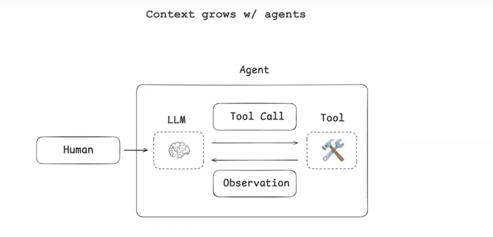

AI Agent通常会不断通过观察，执行工具的循环来的到最终的结果，在这个过程中不断调用工具，工具会输出结果，然后将聊天历史发送给LLM，最终会导致消息的无限增长爆炸达到模型的上下文上限。

比如：manus-典型任务一次调用大概会有50个工具被调用。Anthropic-生产环境的代理可以进行数百轮的对话。

同时chroma有研究报告说明当上下文上升会导致模型的性能下降，Anthropic 也解释过，上下文增长会消耗 LLM 的注意力预算。因此，在构建智能体时，仔细管理哪些信息进入 LLM 的上下文窗口非常重要。[https://research.trychroma.com/context-rot](https://research.trychroma.com/context-rot)

### 示例
从五个角度分别展开介绍

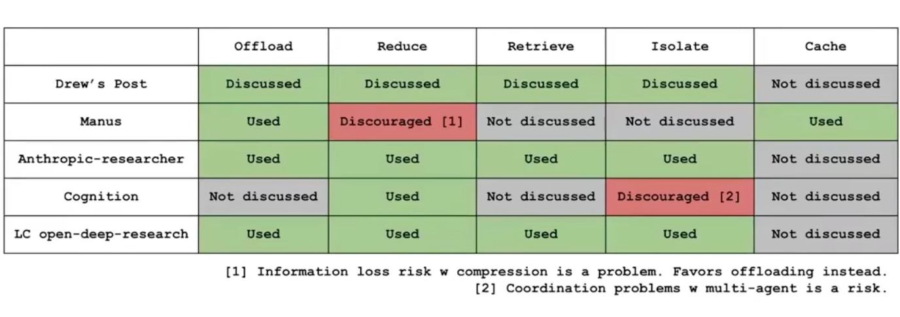

### 为什么需要上下文工程
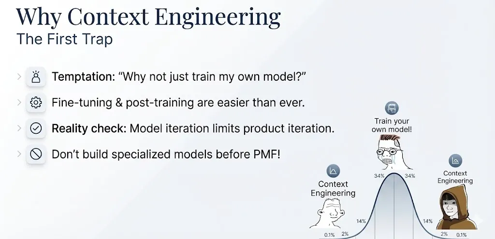

#### manus经验
1.  Peak认为创业公司不应该过早构建专用模型，而应该更多依赖通用模型和上下文工程。原因是产品的创新力完全受限于模型的迭代速度，一次训练佳评估的周期可能需要一到2周，最糟糕的是还没有达到PMF（产品市场契合度）。
2. Peak认为另一个陷阱是开源基础模型变得更强大选择一个强大的基础模型用自己的数据进行微调，让它在特定的用例表现出色。peak认为现在仍然还处于AI和代理的早期阶段，任何变化都将改变一切，比如Chatgpt的发布。

#### 核心内容 
+ **诱惑（Temptation）：“为什么不直接训练我自己的模型？”**

很多开发者在做AI应用时，第一直觉是拥有一切的控制权，觉得训练或微调一个专属模型更“专业”或效果更好。

+ **现状：微调（Fine-tuning）和后训练（Post-training）变得前所未有的简单。**

现在的技术门槛降低了，导致开发者更容易因为“由于我能做，所以我应该做”而陷入这个陷阱。

+ **现实检验（Reality check）：**模型迭代会限制产品迭代。

这是核心论点。 如果你的产品逻辑依赖于训练好的模型，那么每次你想修改产品功能，可能都需要重新训练或调整模型，这非常慢且成本高。相反，修改Prompt（上下文）是即时的。

+ **结论：在找到PMF（产品与市场契合点）之前，不要构建专用模型！**

#### 总结
在产品还没验证是否有人买单之前，保持灵活性是最重要的。

对于AI应用开发者，特别是初创团队，不要为了技术虚荣心去训练模型。**上下文工程（Prompt Engineering + RAG）** 能够让你以最快的速度迭代产品逻辑。只有当你已经确定了产品方向，且现有通用模型确实无法满足特定需求时，再去考虑训练或微调模型。

### 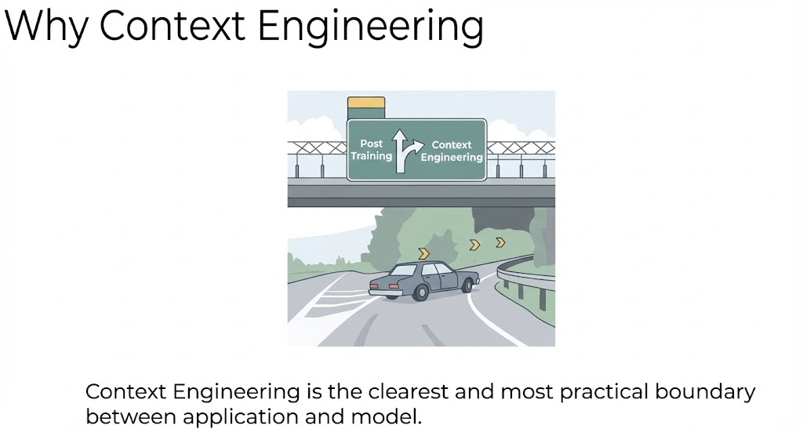

对于大多数应用开发者来说，**“下高速”去往上下文工程** 是更明智、更符合应用层开发逻辑的选择，而不是留在“后训练”的主干道上死磕模型训练。

| **维度** | **Post Training (后训练/微调)** | **Context Engineering (上下文工程)** |
| --- | --- | --- |
| **操作对象** | 模型参数 (Weights) | 模型输入 (Prompt/Context) |
| **成本** | 高 (算力、数据整理) | 低 (逻辑代码、Token消耗) |
| **迭代速度** | 慢 (需要重新训练) | 快 (即改即生效) |
| **知识更新** | 困难 (知识固化在参数里) | 容易 (实时检索) |
| **角色定位** | 算法工程师/模型厂商 | **应用开发者/业务工程师** |

## Manus的架构
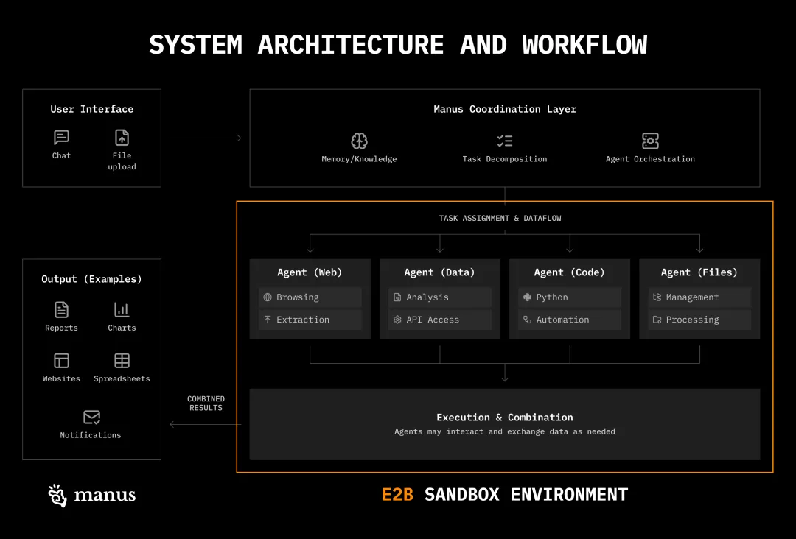

## 核心内容-卸载

### 核心思想： 
不需要把所有的上下文都存在于Agent的消息历史中。你可以将它们下载下来获取到信息后，然后发送到其他地方，这样它就在上下文窗口之外。

### 举例
**普遍，流行的一致方式：文件系统**

将消息写入到文件中，然后只将一些必要的最小信息发送回你的代理。如果需要就可以引用完整的上下文。但是那个完整的负载。例如非常占用token的网页搜索结果，就不会塞满你的上下文窗口。

1. Use file system for planning. (使用文件系统进行规划)
    - 这意味着在执行一个复杂任务（如多步骤推理或代理协作）之前，可以将计划、步骤、中间决策等信息写入文件。这样，即使程序重启或内存不足，也能从文件中恢复计划，保证任务的连续性。
2. Use file system for long-term memories. (使用文件系统作为长期记忆)
    - 对于Agent来说，长期记忆（例如用户偏好、历史对话记录、已学知识等）不需要每次都加载到内存中。通过文件系统存储这些记忆，可以在需要时按需读取，避免内存被长期占用。
3. Use file system to offload tok-heavy context. (使用文件系统卸载高Token消耗的上下文)
    - “Tok-heavy” 指的是包含大量token（词元）的上下文，比如一篇长文章、一段冗长的对话历史或一个复杂的代码库。这些数据会迅速耗尽模型的上下文窗口和内存。将其保存到文件系统中，只在必要时加载相关片段，是管理大模型资源的关键策略。

比如：Manus、Deepagents、open-deep-reasearch、claude code ......

**在我的笔记**中有相关的知识点（langchain-  How agents can use filesystems for context engineering）

### 工具卸载

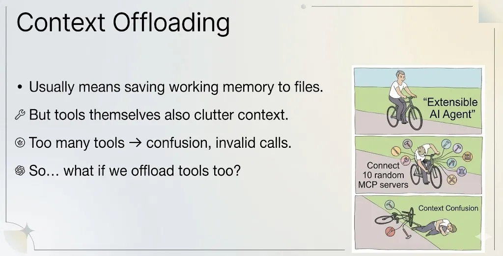

+ 通常情况下，上下文卸载指的是将 Agent 的“工作记忆”（短期记忆）保存到文件或数据库中，以释放上下文窗口（Context Window）。
+ 但随着系统规模发展，特别是如果你决定集成MCP，工具本身的定义（System Prompt 中关于工具的描述、参数说明等）也会占用宝贵的上下文空间。
+ 如果给 Agent 挂载了太多的工具，会导致模型产生困惑（Confusion），不知道该用哪个，或者产生无效调用（Invalid calls）。
+ 如果我们不仅仅卸载记忆，把工具本身也进行卸载（即按需加载工具，而不是一次性全部塞入）会怎样？

#### 常见方案与问题
目前常见的做法是让AI系统根据当前任务需求，动态地选取需要用到的工具。但这会带来两个明显的问题：

1. 上下文记忆被频繁打断  
每次动态加载工具时，工具说明会放在对话历史的最前面，导致模型之前生成的中间记忆（KV缓存）被重置。
2. 历史调用可能误导模型  
虽然某些工具已经被移除了，但模型之前成功调用这些工具的记录还留在对话历史里。这就像你之前用过某个功能，现在这个功能已经失效了，但系统还记得你用过它——这会让模型误以为仍然可以调用这些已经不存在的工具，或者使用已经无效的参数。

#### 优化策略（Hierarchical Action Space）
不要把所有的工具和逻辑都塞进 Prompt（提示词）的上下文里，而是根据复杂程度分层管理。

Manus提出了**三个抽象层级（Three abstraction levels）**，这代表了 AI 与外部世界交互的三种不同深度和方式：

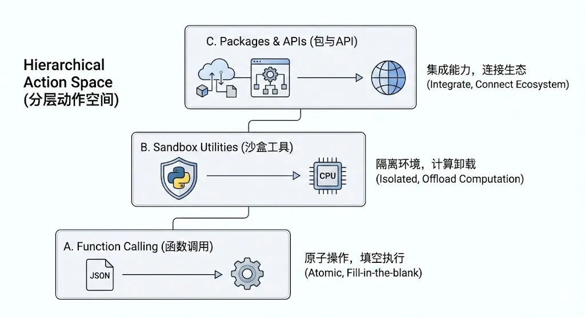

**A. Function Calling (函数调用)**

上面常见方案与问题已经提及虽然在使用了约束解码后，“函数调用”是最直接、最安全的方式，但它并非完美无缺。它存在两个主要痛点：

1. 缓存不友好：代码变动会导致缓存失效，影响性能。
2. 可维护性风险：过度拆分可能导致函数数量爆炸，反而增加理解成本。

Manus 的核心设计是：自身仅维护一组功能单一、边界清晰的原子函数（如执行命令、搜索、浏览器操作）。这些原子函数可以编排组合成复杂工作流。

而对于所有更上层的具体功能，Manus 都将其卸载至下一层的沙盒实用工具中完成，以此保持自身核心的简洁与稳定。

B. Sandbox Utilities (沙盒工具/实用程序)

    - Each session runs in a full VM sandbox (每个会话运行在一个完整的虚拟机沙盒中)
        * 含义： 每个用户的对话或任务都在一个独立的、隔离的环境中运行。它运行在Manus定制的linux系统上
        * 作用：安全性。即便 Agent 执行了恶意代码（比如删除文件），也只会影响这个临时的沙盒，不会破坏宿主服务器。同时保证了不同用户之间的数据隔离。
    - Model can call shell utilities (CLI) (模型可以调用 Shell 命令行工具)
        * 含义： 模型不再局限于“生成文本”，它可以像程序员一样使用 Linux 命令行（CLI）。
        * 作用： 赋予了 Agent 操作系统的能力。它可以使用 `grep` 搜索文件，用 `git` 拉取代码，用 `ffmpeg`处理视频，格式转换器，或者运行 Python 脚本，还有一些特殊的Manus Mcp Cli。这比单纯的文本生成强大得多。
    - Easy to extend without touching model context (易于扩展，无需占用模型上下文)
        * 含义： 这是“卸载”的核心优势。如果你想让 Agent 学会使用一个新工具（比如图像处理库），你只需要在沙盒里预装这个库即可。
        * 作用： 你不需要在 Prompt 里写几千字的“工具说明书”教模型怎么用这个库。模型只需要知道“我有这个环境”即可，极大地节省了 Token 消耗。在命令行界面，你可以在不触及模型函数调用空间的情况下添加新功能。manus只是在你的电脑中预装一些命令，可以运行 --help来了解如何使用新工具。
    - Great for large outputs → write to file (非常适合处理大量输出 → 写入文件)
        * 含义： LLM 的输出长度通常有限制（Output Token Limit）。
        * 作用： 如果任务是“生成一个包含 10 万行数据的 Excel 表”，直接让模型在对话框里吐出这些数据是不现实的。通过沙盒，模型可以将数据直接写入文件，然后只返回一个文件下载链接或文件路径。这绕过了 LLM 的输出限制。同时模型可以使用所有的这些Linux工具，如grep、cat、less、more、来即时处理结果，所以这里的权衡是。它非常适合处理大输出。但对于与前端进行低延迟来回交互则不太理想，因为你总是需要可视化智能体的交互，并展示给用户。

C. Packages & APIs (包与API)

+ 定义： 这是最高层级的抽象。指调用完整的外部软件库（SDK）或第三方服务。
+ 特点：
    - 能力： 极其强大。比如调用 `Pandas` 库处理大数据，或者调用 AWS SDK 管理云资源。
    - 封装： 模型不需要知道底层的实现细节，只需要知道如何调用这个“包”的高级接口

在Manus中，您可以通过编写Python脚本来解锁更强大的能力，具体优势如下：

+ 开箱即用的服务：Manus已为你内置了许多第三方专业服务（如金融数据、3D设计库）的访问权限，省去您自己申请和配置的麻烦。
+ 处理复杂任务的智慧方式：面对海量数据或复杂计算时，让AI直接处理效率很低。更聪明的做法是：让脚本去处理脏活累活，AI只负责核心决策。例如：分析一年股价时，脚本会先计算好关键指标（如最高/最低价），再将简洁的结论交给AI，而不是把成千上万行原始数据都塞给它。
+ 强大的流程自动化：你可以把不同的脚本和工具像积木一样组合，轻松实现自动化流水线。例如：一个脚本可以同时完成“查询城市信息 -> 获取当地天气 -> 生成报告”这一整套动作。

所有这些操作都在一个安全、隔离的环境中运行，确保您的数据和工作流稳定可靠。

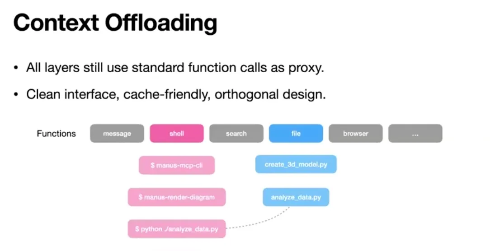

+ Standard function calls as proxy（标准函数调用作为代理）： LLM 不直接“持有”数据，而是通过调用工具来操作数据。例如，它不直接生成一张图片的二进制流在对话框里，而是调用工具生成文件。
+ Clean interface, cache-friendly, orthogonal design（清晰接口、缓存友好、正交设计）：`File`（文件操作）和 `Shell`（命令执行）是两个独立的功能维度，互不干扰但可以组合。
+ 缓存友好： 因为操作是模块化的，中间结果（如生成的代码文件）可以被保存和复用，不需要每次都让 LLM 重新生成一遍。

简单来说，这个三层结构在设计上保持了简洁和高效：

+ 对模型来说，它依然使用常规的函数调用方式，接口简单、处理高效，并且各功能之间互不干扰。
+ 仍然可以像以前一样，通过 shell 函数使用各种工具。
+ 如果你在第三方应用中使用 API，也只需像平常一样用文件函数读写文件，再用 shell 函数执行即可。

所以，这并不会增加模型的负担，所有操作都是模型已经熟悉和训练过的内容，使用起来自然顺畅。

#### LLM是如何调用各种shell工具的？它如何知道哪些工具存在以及如何调用它们？
我们提前在系统里给 Agent 装好了一批命令行工具，放在一个固定的文件夹里。

为了方便，还把最常用的一些工具名称直接写在了给系统提示词里，但写得很简单。

我们不会教 Agent 这些工具具体怎么用，只会告诉它有哪些工具可用。

如果 Agent 想知道某个工具的具体用法，它可以自己输入“工具名 --help”来查看帮助文档。

#### 示例
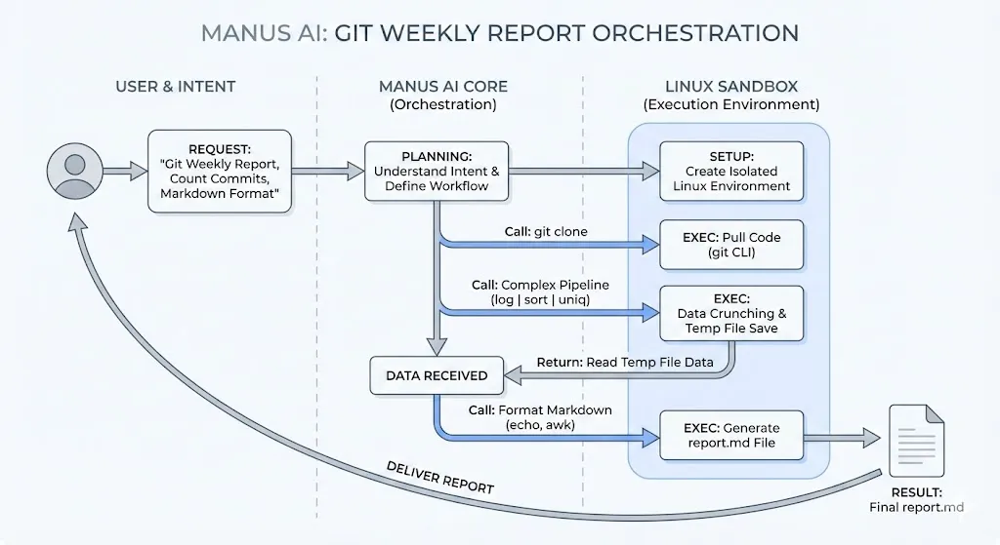

完整案例演示：创建一个项目周报

用户请求：“请为我生成过去一周项目‘Alpha’的Git提交日志周报，统计每个成员的提交次数，并输出成Markdown格式。”

**Manus 的运作过程：**

1. 意图识别与规划：Manus 模型理解请求，并编排原子函数工作流。
2. 进入沙盒：为用户创建一个全新的Linux沙盒环境。
3. 执行工作流：
    - 原子函数调用：`execute_command("git clone https://github.com/company/alpha.git")`
        * 沙盒执行：沙盒中的 `git` CLI工具拉取代码。
    - 原子函数调用：`execute_command("cd alpha && git log --since='1 week ago' --pretty=format:'%an'")`
        * 沙盒执行：沙盒中的 `git log` 命令输出过去一周的所有提交者姓名。
    - 原子函数调用：`execute_command("cd alpha && git log --since='1 week ago' --pretty=format:'%an' | sort | uniq -c | sort -nr > /tmp/commit_count.txt")`
        * 沙盒执行：这里展示了强大的CLI能力。通过管道 `|` 将上一个命令的输出传递给 `sort`, `uniq`, `sort` 等工具进行排序、去重和计数，最终将结果（“提交次数 作者名”）写入临时文件。这一切复杂的数据处理都由沙盒内的现有工具完成，Manus核心无需关心。
    - 原子函数调用：`read_file("/tmp/commit_count.txt")`
        * 沙盒执行：读取文件内容。
    - 原子函数调用：`execute_command("echo '# Project Alpha Weekly Report' > report.md && echo '## Commit Statistics' >> report.md && cat /tmp/commit_count.txt | awk '{print \"- \" $2 \": \" $1 \" commits\"}' >> report.md")`
        * 沙盒执行：使用 `echo`, `cat`, `awk` 等工具，将读取到的数据格式化成美观的Markdown文档 `report.md`。
4. 返回结果：Manus 模型最终将 `report.md` 文件的内容或下载链接返回给用户。

Manus依赖于LLM对Linux标准工具集的普遍了解。`git`, `grep`, `sort`, `curl` 等是程序员和LLM之间的“共同知识”。只要Manus沙盒预装的是这些标准工具，LLM就能大概率正确地使用它们。

对于Manus自定义的特殊CLI工具，文中提到可以运行 `--help` 来了解用法。这意味着在Prompt中，可以告知模型：“如果你遇到不熟悉的命令，可以尝试执行 `[command] --help` 来获取用法信息。” 然后LLM就会在运行时，通过调用 `execute_command("mytool --help")` 来动态学习，再根据帮助信息进行后续操作。这再次体现了“卸载”的思想——工具的使用说明书不在Prompt里，而在沙盒环境里。

### 经验：工具管理的原则：少即是多
面对大量可用的工具，我们面临两个核心问题：多少工具算太多？以及应该如何选择？

**核心策略：提供“原子工具”，而非“功能全集”**

1. **工具数量并非越多越好**  
不同模型能有效处理的工具数量是有限的（例如，可能只有30个左右）。盲目提供过多工具会超出模型的处理能力，反而降低其效率。
2. **关键在于工具的“原子性”**  
不需要在模型的行动空间里塞满各种复杂的功能。相反，应该只提供最核心、不可再分的原子函数。
    - 例如：不需要一个“处理数据”的复杂工具，而是提供一个“Shell”脚本环境。让模型通过组合原子命令（如 `grep`, `sort`）来自行构建复杂功能。

**Manus的实践经验**

+ 他们只保留了 10到20个 最核心的原子函数供模型直接调用。
+ 其他所有功能和数据都放置在共享沙盒（如文件系统）中。模型可以通过原子工具（如Shell）去访问和操作沙盒中的资源，从而无需动态加载大量专用工具。

**总结**  
这套方法的核心优势在于：它极大地简化了模型需要学习的工具集，同时通过赋予模型组合原子工具的能力（比如编写脚本），让它依然能完成无限复杂的任务，实现了灵活性与简洁性的统一。

### 经验：混合执行策略：在灵活与可控之间取得平衡
在智能体系统中，我们面临一个选择：是让工具在受控的沙盒中执行，还是直接执行？理想的答案是采用一种混合执行模式，兼顾灵活性与安全性。

**纯代码方式的局限性**

Manus曾尝试完全通过编写代码（例如让模型生成Python脚本）来解决问题，但这种方法存在明显缺陷：

+ 失去控制：无法利用“约束解码”来确保输出的格式和内容符合预期，容易产生混乱或错误的结果。
+ 难以追踪：一旦过程出错，排查问题会变得非常困难。

**混合方式的优势**

混合执行策略结合了两种方式的优点：

1. 直接执行：适用于简单、安全的原子操作，并能利用约束解码确保返回结果的结构化。
2. 沙盒执行：适用于复杂或高风险任务。其关键优势在于数据处理在隔离环境中完成。
    - 例如：处理大量数据时，不需要将整个数据集都返回给模型。相反，可以在Python运行时内存中完成计算，只将最终的结果（比如一个统计摘要）返回给模型。这极大地减少了上下文消耗，提升了效率。

**结论**

混合方式实现了最佳平衡：既通过直接执行和约束解码保持了控制力与可靠性，又通过沙盒执行获得了处理复杂任务时的灵活性与高效性。

## 核心内容-缩减

### 压缩

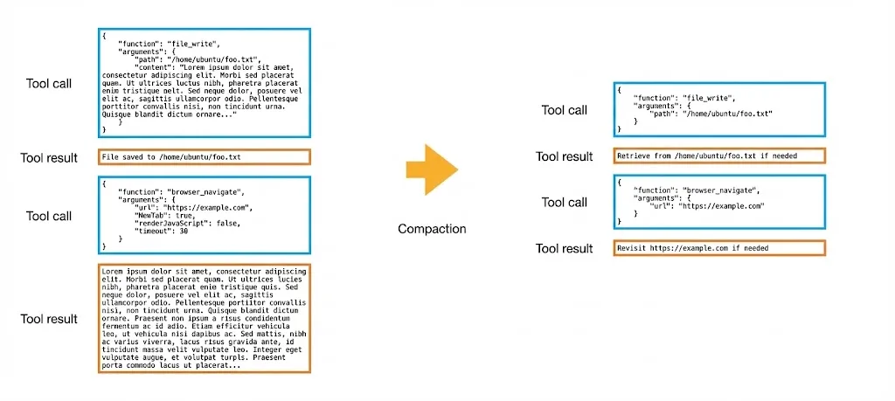

在 Manus 中，每次工具调用都有完整（full）和紧凑（compact）两种格式。

紧凑版本会剔除所有可从文件系统或外部状态中重建的信息。

例如，假设某个工具用于写入文件，它可能包含“路径”和“内容”两个字段。一旦该工具执行完成，文件就已经存在于环境中。因此，在紧凑格式中，我们可以安全地删除冗长的“内容”字段，仅保留“路径”。如果智能体设计得当，当它需要再次读取该文件时，可以直接通过路径进行检索。

在智能体任务中，这种可逆性至关重要。因为智能体是基于先前的行动与观察进行链式预测的，我们无法预知在若干步骤之后，哪一个过去的行动会变得至关重要。因此，压缩机制显得尤为重要。

### 摘要
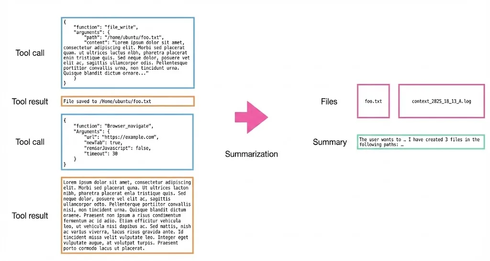

然而，目前压缩的效果仍然有限，因为上下文信息仍会持续增长并可能达到上限。为此，我们需要将压缩技术与更传统的摘要方法结合使用。

Manus在处理这一问题时非常谨慎：在进行摘要之前，可能会将上下文中的关键部分转存到文件中。有时甚至会更进一步，将整个摘要前的上下文以文本文件或日志文件的形式转储至文件系统中。

#### 经验
不要使用自由形式的提示词让AI生成所有的内容，需要定义固定结构(schema)，它类似于是一个CSV的表格，让AI来填写。使用这种更结构化的模式，可以保证输出是稳定的，所以不要使用自由形式的摘要。  

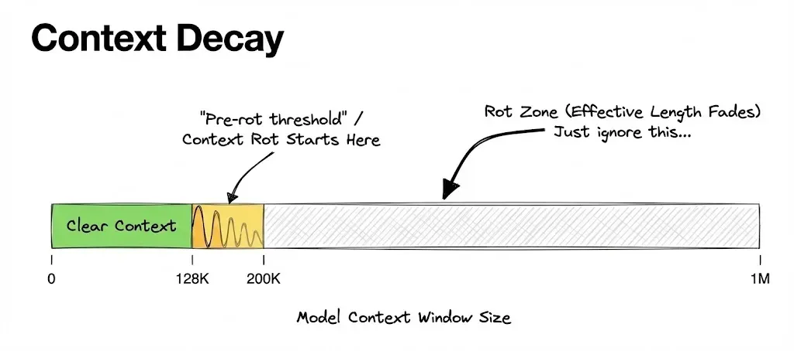

压缩和摘要根本区别在于，压缩是可逆的而摘要不是，两者都能缩短上下文长度，但他们的行为方式截然不同。

为了确保两种模式能够有效共存，我们需要设定并跟踪多个上下文长度阈值。

技术上，模型通常有1M token的上限，但大多数模型在达到该上限前就会出现性能下降。通常在处理约20万token时，就可能出现所谓的“上下文腐化”现象，表现为内容重复、推理速度减慢以及输出质量下降。

因此，通过大量测试与评估，准确识别出性能开始下降前的阈值至关重要。

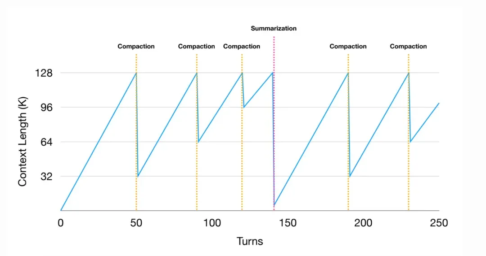

当上下文长度接近阈值时，必须触发内容缩减。此时应优先采用压缩策略，而非直接进行摘要。

需要注意的是，压缩并非针对全部历史记录。一种可行的做法是：仅压缩最早期的50%工具调用，同时完整保留最近的调用细节。这样做既能有效缩减上下文长度，又能确保模型始终拥有最新、完整的工具使用示例作为参考。否则，若模型接触到大量不完整的压缩记录，可能会在后续行为中错误地模仿这种格式，导致调用时缺失必要字段。

压缩操作完成后，必须立即评估此次压缩的实际效果，确认上下文空间释放了多少可用容量。如上图所示，若经过多轮压缩后收益已微乎其微——因为即使是压缩格式仍会占用空间——则意味着需要从压缩策略转向摘要策略。

在实施摘要时，务必遵循两项关键原则：

1. 始终基于完整原始数据生成摘要，而非已压缩的版本；
2. 保留最近几次工具调用及结果的完整记录，不对其进行摘要。

这两项原则至关重要：完整保留近期细节能为模型提供清晰的断点记忆，使其能够顺畅地延续任务执行；而若将近期记录也进行摘要，则可能导致模型出现风格漂移或语气不一致。实践证明，保留最新数条完整工具调用示例，对维持模型行为稳定性具有显著帮助。

## 核心内容-检索
### 索引、语意搜索
示例：cursor

在使用文件系统时，如果正在处理的上下文变得足够大，manus也不使用索引数据库，只依赖于grep和glob。但是如果考虑构建更长期的记忆，或者想集成一些企业知识库。仍然必须依赖外部向量索引，因为这关乎你能访问的信息量。

### 基于文件的工具 glob grep
示例：Claude code 、Manus

## 核心内容-隔离

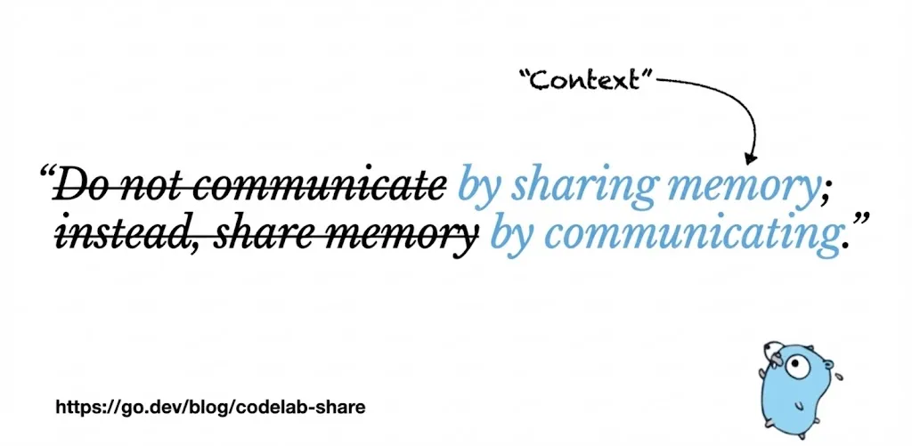

在构建多智能体系统时会产生繁重的同步开销。这与经典的并发问题是一样的。我们可以借鉴编程语言中的一些智慧！借鉴go语言使用了两种方式进行上下文交互: 1. 通过共享内存 2. 通过通信

**通信模式**，指的是主智能体与子智能体之间通过消息进行协作的方式。其典型流程是：主智能体向子智能体发送一段提示指令，而子智能体的上下文中仅包含完成该指令所需的信息。

这种模式适用于任务指令**简短清晰**，且主智能体**只关心最终输出**的场景。例如，在代码库中搜索特定代码片段：主智能体不关心子智能体的具体搜索过程（这被称为“过程抽象”），它只需要最终的结果。在这种情况下，使用通信模式可以最大限度地保持设计的简洁性。

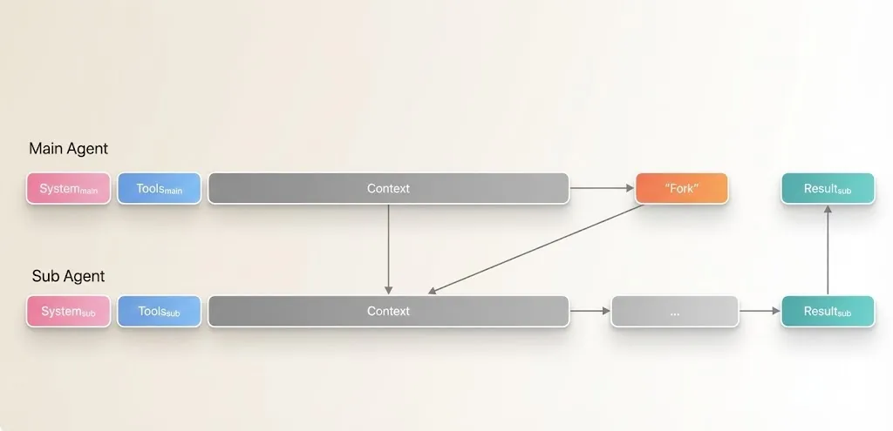

相比之下，在更复杂的任务中，更适合使用“共享内存”模式。在该模式下，子智能体能够访问完整的上下文历史（包括全部工具调用记录），但它仍使用自己独立的系统提示词和行动空间。

例如，在进行深度研究并撰写最终报告时，整个过程涉及大量的中间搜索和笔记。此时就应考虑使用共享内存（即共享上下文）模式。虽然理论上可以将所有中间结果保存为文件再让子智能体读取，但这样做会浪费延迟与上下文空间。若计算总 token 消耗，后者反而可能更多。

需要注意的是，共享上下文本身成本较高。由于每个子智能体都需要预填充大量输入，系统必须承担全部 token 计算成本，且无法通过 KV 缓存实现复用。

### 经验：长工具调用的信息管理：压缩与保留策略
当智能体调用一个会消耗大量token的工具时会面临一个两难问题：既希望保留关键信息供后续决策，又不想让冗长的结果挤占宝贵的上下文空间。

**核心思路：压缩摘要，而非完整保留**  
直接传回完整结果再删除是一种方法，但更优的策略是主动对信息进行“压缩摘要”。这就像做了多个查询后，只收集最重要的结论，而舍弃冗余细节。

**解决方案一：使用“智能体即工具”**  
对于复杂的信息处理任务，可以创建一个专用的子智能体（或称为“智能体即工具”）。这个子智能体的职责就是代替主智能体去阅读和理解长篇内容，并提炼出核心要点，再将这个精简后的摘要返回给主智能体使用。

**解决方案二：关键信息持久化**  
对于像谷歌搜索这类相对简单的任务，可以采用压缩卸载的方式。但一个重要的最佳实践是：始终指示模型将中间的关键发现或见解即时写入笔记或文件。

这么做的目的是建立一个安全网：即使后续的压缩过程丢失了某些细节，最核心的智慧结晶已经被单独保存下来，不会丢失。

**设计哲学：拥抱“遗忘”**  
无需保留所有原始信息，因为大部分旧的工具调用细节会很快过时并失去价值。我们的目标不是记住一切，而是确保关键洞察得以保留，从而在压缩信息的同时，不损害智能体的决策能力。

### 经验：智能体协作的关键：高效的信息传递模式
在多个智能体协作时，一个核心挑战是：如何让主智能体向子智能体传递恰到好处的信息，既保证任务顺利执行，又避免用冗长的上下文拖慢效率。

**解决方案：共享工作空间与结构化输出**

1. **设立共享“工作区”**  
主智能体与子智能体之间通过一个共享的沙盒（例如共用的文件系统）来交换信息。这避免了主智能体需要向子智能体“预填充”大量背景信息，子智能体可以直接从工作区获取所需内容。
2. **约束输出模式，确保数据规整**  
整个流程中最关键的一步是让主智能体来定义子智能体的输出格式。
    - 具体做法：当主智能体创建子智能体时，会使用“约束解码”等技术，强制要求子智能体必须按照预设的模式（比如一个特定的JSON结构或数据表格）来返回结果。
    - 实际效果：这就像主智能体生成一张结构固定的电子表格让子智能体填写。无论子智能体内部如何处理任务，它最终提交的答案都必须符合这张表格的格式要求。

这种方法的好处：  
通过“共享工作区”加“结构化输出”的组合拳，既保证了信息的充分共享，又确保了子智能体传回结果的准确性与规整性，使得主智能体能够轻松整合和处理所有反馈。

### 经验：多智能体系统设计：少而精的架构哲学
在构建多智能体系统时，一个关键问题是：如何设计智能体之间的关系与分工？

**核心原则：谨慎划分角色，避免过度拆分**

Manus 是一个多智能体系统，但它不按具体的“角色”（例如“翻译官”、“数据分析师”）来无限细分智能体。相反，它只设计了少数几个核心的、功能通用的智能体，例如：

+ 一个庞大的通用执行智能体
+ 一个规划智能体
+ 一个知识管理智能体：

知识智能体所做的事审查用户和智能体之间的对话，并找出哪些内容应该保存到长期记忆中，类似记忆管理的规划起。

+ 少数数据API注册智能体

**关键策略：将复杂功能实现为“智能体即工具”**

系统对添加新的、独立的子智能体非常谨慎。当需要扩展能力时，更倾向于将特定功能实现为一个被调用的工具，而不是一个拥有独立生命周期和上下文的自治智能体。

这种“智能体即工具”的模式，由一个主规划智能体来协调。规划智能体拥有自己的上下文窗口，负责制定计划、生成计划对象，并在需要时调用这些“工具型智能体”来完成任务，而不是与多个独立的智能体进行复杂的通信。

**设计优势**

这种“少而精”的架构确保了系统的简洁性与可控性，避免了多个自治智能体之间通信带来的巨大复杂度和上下文开销。

  

## 核心内容-缓存
Manus目前不使用任何开源模型，在输入远大于输出的时候，KV Cache将变得非常的重要，使用开源模型KV Cache很难实现，如果使用在线模型，模型厂商拥有更坚实的基础设施，可以实现全球范围的分布式缓存。

## 总结

这五个维度——卸载、缩减、检索、隔离与缓存——并非彼此独立，而是相互关联的。

例如，卸载与检索能共同实现更高效的上下文缩减；而稳定的检索机制，则为安全地进行任务隔离提供了保障。反过来，隔离本身也会减缓上下文的增长速度，从而降低缩减操作的频率。

然而，更多的隔离与缩减也可能带来副作用，例如影响KV缓存的效率，甚至对输出质量构成挑战。

由此可见，上下文管理本质上是一门需要权衡的科学与艺术，其核心在于如何在多个相互冲突的目标之间，找到那个精妙的平衡点。

### 少折腾，多信任
Manus 发现，真正的进步不在于设计复杂的上下文管理或检索技巧，而恰恰在于“做减法”——信任模型，减少不必要的干预。每一次系统简化，结果都是更快、更稳、更聪明。让模型更轻松地工作，才是最终目标。

****

### 经验：智能体如何应对模型能力的快速演变？
随着模型能力的快速提升，开发团队面临一个核心挑战：如何让智能体架构适应这种变化？

核心挑战：模型不仅“变强”，还在“变化”

+ Lance的观点：他认为最大的挑战之一，是随着模型能力提升，需要逐步移除当初为辅助弱模型而搭建的“脚手架”。他希望能找到一种方法，让智能体架构能更高效地适配模型能力的提升。
+ Peak的实践：其产品Manus已经历了五次重构。他强调重构不能停止，因为模型本身的行为和特性也在不断变化，这迫使架构必须持续调整。

**Manus的应对策略：面向未来设计架构**  
Manus内部有一个核心设计理论：

+ 不追求静态基准测试：他们不过分关注智能体在某个固定模型上的基准测试表现。
+ 采用“固定架构，切换模型”的测试方法：他们会将同一套智能体架构，放到不同能力（从弱到强）的模型上进行测试。
+ 衡量架构的“未来性”：如果一个架构在切换到更强模型时，性能能够获得巨大提升，那么就认为这个架构更具“未来性”，更能适应模型的迭代。

基于这一策略，团队会频繁地提前为下一个版本的模型准备好智能体架构，从而在模型发布后能快速适配和应用。

## 其他经验

1. manus有记忆的概念吗？比如claude code 有 claude.md 文件。如何处理长期记忆？

manus存在一个叫做“知识”的概念，它有点像显示的记忆，它会弹出框来与用户进行交互，让用户确认，将这部分内容作为后续用户的记忆。但是peak在描述的过程中，manus正在探索更加自动化，自动通过用户反馈来增强智能体的方式。所以看起来manus在这块可能还没有很好的实践经验。

2. 存储数据的格式有哪些最佳实践或注意事项呢？比如Markdown，纯文本，日志，如何看待文件格式。

总是优先考虑基于行的格式，因为运行Agent时会使用像grep这样的工具，或者从一系列的行中读取。

3. 关于规划，manus会生成待办列表和任务事项吗？

之前使用 to-do.md 范式，会频繁更新md文件。但是现在使用一种更结构化的规划方式，会有一个规器，在内部也算是一种工具调用，使用这样一个独立的智能体来管理计划，在最新的manus中不再使用to-do.md 的范式了。并且认为to-do.md 仍然有效，并且可以生成好的结果，但是如果想节省token，需要找到另一种方法。

5. 关于安全防护问题相关的见解

不允许信息流出沙盒，如果受到提示词注入攻击，对出站流量会有检查。例如：我们会确认没有像token这样的东西流出沙盒。移除机制，确保没有信息流出沙盒，应用公司在某些方面已经无法提供更多的安全措施，可能希望模型厂商，比如 athropic等增加更多安全防护措施。当前采用渐进方式事让用户频繁接管确认。

6. Agent评估，哪些评估在实际上在使用

a. 对于manus中的每个已完成会话，要求用户提供反馈。

b. 仍然使用一些具有可验证结果的内部自动化测试。例如：整理自己的数据集，有明确答案的。

c. 雇佣人来实验，然后人为评估。

7. 关于强化学习

只有在拥有足够资源时采取尝试，如果你想支持MCP，就不是固定的动作空间，因为MCP是动态增减的，也就很难设计出好的奖励。

