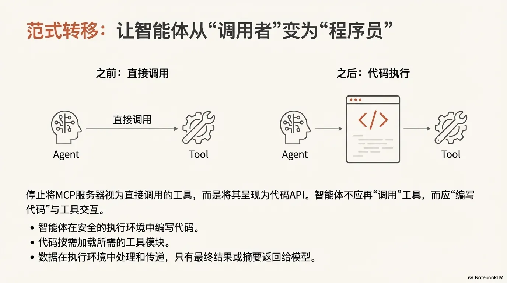
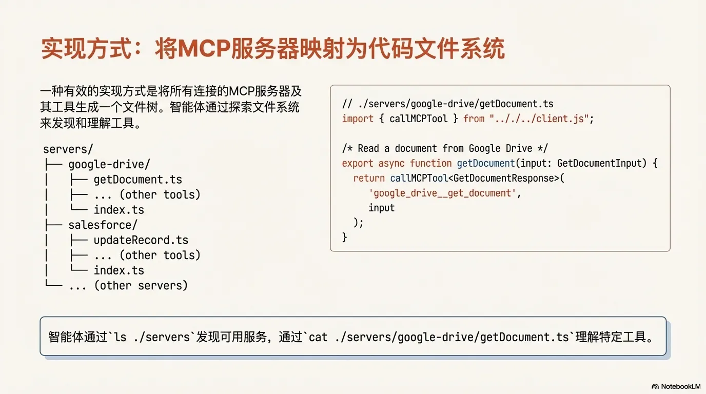
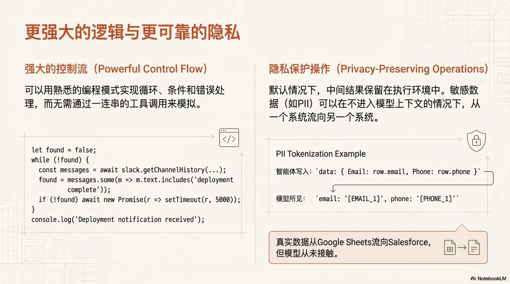
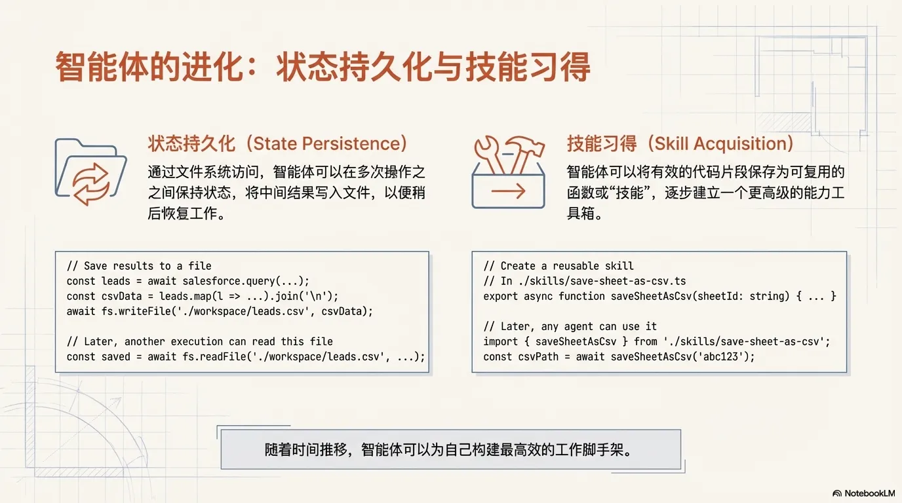
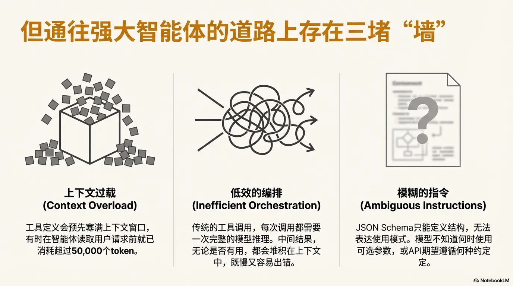
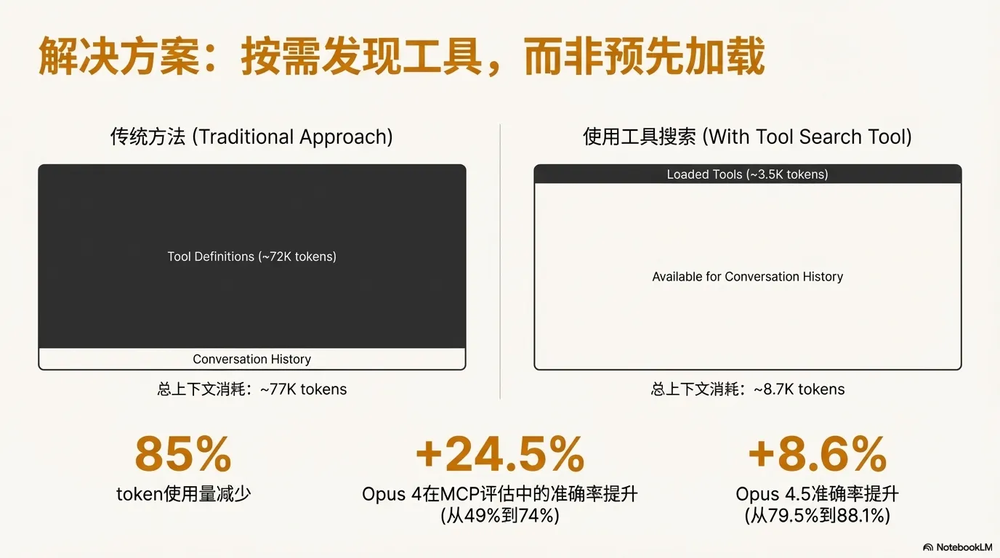
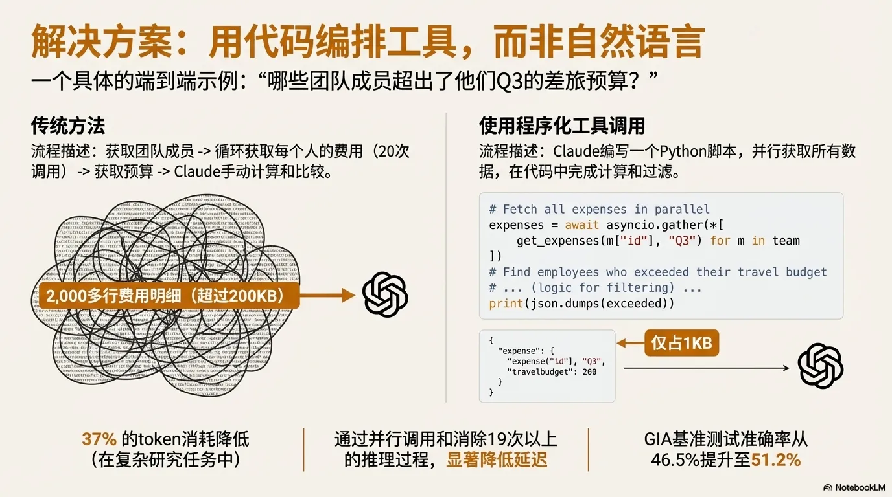
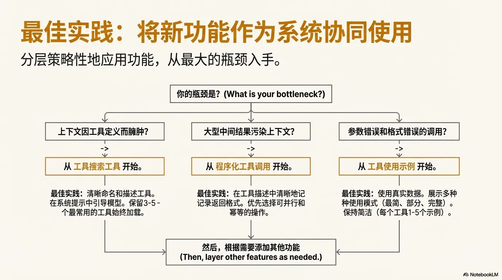

## <font style="color:rgb(27, 28, 29);">从传统模式（Function Calling）切换到代模式(Programmatic Tool Calling)</font>

### 背景

传统的模型上下文协议（MCP）直连方式之所以效率低下，主要源于两个核心瓶颈：


• 工具定义过载：在传统模式下，智能体需要一次性将所有可用工具的详细定义都加载到上下文中。这意味着，即使你的任务只需要用到一个Google
Drive的功能，像`gdrive.getDocument`和`salesforce.updateRecord`等成百上千个工具的完整描述、参数和返回值定义，都必须全部塞进模型的“大脑”里，造成巨大的上下文开销。

• 中间结果冗余：当智能体执行一个多步骤任务时，问题会变得更严重。例如，“从Google
Drive下载会议纪要，并将其附加到Salesforce的销售线索中”。在这个过程中，完整的会议纪要内容不仅要从`gdrive`
工具调用中返回到模型上下文，还要在接下来的`salesforce`
工具调用中被模型完整地再次写入上下文。这意味着，一个2小时的销售会议就可能要处理额外的50,000个token，这些数据在上下文中来回传递，不仅成本高昂，还可能超出模型的上下文长度限制，导致任务失败。

### 概述


#### <font style="color:rgb(27, 28, 29);">1. 传统模式 (Traditional MCP)</font>

这代表了目前最常见的“函数调用” (Function Calling) 流程。LLM 并不真正“运行”任何东西，它只是“选择”一个工具。

流程分解：

1. MCP server (提供工具的定义) → Agent
   - 含义： 代理首先向服务器请求可用的工具列表及其“说明书”（tool def: 包括功能、名称、所需参数等）。
2. Agent → LLM  (提供匹配工具的“功能”)
   - 含义： 代理将这些“说明书”交给 LLM，让 LLM“阅读”并理解它能使用哪些工具。
3. LLM → Agent  (输出特殊文本可以被解析为函数调用)
   - 含义： 这是关键一步。当代理需要完成一个任务时（例如，用户说“查询今天的天气”），LLM 不会自己去查，而是会输出一个结构化的文本（比如
   JSON 格式），告诉代理：“请帮我调用‘查询天气’这个工具，参数是‘今天’”。
4. Agent → MCP server (4. 调用 MCP 工具)
    - 含义： 代理收到 LLM 的“指令”后，它会真正执行这个 API 调用，去服务器上查询天气。

总结： 在传统模式下，LLM 像一个“指挥者”。它只负责“说”要用哪个工具，而代理是那个“执行者”，负责实际去调用。

#### 2. 代码模式 (Code Mode)

这是一种更先进、更灵活的模式。LLM 不再只是“选择”工具，而是“编写代码”来使用工具。现在被叫做PTC（Programmatic tool calling）

**流程分解：**

1. MCP server (提供工具定义) → Agent
    - 含义： 与传统模式相同，代理获取工具的“说明书”。
2. Agent → LLM (提供匹配工具的 TypeScript API)
    - 含义： 代理向 LLM 提供的不再是简单的功能描述，而是一个完整的 API 库（比如TypeScript 格式）。这就像给了 LLM
      一个“软件开发工具包” (SDK)。
3. LLM → Agent (编写代码以调用 API)
    - 含义： 这是最大的区别。LLM 现在会生成一段真正的可执行代码（比如 TypeScript 代码）。这段代码可能包含更复杂的逻辑，比如“先调用工具
      A，如果结果是 X，就再调用工具 B，否则调用工具 C”。
4. Agent → 动态隔离沙盒 (在沙盒中执行代码)
    - 含义： 因为 LLM 生成的代码可能不安全（有 bug
      或恶意代码），代理不能在主系统中直接运行它。它会将这段代码放进一个“动态隔离沙盒” (Dynamic Isolate Sandbox)
      中。沙盒是一个安全、受控的环境。
5. 沙盒 → Agent  (调用代理提供的 RPC 绑定)
    - 含义： 沙盒中运行的代码需要一种方式来“接触”到外部的 MCP 服务器。它通过调用代理事先定义好的“RPC 绑定”（一种通信机制）来发出请求。
6. Agent → MCP server (调用 MCP 工具)
    - 含义： 代理收到来自沙盒的 RPC 请求后，最终由代理来执行对服务器的实际工具调用。

总结： 在代码模式下，LLM 像一个**“程序员”**。它编写一个“小程序”来完成任务。代理则像一个**“系统监工”**
，负责在安全的环境（沙盒）中运行这个小程序，并帮它连接到外部世界。

### 核心转变

解决方案的核心思想是进行一次根本性的转变：让AI智能体不再直接调用工具，而是编写代码来与MCP服务器交互。



这个逻辑很简单，却异常强大。智能体不再是被动地接收所有工具定义，而是像一个真正的程序员一样，可以根据任务需求，只`import`
它需要的特定工具函数。更关键的是，所有庞大的数据处理（比如筛选、转换）都在代码执行环境中完成，模型只需要接收和处理最终的关键结果，而不是原始的、未经处理的庞大数据。

这种模式的威力有多大？数据显示，通过这种方式，一个复杂任务的token消耗可以从惊人的150,000个锐减到仅仅2,000个，节省了98.7%的时间和成本。

正如Cloudflare等公司的发现，这个解决方案的核心洞察是相同的：大型语言模型（LLM）天生就擅长编写代码，我们应该充分利用这一优势来构建更高效、更强大的AI智能体。



### 五个令人惊喜的收获

这种“代码执行”模式不仅解决了效率问题，还带来了一系列深刻的、结构性的优势。

#### 渐进式披露：让AI按需“学习”工具，而不是一次性“死记硬背”


在这种模式下，所有可用的工具都像一个代码库一样，存放在文件系统中。AI智能体可以通过浏览文件目录，或者使用一个专门的
`search_tools`工具，来动态地发现和加载当前任务真正需要的工具定义。这彻底避免了将成百上千个工具定义全部预加载到上下文中的巨大浪费，让智能体变得更加轻盈和专注。

#### 上下文高效的结果：只给AI看关键信息，而不是原始数据

想象一下，智能体需要处理一个包含10,000行数据的电子表格。在传统模式下，这10,000行数据会全部涌入模型上下文。而在代码执行模式下，智能体可以在执行环境中获取整个表格，用几行代码将其筛选出任务所需的5行关键数据，然后只将这5行简洁的结果返回给模型进行下一步决策。这不仅极大地节省了成本，还避免了模型在处理海量数据时出错或超出上下文长度限制的风险。

#### 更强大的控制流：让AI用代码逻辑取代繁琐的反复调用

复杂的任务逻辑，如循环和条件判断，现在可以用高效的代码来实现了。例如，智能体需要监控一个Slack频道，直到收到“部署完成”的消息。它不再需要与模型进行多次低效的来回通信（“检查一下 >
没收到 > 等5秒 > 再检查一下”），而是可以生成一段简单的`while`循环代码，在执行环境中快速完成这个轮询任务。此外，这种方式还能显著降低“首个token生成时间”（time
to first token）的延迟。复杂的逻辑判断（如if-else树）被交给了高效的代码执行环境，而无需等待模型进行缓慢且昂贵的推理评估。

#### 隐私保护：敏感数据在“安全区”流动，模型“非请勿视”



这是一个至关重要的优势。由于中间数据默认停留在代码执行环境中，它们不会进入模型的上下文。这意味着，你可以让数据（例如客户列表）从一个工具（Google
Drive）流向另一个工具（Salesforce），而模型本身完全接触不到这些原始数据。更进一步，系统可以自动对PII（个人身份信息）进行“脱敏”处理，模型看到的只是
`[EMAIL_1]`、`[PHONE_1]`这样的占位符，而真实的数据在工具之间安全流动。你甚至可以利用这一点来定义确定性的安全规则，精确控制数据的流向，从而实现主动的、基于规则的数据治理。

#### 状态持久化与技能沉淀：让AI拥有“记忆”和可复用的“工具箱”



代码执行模式赋予了智能体“记忆”的能力。它可以将中间结果（如`leads.csv`
）写入文件系统，以便在任务中断后能够从断点处恢复。更令人兴奋的是，智能体可以将一段成功解决特定问题的代码保存为一个可复用的函数或“技能”（Skill），例如
`saveSheetAsCsv.ts`。为了让这些技能更加结构化和易于发现，一个最佳实践是在这些函数旁添加一个`SKILL.md`
文件进行说明。随着时间的推移，智能体不再只是一个一次性的任务执行者，而是能够不断积累经验、沉淀能力，并最终构建起一个强大、个性化的高级能力库。

### 沙盒环境

当然，这种方法并非没有代价。运行由AI生成的代码需要一个安全的沙盒执行环境，以防止潜在的安全风险，并需要设置资源限制和监控。这带来了额外的基础设施开销和安全方面的考虑，是开发者在选择这种架构时需要权衡的因素。

### 小结

从“直接调用工具”到“编写代码执行”，其本质是将那些经过时间考验的成熟模式——如代码复用、模块化、状态管理和数据本地化处理——应用到了新兴的AI智能体领域。这不仅是一次技术上的优化，更是一次思想上的升级，它为构建更高效、更强大、更安全的AI系统指明了方向。

<font style="color:rgb(199, 199, 199);background-color:rgb(34, 38, 43);"></font>

## 工具的高级使用



### 工具搜索工具（Tool Search Tool）：突破上下文窗口限制，实现大规模工具动态发现



#### 剖析核心挑战：日益增长的工具库与有限的上下文

当 AI 代理需要与大量工具交互时，其上下文窗口会迅速被工具定义所占据。这不仅带来了高昂的 Token 成本，也限制了模型处理实际任务的能力。

• 高昂的 Token 开销：以一个典型的五服务器配置为例（GitHub, Slack, Sentry, Grafana, Splunk），其工具定义就可能消耗约 55,000
Token。如果再加入 Jira（约 17,000 Token），总开销将迅速超过 100,000 Token。在 Anthropic 的内部实践中，我们曾观察到未经优化的工具定义消耗了高达
134,000 Token 的上下文。

• 调用准确性下降：Token 成本并非唯一的问题。当模型面对一个庞大的工具列表时，最常见的失败源于错误的工具选择和错误的参数值，尤其是在工具名称相似（例如
`notification-send-user` 与 `notification-send-channel`）的情况下，这种混淆更为普遍。

#### 阐述解决方案与技术优势：按需加载与精准调用

工具搜索工具通过“按需发现”机制，彻底改变了工具的加载方式。Claude
不再需要在对话开始前加载所有工具的定义，而是在需要执行特定任务时，动态地搜索并仅加载最相关的工具。这种方法的优势是显而易见的：

更重要的是，这种上下文的精简直接转化为模型准确率的显著提升。在Claude的内部 MCP 评估中，当处理大型工具库时，启用工具搜索工具带来了惊人的效果：

• Opus 4 的准确率从 49% 提升至 74%。

• Opus 4.5 的准确率从 79.5% 提升至 88.1%。

#### 解析实现原理

该功能的实现机制既简单又强大。您只需在提供给 API 的工具定义中，通过设置 `defer_loading: true` 来标记那些可以被按需发现的工具。

其工作流程如下：

1. 在初始阶段，Claude 的上下文中只包含核心工具（`defer_loading: false`）以及工具搜索工具本身。

2. 当 Claude 需要执行一项特定能力时（例如，与 GitHub 交互），它会调用工具搜索功能。

3. 工具搜索工具返回匹配工具的引用（例如，`github.createPullRequest` 和 `github.listIssues`）。

4. 随后，系统仅将这些被引用的工具的完整定义加载到 Claude 的上下文中，供其调用。

**提示词缓存说明**： 此方法不会破坏提示词缓存（prompt caching）。因为被延迟加载的工具从一开始就被完全排除在初始提示词之外。它们仅在
Claude 搜索之后才被添加到上下文中，因此系统提示和核心工具定义仍然是可缓存的。

**实现代码示例：**

为单个工具启用延迟加载：

```bash
{
  "tools": [
    // Include a tool search tool (regex, BM25, or custom)
    {"type": "tool_search_tool_regex_20251119", "name": "tool_search_tool_regex"},
    // Mark tools for on-demand discovery
    {
      "name": "github.createPullRequest",
      "description": "Create a pull request",
      "input_schema": {...},
      "defer_loading": true
    }
    // ... hundreds more deferred tools with defer_loading: true
  ]
}
```

<font style="color:rgb(199, 199, 199);background-color:rgb(34, 38, 43);">  
</font>为整个 MCP 服务器启用延迟加载，同时保留个别高频工具：

```bash
{
  "type": "mcp_toolset",
  "mcp_server_name": "google-drive",
  "default_config": {"defer_loading": true}, # defer loading the entire server
  "configs": {
    "search_files": {
      "defer_loading": false // Keep most used tool loaded
    }
  }
}
```

#### 提供最佳实践与适用场景

启用工具搜索工具需要在“上下文节省”与“额外搜索延迟”之间进行权衡。

• 适用场景

    ◦ 工具定义消耗超过 10,000 Token。

    ◦ 在工具选择方面遇到准确性问题。

    ◦ 构建连接了多个服务器的 MCP 系统。

    ◦ 可用的工具数量超过 10 个。  

• 不适用场景

    ◦ 工具库很小（少于 10 个工具）。

    ◦ 在每次会话中，所有工具都会被频繁使用。

    ◦ 工具定义本身非常紧凑。

### 程序化工具调用（Programmatic Tool Calling）：实现高效、可控的复杂工作流



程序化工具调用（Programmatic Tool Calling, PTC）是提升工作流效率与控制力的关键方案。它使 Claude
的能力从简单的顺序化工具调用，跃升至基于代码的复杂编排。这一转变对于处理海量数据、执行多步依赖任务以及实现并行操作至关重要。

#### 剖析核心挑战：上下文污染与高昂的推理开销

传统的“一次调用-一次推理”模式在处理复杂工作流时，会暴露两个根本性问题：

• 中间结果造成的上下文污染：想象一下，当 Claude 需要分析一个 10MB
的日志文件以查找错误模式时，整个文件内容都会进入其上下文窗口，而模型真正需要的可能只是错误频率的摘要。同样，在跨多个数据库表获取客户数据时，每一条记录都会累积在上下文中，这些海量的中间结果不仅会消耗宝贵的
Token 预算，甚至可能将重要的指令完全挤出上下文窗口。

•
高昂的推理开销与低效的结果综合：在传统模式下，每一次工具调用都意味着一次完整的模型推理。模型接收到结果后，必须通过自然语言处理的方式来“审视”数据，提取关键信息，并推理下一步的行动。一个包含五个工具的工作流，就意味着至少五次独立的模型推理过程，这一过程既缓慢又容易出错。

#### 阐述解决方案与技术优势：代码即编排

程序化工具调用允许 Claude 直接编写 Python 代码来编排整个工具调用流程，这正是发挥了 Claude
擅长编写代码的核心优势。模型不再逐个请求工具，而是生成一个脚本，该脚本可以调用多个工具、处理它们的输出，并精确控制最终哪些信息需要返回给模型进行推理。

**深度案例分析：预算合规性检查**

假设一个常见的业务需求：“找出第三季度差旅预算超标的团队成员”。我们有三个可用工具：

• `get_team_members(department)`: 获取团队成员列表。

• `get_expenses(user_id, quarter)`: 获取用户的费用明细。

• `get_budget_by_level(level)`: 获取不同职级的预算标准。

传统方法将涉及多次 API 往返和海量的上下文消耗。而通过程序化调用，Claude 会生成如下的 Python 编排脚本：

```python
team = await get_team_members("engineering")

# 为每个唯一的职级获取预算
levels = list(set(m["level"] for m in team))
budget_results = await asyncio.gather(*[
    get_budget_by_level(level) for level in levels
])
# 创建一个预算查找字典
budgets = {level: budget for level, budget in zip(levels, budget_results)}

# 并行获取所有成员的费用
expenses = await asyncio.gather(*[
    get_expenses(m["id"], "Q3") for m in team
])

# 查找超出差旅预算的员工
exceeded = []
for member, exp in zip(team, expenses):
    budget = budgets[member["level"]]
    total = sum(e["amount"] for e in exp)
    if total > budget["travel_limit"]:
        exceeded.append({
            "name": member["name"],
            "spent": total,
            "limit": budget["travel_limit"]
        })

print(json.dumps(exceeded))
```

在这个流程中，数千条原始费用明细在代码执行环境中被处理，最终将 200KB 的原始费用数据锐减至仅 1KB 的结果进入 Claude
上下文。这种方法的优势是巨大的：

• Token 节省：通过将中间结果隔离在上下文之外，PTC 显著降低了 Token 消耗。在复杂的研报任务中，平均 Token 使用量从 43,588 下降至
27,297，降幅高达 37%。

• 延迟降低：当 Claude 在一个代码块中编排 20 多个工具调用时，可以消除超过 19 次独立的模型推理过程，从而大幅降低了端到端延迟。

• 准确性提升：通过编写显式的编排逻辑，Claude 在处理复杂依赖关系时比在自然语言中进行推理更不容易出错。内部知识检索任务的准确率从
25.6% 提升至 28.5%；GIA 基准测试的准确率从 46.5% 提升至 51.2%。

#### 解析实现原理

程序化工具调用的实现遵循以下四个步骤：

1. 标记工具为代码可调用 您需要在工具定义中加入 `allowed_callers` 字段，明确允许代码执行环境调用此工具。

2. Claude 编写编排代码 模型不再生成单个 `tool_use` 请求，而是生成一个包含 Python 代码的 `code_execution` 请求。

3. 工具在隔离环境中执行 当代码调用一个工具时（如 `get_expenses()`），您的应用会收到一个带有 `caller`
   字段的工具请求。您返回结果后，该结果会被代码执行环境处理，而不会直接进入 Claude 的上下文。

4. 仅最终输出进入上下文 只有当整个代码块执行完毕后，其最终的输出（例如 `stdout`）才会被作为结果返回给 Claude。

#### 提供最佳实践与适用场景

程序化工具调用为工作流增加了一个代码执行步骤，这种额外的开销在特定场景下能带来巨大的回报。

• 最适用场景

    ◦ 处理大型数据集，而模型仅需其聚合或摘要结果。

    ◦ 运行包含三个或更多相互依赖的工具调用的多步工作流。

    ◦ 在 Claude 看到结果之前，需要对工具结果进行过滤、排序或转换。

    ◦ 执行并行操作，例如同时检查 50 个端点的状态。

• 不太适用场景

    ◦ 简单的单工具调用。

    ◦ 任务要求 Claude 必须看到并推理所有中间结果。

    ◦ 执行响应体积很小的快速查找操作。

在确保了工具执行的效率后，我们还需要解决工具调用的正确性问题，这正是下一个功能所要解决的核心挑战。

### 工具使用示例（Tool Use Examples）：通过范例提升参数调用的准确性

工具使用示例功能的战略价值在于解决工具使用的“最后一公里”问题。它确保了工具调用不仅在结构上有效（符合 JSON
Schema），更在语义和约定上正确无误，从而大幅提升系统的可靠性。


#### 剖析核心挑战：JSON Schema 的表达局限性

JSON Schema 在定义结构化数据方面表现出色，但它对于语义正确性和惯用法的表达却是沉默的。这种沉默会造成一个巨大的可靠性缺口，因为
Schema 无法捕捉那些微妙的、约定俗成的用法模式。以一个用于创建支持工单的 `create_ticket` API 为例，仅凭 Schema 会留下许多模糊之处：

• 格式模糊性：`due_date` 字段应该使用 `"2024-11-06"`，`"Nov 6, 2024"`，还是 `"2024-11-06T00:00:00Z"`？

• ID 约定：`reporter.id` 的格式是 UUID，`"USR-12345"`，还是纯数字 `"12345"`？

• 嵌套结构用法：在何种情况下应该填充可选的 `reporter.contact` 对象？

• 参数关联性：`escalation`（紧急上报）对象的等级与工单的 `priority`（优先级）之间存在何种关联？

这些模糊性常常导致格式错误的工具调用和不一致的参数使用。

阐述解决方案与技术优势：展示而非告知

工具使用示例通过 `input_examples` 字段，允许您在工具定义中直接提供具体的用例，从而“展示”给 Claude 正确的使用方式，而不是仅仅“告知”其结构。

```plain
{
  "name": "create_ticket",
  "input_schema": { /* ... schema ... */ },
  "input_examples": [
    {
      "title": "Login page returns 500 error",
      "priority": "critical",
      "labels": ["bug", "authentication", "production"],
      "reporter": {
        "id": "USR-12345",
        "name": "Jane Smith",
        "contact": { "email": "jane@acme.com", "phone": "+1-555-0123" }
      },
      "due_date": "2024-11-06",
      "escalation": { "level": 2, "notify_manager": true, "sla_hours": 4 }
    },
    {
      "title": "Add dark mode support",
      "labels": ["feature-request", "ui"],
      "reporter": { "id": "USR-67890", "name": "Alex Chen" }
    },
    {
      "title": "Update API documentation"
    }
  ]
}
```

通过这三个简单的示例，Claude 能够学习到：

• 格式约定：日期使用 `YYYY-MM-DD` 格式，用户 ID 遵循 `USR-XXXXX` 模式，标签使用短横线分隔（kebab-case）。

• 嵌套结构模式：如何构建 `reporter` 对象及其嵌套的 `contact` 子对象。

• 可选参数关联性：“critical”级别的错误报告会包含完整的联系信息和紧急上报详情；功能请求则只包含报告人信息；而内部任务可能只需要一个标题。

#### 提供最佳实践与适用场景

提供工具使用示例会增加工具定义的 Token 成本，因此应在准确性提升带来的价值超过额外成本时使用。

• 最适用场景

    ◦ 工具包含复杂的嵌套结构，仅靠 Schema 无法保证正确用法。

    ◦ 工具拥有许多可选参数，且其组合模式非常重要。

    ◦ API 遵循特定的领域惯例（例如 ID 格式、命名约定）。

    ◦ 存在功能相似的工具，需要通过示例来澄清其使用场景的差异。

• 不太适用场景

    ◦ 参数简单、用法明确的工具。

    ◦ 使用 Claude 已经熟知的标准格式（如 URL、Email）。

    ◦ 可以通过 JSON Schema 约束本身解决的验证问题。

### 综合应用与最佳实践

  
虽然工具搜索、程序化工具调用和工具使用示例各自解决了特定的瓶颈，但它们的真正威力在于被战略性地组合使用，以构建出一个既稳健、可扩展，又精确的
AI 代理。

#### 实施策略：战略性地分层应用功能

我们的核心原则是：从最大的瓶颈入手。根据您在开发过程中遇到的具体挑战，选择最合适的工具来解决它。

• `上下文因工具定义而膨胀 → 工具搜索工具 (Tool Search Tool)`

• `大型中间结果污染上下文 → 程序化工具调用 (Programmatic Tool Calling)`

• `参数错误和格式错误的调用 → 工具使用示例 (Tool Use Examples)`

这种专注的方法能让您优先解决限制代理性能的关键问题。这些功能是互补的，您可以根据需求分层应用。例如，先用工具搜索工具解决发现问题，再用程序化工具调用优化执行效率，最后用工具使用示例确保调用的准确性。

#### 配置指南：优化工具的发现、执行与准确性

为了最大化每个功能的效果，请遵循以下配置最佳实践：

**配置工具搜索以实现更佳发现**

• 确保工具描述清晰且功能明确：工具搜索功能依赖于工具的名称和描述。必须确保它们具有足够的描述性，能够准确反映工具的功能。

• 提供系统提示引导：在系统提示中告知 Claude 可用的工具类别（如“你有用于 Slack 消息、Google Drive 文件管理和 Jira
工单追踪的工具”），以引导它使用工具搜索来发现具体能力。

• 平衡即时与按需加载：将三到五个最常用的工具设置为始终加载 (`defer_loading: false`)
，而将其余工具设置为延迟加载。这在保证核心操作的即时可用性与大规模工具的可发现性之间取得了最佳平衡。

**配置程序化工具调用以实现正确执行**

• 清晰地文档化返回格式：由于 Claude 需要编写代码来解析工具的输出，因此在工具的描述中清晰地说明返回数据的结构至关重要。

• 优先选择可并行的工具：那些可以独立执行、互不依赖的操作是程序化工具调用的理想候选者，因为它们可以被并行处理以显著提高效率。

**配置工具使用示例以确保参数准确性**

• 必须使用真实数据：示例中的数据应尽可能贴近真实世界（例如，使用真实的城市名而非“string”），这能帮助模型更好地理解上下文和格式约定。

• 展示多样性：提供覆盖不同场景的示例，包括最简参数、部分参数和完整参数的调用模式。

• 保持简洁：每个工具提供 1-5 个高质量的示例即可，重点应放在那些仅凭 Schema 难以理解的模糊之处。

### 小结：赋能下一代 AI 代理

工具搜索、程序化工具调用和工具使用示例这三项功能的推出，标志着 Claude 的工具使用能力从简单的函数调用，向着智能、动态的编排能力发生了根本性的转变。正如我们在引言中设想的
IDE 助手和运营协调员，随着 AI 代理需要处理日益复杂、横跨数十种工具和海量数据集的工作流，动态的工具发现、高效的执行流程和可靠的参数调用已不再是可选项，而是其能力的核心基石。

## 资料

anthropic-代码驱动的MCP：

[https://www.anthropic.com/engineering/code-execution-with-mcp](https://www.anthropic.com/engineering/code-execution-with-mcp)

在 Claude 开发者平台上引入高级工具的使用：

[https://www.anthropic.com/engineering/advanced-tool-use](https://www.anthropic.com/engineering/advanced-tool-use)<font style="color:rgb(199, 199, 199);background-color:rgb(34, 38, 43);">  
</font>

<font style="color:rgb(199, 199, 199);background-color:rgb(34, 38, 43);">  

</font>

