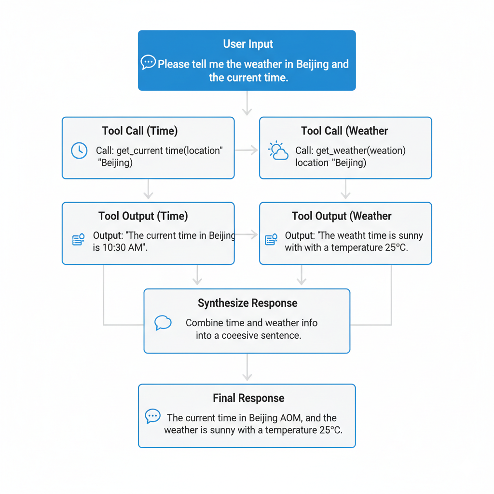
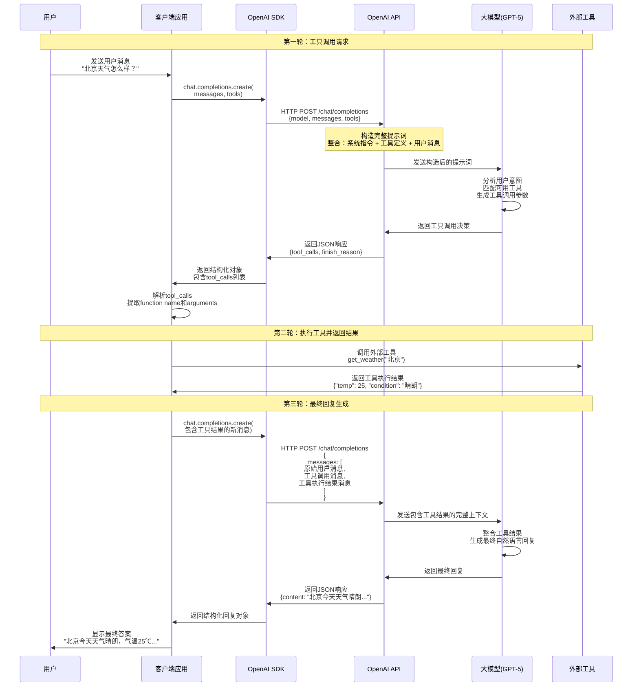
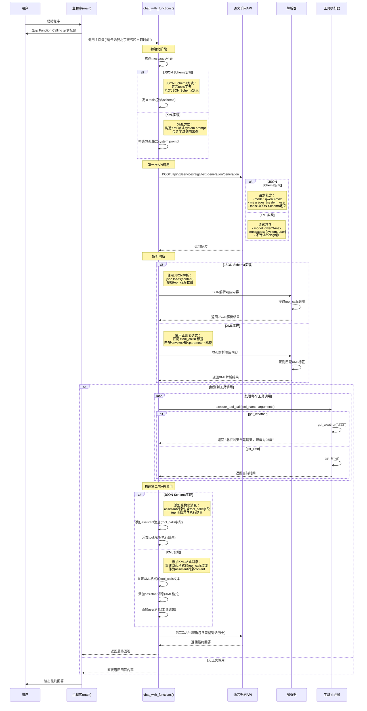
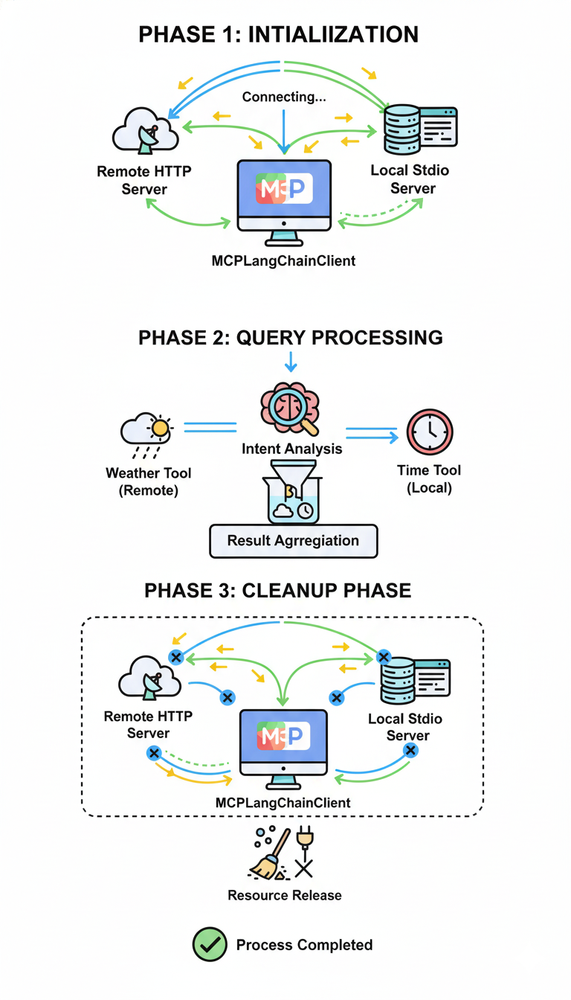
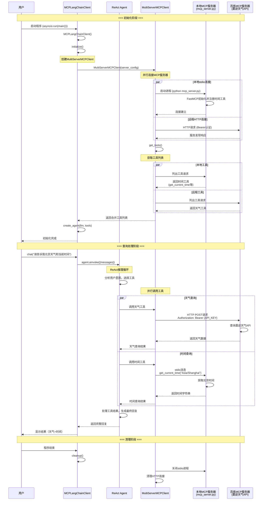

## 背景
AI Agent（智能体）是基于 LLM（大语言模型）构建的智能系统，能够自主理解人类的自然语言指令，感知环境状态，决策并采取行动。

智能体的核心要素包括：记忆、工具、知识与规划。


更多关于智能体原理的内容，可参考 GitHub 笔记：[https://github.com/BaqiF2/ydc_ai_dev/blob/main/knowledge/Base-Agent.md](https://github.com/BaqiF2/ydc_ai_dev/blob/main/knowledge/Base-Agent.md)


本文主要围绕智能体要素之一的工具，从以下三个方向展开说明：

1. Function Calling（框架调用）：使用 OpenAI 提供的 Function Calling 格式进行工具调用
2. 原理层（提示词）：使用 JSON Schema 与 XML 实现工具调用，适用于调用准确率较低时的优化场景
3. MCP（Model Context Protocol）：通过 MCP Server 封装多个工具，结合 MCP 平台实现工具调用


## Function calling（框架调用）
### 概述
Function Calling 是 AI 模型的关键能力，使大语言模型能够根据用户请求，智能识别并调用外部工具或 API 接口。它如同模型的“手”，将语言理解转化为实际行动——无论是查询天气、计算数据，还是操作软件，都能通过结构化输出实现与真实世界的交互。这一技术极大拓展了 AI 的应用边界，让智能助手真正成为高效的数字生产力伙伴。



### 交互流程说明
使用 SDK 调用 OpenAI 模型并希望模型调用工具时，通常遵循以下流程：




  
注：此处的“客户端”是相对于模型提供商而言，并非指应用本身的客户端/服务端结构。


#### 第一阶段：工具调用决策
1. **用户输入（客户端）** → 客户端接收消息
2. **SDK 封装（客户端）** → 将 tools 参数格式化为 API 请求
3. **API 层提示词构造（服务商）** → 自动整合工具描述到系统上下文中
4. **模型推理（服务商）** → 分析用户意图，决定调用工具并生成参数

#### 第二阶段：工具执行
5. **客户端解析（客户端）** → 提取工具名称和参数
6. **调用外部工具（客户端）** → 执行实际的业务逻辑（如查询天气 API）
7. **获取工具结果（客户端）** → 接收工具返回的数据

```json
{
  "model": "gpt-4",
  "messages": [{"role": "user", "content": "北京天气怎么样？"}],
  "tools": [{
    "type": "function",
    "function": {
      "name": "get_weather",
      "parameters": {"location": "string"}
    }
  }]
}
```

```json
{
  "tool_calls": [{
    "id": "call_123",
    "function": {
      "name": "get_weather", 
      "arguments": "{\"location\": \"北京\"}"
    }
  }]
}
```

#### 第三阶段：结果整合
8. **传递工具结果（客户端）** → 将执行结果以 `tool` 角色消息传回
9. **模型最终推理（服务商）** → 基于工具结果生成自然语言回复
10. **返回最终答案（服务商）** → 用户获得包含工具数据的智能回复

```json
{
  "messages": [
    {"role": "user", "content": "北京天气怎么样？"},
    {"role": "assistant", "tool_calls": [...]},
    {"role": "assistant", "tool_call_id": "call_123", "content": "北京今天天气晴朗，气温25℃..."}
  ]
}
```

```python
{
  "messages": [
    {"role": "assistant", "tool_call_id": "call_123", "content": "北京今天天气晴朗，气温25℃..."}
  ]
}
```

### 代码实践
```python
llm = ChatOpenAI(api_key=os.getenv("DASHSCOPE_API_KEY"),
                 base_url="https://dashscope.aliyuncs.com/compatible-mode/v1",
                 model="qwen3-max")

@tool
def get_weather(city: str) -> str:
    """获取指定城市的天气信息"""
    return f"{city}的天气是晴天，温度为25度。"

@tool
def get_time() -> str:
    """获取当前时间"""
    from datetime import datetime
    return datetime.now().strftime("%Y-%m-%d %H:%M:%S")

# 绑定多个工具到LLM
tool_llm = llm.bind_tools(tools=[get_weather, get_time])

message_history = [{"role":"user", "content":"请告诉我北京天气和当前时间"}]

print("\n=== 测试多个工具调用 ===")
multi_response = tool_llm.invoke(message_history)
print(f'内容: {multi_response.content}')
print(f'工具调用: {multi_response.tool_calls}')


```

```python
print("\n=== 工具调用结果处理 ===")
if multi_response.tool_calls:
    for tool_call in multi_response.tool_calls:
        print(f"工具名称: {tool_call['name']}")
        print(f"参数: {tool_call['args']}")
        # 实际项目中这里会执行工具函数
        if tool_call['name'] == 'get_weather':
            # 调用基础函数
            result = get_weather.invoke(tool_call['args']['city'])
            print(f"执行结果: {result}")
            message_history.append({"role": "tool", "content": result, "tool_call_id": tool_call['id']})
        elif tool_call['name'] == 'get_time':
            # 调用基础函数
            result = get_time.invoke(None)
            print(f"执行结果: {result}")
            message_history.append({"role": "tool", "content": result, "tool_call_id": tool_call['id']})


final_result = tool_llm.invoke(message_history)

print(f"最终结果: {final_result.content}")
```

#### 输出示例：
```python
=== 测试多个工具调用 ===
内容: 
工具调用: [{'name': 'get_weather', 'args': {'city': '北京'}, 'id': 'call_2f7397098f7648f18bf3ff95', 'type': 'tool_call'}, {'name': 'get_time', 'args': {}, 'id': 'call_c49f888c34814863928c1506', 'type': 'tool_call'}]

=== LangChain 1.0新特性 - content_blocks ===
内容块: [{'type': 'tool_call', 'name': 'get_weather', 'args': {'city': '北京'}, 'id': 'call_2f7397098f7648f18bf3ff95'}, {'type': 'tool_call', 'name': 'get_time', 'args': {}, 'id': 'call_c49f888c34814863928c1506'}]

=== 工具调用结果处理 ===
工具名称: get_weather
参数: {'city': '北京'}
执行结果: 北京的天气是晴天，温度为25度。
工具名称: get_time
参数: {}
执行结果: 2025-10-30 21:28:42
最终结果: 北京当前天气是晴天，温度为25度。当前时间为2025年10月30日21点28分42秒。
```

### 总结
本示例完整展示了工具调用的流程：借助框架封装的 SDK 调用 LLM，LLM 返回需调用的工具及其参数；客户端执行工具后获得结果，并将历史上下文再次发送给 LLM，最终由 LLM 生成包含工具执行结果的回复。


备注：本示例还使用了 LangChain 1.0 的新特性 content_blocks 来输出文本块内容。

## json schema + xml（提示词+原理）


### 概述
通过 JSON Schema 或 XML 定义工具的参数规范，结合提示词描述任务目标与调用逻辑，可精准引导 LLM 进行工具调用。其原理是：JSON Schema/XML 提供结构化的任务上下文，确保输出标准化，LLM 据此生成符合要求的参数，最终通过解析器执行外部工具调用。该方法显著提升了工具调用的准确性与可控性。

### 交互流程说明


#### 第一阶段： 初始化阶段
+ **用户提问**: 触发整个工具调用流程
+ **系统提示词**: 定义AI角色、可用工具和调用格式
+ **工具定义**: 使用JSON Schema描述工具接口

#### 第二阶段： 第一次API调用 (决策阶段)
+ **请求构造**: 包含消息历史和工具定义
+ **LLM分析**: 判断是否需要调用工具以及调用哪些工具
+ **返回决策**: 以JSON格式返回工具调用计划

#### 第三阶段：工具解析与执行阶段
+ **双重解析**: 优先JSON解析，降级到原生tool_calls
+ **并发执行**: 依次或并发执行多个工具调用
+ **结果收集**: 存储每个工具的执行结果和ID

#### 第四阶段： 消息历史构建
+ **格式标准化**: 按照OpenAI格式构建多轮消息
+ **角色分配**: assistant(工具调用) + tool(执行结果)
+ **ID关联**: 通过tool_call_id关联调用和结果

#### 第五阶段. 第二次API调用 (生成阶段)
+ **完整上下文**: 包含原始问题、工具调用、工具结果
+ **最终推理**: LLM基于所有信息生成最终回答
+ **答案返回**: 综合工具结果的完整回答


### 代码实践
```python
# 构造提示词
system_prompt = f"""
你是一个专业的人工智能助手，你会根据用户的问题来解答。你可以借助工具来辅助你生成答案。

工具定义：
1. get_weather: 获取指定城市的天气信息，参数：city (string, required) - 城市名称
2. get_time: 获取当前时间，无需参数

请根据用户的问题，选择合适的工具来调用。如果你需要调用工具，请按照以下JSON格式返回：

{{
    "tool_calls": [
        {{
            "name": "工具名称",
            "arguments": {{"参数名": "参数值"}}
        }}
    ]
}}

如果不需要调用工具，请直接回答用户问题。
"""

# ....

# 请求模型厂商
def call_qwen_api(messages: list, tools: dict = None) -> dict:
    """调用通义千问API"""
    # ...省略

    # 如果有工具定义，添加到请求中
    if tools:
        data["input"]["tools"] = [{
            "type": "function",
            "function": {
                "name": tool_name,
                "description": tool_desc,
                "parameters": tool_schema
            }
        } for tool_name, (tool_desc, tool_schema) in tools.items()]

        response = requests.post(url, headers=headers, json=data)
    # ...省略

    # 解析json, 调用工具
    try:
        message = response["output"]["choices"][0]["message"]
        content = message.get("content", "")

        try:
            content_dict = json.loads(content)
            tool_calls = content_dict.get("tool_calls", [])
        except json.JSONDecodeError:
             print(f"解析响应失败: {content}")
             tool_calls = message.get("tool_calls", [])

        print(f"第一次返回调用结果: {content}")        
        # 如果有工具调用
        if tool_calls:
            print("\n=== 工具调用 ===")
    # 省略工具调用和再次发起....

```

```python
# 构造XML格式的提示词
system_prompt = """
你是一个专业的人工智能助手，你会根据用户的问题来解答。你可以借助工具来辅助你生成答案。

工具定义：
1. get_weather: 获取指定城市的天气信息，参数：city (string, required) - 城市名称
2. get_time: 获取当前时间，无需参数

请根据用户的问题，选择合适的工具来调用。如果你需要调用工具，请按照以下XML格式返回：

<tool_calls>
    <invoke name="工具名称">
        <parameter name="参数名">参数值</parameter>
        <parameter name="参数名">参数值</parameter>
    </invoke>
    <invoke name="另一个工具名称">
        <parameter name="参数名">参数值</parameter>
    </invoke>
</tool_calls>

如果不需要调用工具，请直接回答用户问题。
"""

# 省略...
def call_qwen_api(messages: list) -> dict:
    """调用通义千问API"""
    api_key = os.getenv("DASHSCOPE_API_KEY")
    url = "https://dashscope.aliyuncs.com/api/v1/services/aigc/text-generation/generation"
    headers = {
        "Authorization": f"Bearer {api_key}",
        "Content-Type": "application/json"
    }

    # 构建请求数据
    data = {
        "model": "qwen3-max",
        "input": {
            "messages": messages
        },
        "parameters": {
            "result_format": "message",
            "temperature": 0.7
        }
    }

    try:
        response = requests.post(url, headers=headers, json=data)

    # ...省略

    # 解析xml, 调用工具

def parse_xml_tool_calls(content: str) -> list:
    """解析XML格式的工具调用"""
    tool_calls = []

    # 使用正则表达式解析XML
    # 匹配 <tool_calls> 标签内的内容
    tool_calls_match = re.search(r'<tool_calls>(.*?)</tool_calls>', content, re.DOTALL)
    if not tool_calls_match:
        return tool_calls

    tool_calls_content = tool_calls_match.group(1)

    # 匹配所有 <invoke> 标签
    invoke_pattern = r'<invoke name="([^"]+)">(.*?)</invoke>'
    invoke_matches = re.findall(invoke_pattern, tool_calls_content, re.DOTALL)

    for tool_name, params_content in invoke_matches:
        # 解析参数
        param_pattern = r'<parameter name="([^"]+)">([^<]*)</parameter>'
        param_matches = re.findall(param_pattern, params_content, re.DOTALL)

        arguments = {}
        for param_name, param_value in param_matches:
            arguments[param_name] = param_value.strip()

        tool_calls.append({
            "name": tool_name,
            "arguments": arguments
        })

    return tool_calls
```

### 总结
JSON Schema 与 XML 两种方式均可实现大模型的工具调用。值得注意的是，XML 方式并未按照 API 要求传递 `tools` 参数，但仍能正确调用。这是因为许多模型在训练中强化了对 XML Tags 格式的理解，同时 XML 本身具有结构简洁、易于闭合、出错率低等优势。

因此，在编写系统提示词时，可将关键部分改写为 XML Tags 形式，以增强智能体遵循指令的能力。


## MCP 
### 概述
MCP（Model Context Protocol）是由Anthropic推出的开放协议，旨在标准化LLM与外部数据源及工具的安全连接。它通过定义清晰的通信规范，使模型能无缝、安全地调用多种“资源”（如数据库、API），有效扩展AI能力边界，同时保障可控性与互操作性，是开发生态应用的重要桥梁。




### 交互流程说明


#### 第一阶段： 初始化阶段
+ **启动客户端**: 创建MCPLangChainClient实例
+ **连接服务器**: 并行连接本地stdio服务器和远程HTTP服务器
+ **工具发现**: 获取所有MCP服务器提供的工具列表
+ **创建Agent**: 使用LLM和工具列表创建ReAct Agent

#### 第二阶段：查询处理阶段
+ **用户提问**: 用户提出查询请求
+ **意图分析**: Agent分析问题，确定需要的工具
+ **并行调用**: 同时调用天气工具（远程）和时间工具（本地）
+ **结果整合**: 合并多个工具的结果生成最终回复

#### 第三阶段： 清理阶段
+ **连接关闭**: 优雅关闭所有MCP服务器连接
+ **资源释放**: 清理进程和HTTP连接池


### 代码实践


```python
from mcp.server.fastmcp import FastMCP

# 创建FastMCP服务器实例
mcp = FastMCP("Time Service")

@mcp.tool()
def get_current_time(
    timezone: str = "UTC",
    format: Literal["iso", "readable", "timestamp"] = "iso"
) -> str:
    """
    获取当前时间
    
    Args:
        timezone: 时区，例如 'UTC', 'Asia/Shanghai', 'America/New_York'
        format: 返回格式
            - iso: ISO 8601格式 (默认)
            - readable: 可读格式
            - timestamp: Unix时间戳
    
    Returns:
        格式化的当前时间字符串
    """
    try:
        # 获取指定时区
        tz = pytz.timezone(timezone)
        now = datetime.now(tz)

        # 根据格式返回不同的时间表示
        if format == "iso":
            return now.isoformat()
        elif format == "readable":
            return now.strftime("%Y年%m月%d日 %H:%M:%S %Z")
        elif format == "timestamp":
            return str(int(now.timestamp()))
        else:
            return now.isoformat()
    except Exception as e:
        return f"错误: {str(e)}"
# 省略
# 启动mcp
def main():
    """
    MCP服务器入口函数
    支持命令行参数配置传输方式和端口
    """
    import argparse

    parser = argparse.ArgumentParser(description="Time Service MCP Server")
    parser.add_argument(
        "--transport",
        choices=["stdio", "streamable-http"],
        default="stdio",
        help="传输方式：stdio（默认，用于AI客户端）或 streamable-http（用于Web）"
    )
    parser.add_argument(
        "--port",
        type=int,
        default=8000,
        help="HTTP服务端口（仅在streamable-http模式下有效），默认8000"
    )

    args = parser.parse_args()

    # 打印启动信息
    print(f"Time Service MCP Server 启动中...")
    print(f"传输方式: {args.transport}")
    if args.transport == "streamable-http":
        print(f"访问地址: http://localhost:{args.port}/mcp_tools")

    # 运行服务器
    if args.transport == "streamable-http":
        mcp.run(transport="streamable-http", port=args.port)
    else:
        # stdio模式下不打印到stdout，避免干扰MCP协议通信
        mcp.run()
```

```python
┌─────────────────────────────────────────────────────────┐
│           LangGraph Agent (ReAct模式)                    │
│  • 自动工具选择和调用                                     │
│  • 多轮对话和推理                                        │
└───────────┬──────────────────────┬──────────────────────┘
│                      │
┌───────▼────────┐    ┌───────▼────────┐
│ 本地MCP (stdio)  │    │ 百炼MCP (HTTP)  │
│ mcp_server.py   │    │ 墨迹天气API     │
│ • 时间查询工具   │    │ • 天气查询工具   │
└─────────────────┘    └─────────────────┘

# 配置MCP
async def initialize(self):
    """
        初始化MCP客户端和Agent
        """
    print("初始化MCP客户端...")

    # 配置多个MCP服务器
    server_config = {
        # 本地时间服务（stdio传输）
        "time-service": {
            "command": "python",
            "args": ["mcp_server.py"],
            "transport": "stdio",
            "env": {},
        },
        # 百炼墨迹天气服务（HTTP传输）
        "weather-service": {
            "url": "https://dashscope.aliyuncs.com/api/v1/mcps/market-cmapi013828/mcp",
            "transport": "streamable_http",
            "headers": {
                "Authorization": f"Bearer {os.getenv('MOJI_API_KEY')}"
            }
        }
    }

    # 创建MultiServerMCPClient
    self.client = MultiServerMCPClient(server_config)

    # 获取所有MCP服务器的工具
    self.tools = await self.client.get_tools()
```

### stdio与SSE/HTTP 区别
在 MCP 中，stdio（标准输入/输出） 和 SSE/HTTP（基于 HTTP 的服务器发送事件） 是两种不同的传输方式，决定了客户端与服务器（或 MCP 服务器与资源）之间的通信信道。

核心区别：
1. 架构与通信模式：
  - stdio： 采用一对一、紧密耦合的进程间通信。客户端直接启动并连接到一个本地 MCP 服务器进程，通过标准输入输出流进行双向、同步的请求-响应通信。
  -  SSE/HTTP： 采用客户端-服务器模型，通常通过网络进行通信。客户端通过 HTTP 向一个远程的、独立运行的 MCP 服务器发起请求。服务器使用 SSE 流式地返回响应，更适合异步和长时间运行的任务。
2. 部署与位置：
  - stdio： 通信双方必须在同一台机器上。适用于本地工具和资源的集成。
  - SSE/HTTP： 客户端和服务器可以部署在不同的机器上。适用于远程服务、云资源或需要跨网络访问的场景。
3. 连接生命周期：
  - stdio： 连接与 MCP 服务器进程的生命周期绑定。客户端启动服务器，会话开始；客户端断开，服务器进程通常终止。
  - SSE/HTTP： 连接是无状态的 HTTP 请求。MCP 服务器是长期运行的，可以同时服务多个客户端连接。

### 总结
MCP Server 提供了 MCP 发布的示例代码（未加入鉴权），可在局域网环境中供内部应用调用。

MCP Client 提供了调用百炼平台及局域网环境下客户端的示例，能够管理多个平台的 MCP 工具，并根据任务需求选择合适的工具进行调用。

