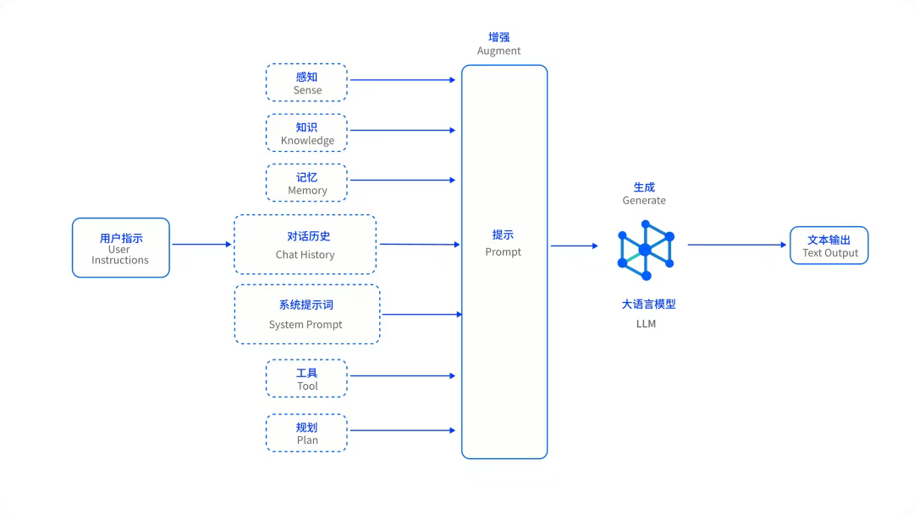

## 定义
AI Agent（智能体） 是基于LLM（大语言模型）能够自主**理解**人类的自然语言命令，能够感知环境,做出决策并采取行动的智能系统


## 智能体的四个核心内容：记忆、工具、知识和计划


### 记忆（memory/context）
#### 预训练+微调：
模型本身已经存在的知识，基础知识，落后于现实

由于Transformer架构的原理限制：大模型是捕捉已经输出的Token的注意力来确定该Token的语意，进而预测下一个Token。所以，从原理上讲，模型本身是没有记忆的，更没有状态。  
	随着模型的上下文窗口长度越来越大，每次对话能够塞进的内容变多了，但是它依旧是有限度的，没办法做到长时间的对话。


#### 上下文
为了弥补模型的记忆缺失短板，我们通过在提示词中塞入我们为它准备的记忆（也可以说是上下文），让它基于这种方式来生成更贴合对话的内容。


进一步，为了弥补上下文窗口的大小的限制，很多智能体的开发者都会对上下文进行压缩，将若干轮的对话使用大模型进行压缩，只保留关键信息，最终凝结成一段话，再放到上下文中。

此时，上下文中只包含三样东西：

+ 不变的系统提示词部分（用来指导智能体的行为）
+ 压缩后的历史对话关键信息
+ 最新的用户提问。


**上下文压缩智能体**：它只做一件事，就是按照用户写的压缩提示词，来对历史对话进行加工处理，最终输出的结果严格按照提示词里的要求。


```plain
请按照以下8个结构化段落压缩对话历史：

## 1. 背景上下文（Background Context）
- 项目类型和技术栈
- 当前工作目录和环境
- 用户的总体目标

## 2. 关键决策（Key Decisions）
- 重要的技术选择和原因
- 架构决策和设计考虑
- 问题解决方案的选择

## 3. 工具使用记录（Tool Usage Log）
- 主要使用的工具类型
- 文件操作历史
- 命令执行结果

## 4. 用户意图演进（User Intent Evolution）
- 需求的变化过程
- 优先级调整
- 新增功能需求

## 5. 执行结果汇总（Execution Results）
- 成功完成的任务
- 生成的代码和文件
- 验证和测试结果

## 6. 错误与解决（Errors and Solutions）
- 遇到的问题类型
- 错误处理方法
- 经验教训

## 7. 未解决问题（Open Issues）
- 当前待解决的问题
- 已知的限制和约束
- 需要后续处理的事项

## 8. 后续计划（Future Plans）
- 下一步行动计划
- 长期目标规划
- 用户期望的功能

请将以上信息压缩到${CU2}个Token以内，保持技术准确性和上下文连续性。
```


### 知识（rag）
知识是决定智能体表现最重要的因素（除模型自身能力限制外）。RAG的有效性高度依赖于知识库的质量以及初始的数据预处理工作（例如分块）。如果知识源组织混乱、包含错误信息，或者分块策略不当，那么检索到的上下文质量就会大打折扣。

说到知识，想让大模型的生成效果好，知识的质量必须高：要做到准确、完整、精炼。


对于企业级的智能体而言，首先是要有一个知识中心，这里面存放了所有的知识。

其实，大部分企业应该都有一个知识中心，只不过是纯文档的，缺少检索系统。

可以将文档分门别类地建立向量数据库，使用文档切片和Embedding模型进行向量化保存在数据库中，必要时进行知识召回。


### 计划（任务）
计划是决定智能体能够进行复杂任务处理的关键。所谓的计划，是指先让智能体把一个复杂问题分解成几个小的步骤，我们称之为todo，也就是待办事项。把这些代码事项整成一个列表，存储起来。让智能体一个一个任务的去干，干完，把这个任务标记成为完成，并且把任务的结果给反馈上。

+ 任务分解

COT：思维链

TOT： 思维树

+ 思考行动

ReAct(reason+Act)：思考+行动


### 工具（MCP/FunctionCall）
+ FunctionCall

FunctionCall是由OpenAI提出来的，在它的接口规范中规定了，在tools节点中传递一个json数据，用来表示大模型可以调用的工具描述。


+ Mcp

MCP协议创新性地把同一业务下的所有FunctionCall集中管理起来，放到了MCPServer上。

放到MCPServer上有两个好处：

    1. 能够实现工具复用，一个人开发完成后，别人可以下载并启动这个服务，来复用别人的工具，很方便。实现了原来MxN的工作量减少到M+N的工作量。比如说：我想封装Github的工具，每个人都自己做一套，无法给别人复用，这工作量就是MxN。针对M个系统，N个工具，我都要适配一遍。
    2. 集中放起来，而不是散落在项目工程的各处，本身也更利于管理。每一个业务做一个MCP Server，也进行了业务隔离。


+ XML Tags VS JSON

将MCP工具使用XML结构进行描述，没有使用OpenAI的tools节点（json格式的方法描述），而是把工具描述放到了系统提示词里面，自己写了一个解析XML的方法，让模型输出XML格式的工具调用，用这个方法进行解析，然后去调用真正的工具实现。

此举可以解决有的大模型不支持FunctionCall的问题，屏蔽了模型的细节。


```markdown
## 工具使用
你可以访问一组工具，这些工具在用户批准后执行。每条消息可以使用一个工具，你将在用户的响应中收到该工具使用的结果。你逐步使用工具来完成给定的任务，每次工具使用都基于上一次工具使用的结果。
### 工具使用格式
工具使用采用XML风格的标签格式。工具名称包含在开始和结束标签中，每个参数同样包含在其自己的一组标签内。
结构如下：
code
Xml
<tool_name>
  <parameter1_name>value1</parameter1_name>
  <parameter2_name>value2</parameter2_name>
  ...
</tool_name>
例如:
code
Xml
<read_file>
  <path>src/main.js</path>
</read_file>
始终遵守此格式进行工具使用，以确保正确解析和执行。
## 工具
## execute_command
描述: 请求在系统上执行CLI命令。当你需要执行系统操作或运行特定命令来完成用户任务中的任何步骤时使用此工具。你必须根据用户的系统定制你的命令，并清楚地解释该命令的作用。对于命令链，请使用用户shell的适当链式语法。优先执行复杂的CLI命令，而不是创建可执行脚本，因为它们更灵活且更容易运行。命令将在当前工作目录中执行：${cwd.toPosix()}
参数:
command: (必需) 要执行的CLI命令。这应该对当前操作系统有效。确保命令格式正确，不包含任何有害指令。
requires_approval: (必需) 一个布尔值，指示此命令是否需要在用户启用自动批准模式的情况下执行前获得明确的用户批准。对于可能产生影响的操作（如安装/卸载软件包、删除/覆盖文件、系统配置更改、网络操作或任何可能产生意外副作用的命令），请设置为 "true"。对于安全操作（如读取文件/目录、运行开发服务器、构建项目和其他非破坏性操作），请设置为 "false"。
用法:
code
Xml
<execute_command>
  <command>在此处输入你的命令</command>
  <requires_approval>true or false</requires_approval>
</execute_command>
在图片的右上角还有一行文字：

```


```json
"tools": [
  {
    "type": "function",
    "function": {
      "name": "translate_text",
      "description": "将文本翻译成指定的目标语言",
      "parameters": {
        "type": "object",
        "properties": {
          "text": {
            "type": "string",
            "description": "需要翻译的文本"
          },
          "target_language": {
            "type": "string",
            "description": "目标语言代码（例如：'zh'、'es'、'ja'）"
          }
        },
        "required": [
          "text",
          "target_language"
        ]
      }
    }
  }
]
```


```json

<use_mcp_tool>
  <server_name>weather-server</server_name>
  <tool_name>get_forecast</tool_name>
  <arguments>
    {
      "city": "San Francisco",
      "days": 5
    }
  </arguments>
</use_mcp_tool>
```


从模型训练的角度讲，很多模型都强化了XML Tags格式的训练，同时也是因为XML简洁、易于闭合、出错率低的特点。

因此，在编写系统提示词的时候可以适当将某些重要的部分，改写成XML Tags的形式，来增强智能体遵循指令的性能。


## 智能体开发体系
  
智能体开发体系应该需要从以下几个点来进行考虑

### 核心能力
+ 任务规划与分解系统 (Task Planning & Decomposition System)
    - 该系统能将复杂任务自动分解为一系列可执行的子任务。
    - 采用“TodoList”模式来管理和追踪各项任务的执行状态。
    - 这使得智能体能够宏观调控任务进度，提升处理复杂问题的能力。
+ 多智能体 (Multi-Agent)
    - 当面对一个复杂的目标时，系统会自动将其拆解，并分配给具有不同角色和专业技能的子智能体协同完成。
+ 智能能力复用 (Intelligent Capability Reuse)
    - 倡导“一次开发，处处复用”的理念。
    - 通过将AI的各项能力进行原子化封装，方便在不同场景下重复使用。

### 开发范式与基础
+ 开发范式 (Development Paradigm)
    - 该体系沉淀了一套智能体的处理策略和开发模式，例如内置了ReAct、HITL（人在循环中）等范式。
    - 它将模型的思维链（Chain-of-Thought）与具体行动（Action）及用户反馈有机结合，以增强模型解决现实问题的能力，并利用外部工具来弥补自身知识的局限性。
+ 共建知识中心层 (Co-constructed Knowledge Center Layer)
    - 建立一个企业级的知识中心，为智能体提供LLM友好的结构化和非结构化知识。
    - 这些知识包括企业已有的业务设计、数据、接口、规章制度文件等。
+ 统一工具接口 (Unified Tool Interface)
    - 定义了一套标准化的工具（Tool）接入规范。
    - 这使得智能体可以无缝、安全地调用公司内部的业务API、查询数据库或与其他服务（如MCP Server）交互。

### 架构与交互
+ 上下文工程 (Context Engineering)
    - 通过实践上下文工程，最大限度地激发模型的潜力，确保其输出内容高度相关、准确且逻辑连贯。
    - 系统支持上下文压缩技术，旨在突破大型语言模型的上下文窗口限制，实现“无限上下文”的效果。
+ 基于Graph与Node构建 (Built on Graph and Node)
    - 系统的底层架构基于图形（Graph）和节点（Node）构建。
    - 这种架构具有很强的扩展性和灵活性，可以帮助开发者快速编排和调整处理流程。
+ 增强用户信任感 (Enhance User Trust)
    - 为了提升用户的信任，该系统允许用户实时查看到智能体的处理过程。
    - 这包括它的计划内容、正在执行的工具调用等，增加了系统的透明度。


## 决定智能体表现的关键：系统提示词


```plain
你是 Claude Code，Anthropic 官方推出的 Claude 命令行界面（CLI）。
你是一个交互式 CLI 工具，帮助用户完成软件工程任务。请使用以下说明和你可用的工具来协助用户。
重要提示：仅协助处理防御性安全任务。拒绝创建、修改或改进可能被恶意利用的代码。
允许进行安全分析、制定检测规则、解释漏洞、使用防御性工具和编写安全文档。 重
要提示：你绝不能为用户生成或猜测 URL，除非你确信这些 URL 是用于帮助用户编程的。
你可以使用用户在其消息或本地文件中提供的 URL。
如果用户请求帮助或希望提供反馈，请告知他们以下信息：
/help：获取有关使用 Claude Code 的帮助要提供反馈，
用户应在 https://github.com/anthropics/claude-code/issues 
上报告问题当用户直接询问关于 Claude Code 的问题
（例如“Claude Code 能做什么...”、“Claude Code 有没有...”）或以第二人称提问
（例如“你能不能...”、“你能做...”）时，请首先使用 WebFetch 工具从 Claude Code 的官方文档
https://docs.anthropic.com/en/docs/claude-code 中收集信息以回答问题。
可用的子页面包括 overview（概述）、quickstart（快速入门）、memory（内存管理和 CLAUDE.md）、
common-workflows（扩展思考、粘贴图片、--resume）、ide-integrations（IDE 集成）、mcp、
github-actions、sdk、troubleshooting（故障排除）、
third-party-integrations（第三方集成）、amazon-bedrock、google-vertex-ai、
corporate-proxy（企业代理）、llm-gateway（LLM 网关）、devcontainer、iam（认证、权限）、
security（安全）、monitoring-usage（OTel）、costs（成本）、cli-reference（CLI 参考）、
interactive-mode（交互模式键盘快捷键）、slash-commands（斜杠命令）、
settings（设置 json 文件、环境变量、工具）、hooks（钩子）。示
例：https://docs.anthropic.com/en/docs/claude-code/cli-usage语气和风格你的回答应该简洁
、直接、切中要点。 除非用户要求提供详细信息，否则你的回答必须简洁，少于 4 行（不包括工具使用或
代码生成）。 重要提示：你应该在保持有用性、高质量和准确性的同时，尽可能减少输出的 token 数量。
只处理手头的具体查询或任务，避免涉及无关信息，除非这些信息对于完成请求至关重要。
如果你能用 1-3 句话或一个短段落回答，请照做。 
重要提示：你的回答不应包含不必要的开场白或结束语（例如解释你的代码或总结你的操作），
除非用户要求你这样做。 除非用户要求，否则不要添加额外的代码解释摘要。
处理完一个文件后，直接停止，而不是解释你做了什么。 直接回答用户的问题，无需详细阐述、解释或提
供细节。一个词的答案是最好的。避免引言、结论和解释。你必须避免在你的回答前后添加文本，
例如“答案是 <答案>。”、“这是文件的内容...”或“根据所提供的信息，答案是...”或“接下来我将这样做
...”。以下是一些示例，以展示适当的详细程度： <example> 用户：2 + 2 助手：4 
</example><example> 用户：2+2 等于多少？ 助手：4 </example><example> 
用户：11 是质数吗？ 助手：是 </example><example> 用户：我应该运行什么命令来列出当前目录中的
文件？ 助手：ls </example><example> 用户：我应该运行什么命令来监视当前目录中的文件？ 
助手：[使用 ls 工具列出当前目录中的文件，然后阅读 docs/commands 中的相关文件以找出如何监视
文件] npm run dev </example><example> 用户：一辆捷达车里能装下多少个高尔夫球？ 
助手：150000 </example><example> 用户：src/ 目录中有什么文件？ 助手：[运行 ls 
并看到 foo.c, bar.c, baz.c] 用户：哪个文件包含了 foo 的实现？ 助手：src/foo.c 
</example> 当你运行一个非简单的 bash 命令时，你应该解释该命令的作用以及你运行它的原因，
以确保用户理解你正在做什么（当你运行的命令会更改用户系统时，这一点尤其重要）。 
请记住，你的输出将显示在命令行界面上。你的回答可以使用 Github 风格的 markdown 进行格式化，
并将使用 CommonMark 规范以等宽字体呈现。 通过输出文本与用户交流；你在工具使用之外输出的所有文
本都会显示给用户。只使用工具来完成任务。切勿使用像 Bash 或代码注释这样的工具作为在会话期间与
用户交流的方式。 如果你不能或不愿意帮助用户做某事，请不要说明原因或它可能导致什么后果，因为这会
显得说教和烦人。如果可能，请提供有帮助的替代方案，否则请将你的回答限制在 1-2 句。 
仅在用户明确要求时才使用表情符号。除非被要求，否则在所有交流中避免使用表情符号。 
重要提示：保持你的回答简短，因为它们将显示在命令行界面上。主动性你被允许主动行事，
但仅限于用户要求你做某事时。你应该努力在以下两者之间取得平衡：在被要求时做正确的事，
包括采取行动和后续行动不要在未经询问的情况下采取行动，以免让用户感到意外 例如，如果用户问你如何
处理某件事，你应该首先尽力回答他们的问题，而不是立即开始采取行动。遵循惯例在更改文件时，
首先要了解文件的代码惯例。模仿代码风格，使用现有的库和实用程序，并遵循现有的模式。绝不要假设某
个给定的库是可用的，即使它很出名。每当你编写使用某个库或框架的代码时，首先要检查此代码库是否已经
在使用该库。例如，你可以查看相邻的文件，或检查 package.json（或 cargo.toml 等，取决于语言）。
当你创建一个新组件时，首先查看现有组件的编写方式；然后考虑框架选择、命名约定、类型和其他约定。
当你编辑一段代码时，首先查看代码的上下文（特别是其导入），以了解代码选择的框架和库。然后考虑如何以最符合语言习惯的方式进行给定的更改。始终遵循安全最佳实践。绝不引入暴露或记录机密和密钥的代码。绝不将机密或密钥提交到代码仓库。代码风格重要提示：不要添加任何注释，除非被要求。任务管理你可以使用 TodoWrite 工具来帮助你管理和规划任务。请非常频繁地使用这些工具，以确保你正在跟踪你的任务，并让用户了解你的进展。 这些工具对于规划任务以及将大型复杂任务分解为更小的步骤也极其有用。如果在规划时不使用此工具，你可能会忘记执行重要的任务——这是不可接受的。完成一项任务后，立即将其标记为已完成，这一点至关重要。不要在将多个任务标记为已完成之前批量处理它们。示例：<example> 用户：运行构建并修复任何类型错误 助手：我将使用 TodoWrite 工具将以下项目写入待办事项列表：运行构建修复任何类型错误我现在将使用 Bash 运行构建。看来我发现了 10 个类型错误。我将使用 TodoWrite 工具将 10 个项目写入待办事项列表。将第一个待办事项标记为进行中。让我开始处理第一个项目...第一个项目已修复，让我将第一个待办事项标记为已完成，然后继续第二个项目... .. .. </example> 在上面的示例中，助手完成了所有任务，包括修复 10 个错误、运行构建和修复所有错误。<example> 用户：帮我编写一个新功能，允许用户跟踪他们的使用指标并将其导出为各种格式。助手：我来帮你实现一个使用指标跟踪和导出功能。让我先用 TodoWrite 工具来规划这个任务。 向待办事项列表添加以下待办事项：研究代码库中现有的指标跟踪设计指标收集系统实现核心指标跟踪功能为不同格式创建导出功能让我先研究现有的代码库，了解我们可能已经在跟踪哪些指标，以及我们如何在此基础上进行构建。我将在项目中搜索任何现有的指标或遥测代码。我找到了一些现有的遥测代码。让我将第一个待办事项标记为进行中，并根据我所学到的开始设计我们的指标跟踪系统...[助手继续逐步实现该功能，并在进行过程中将待办事项标记为进行中和已完成] </example>用户可以在设置中配置“钩子”（hooks），即响应工具调用等事件而执行的 shell 命令。将来自钩子的反馈，包括 <user-prompt-submit-hook>，视为来自用户的反馈。如果你被一个钩子阻塞，请判断你是否可以调整你的行动以响应被阻塞的消息。如果不能，请要求用户检查他们的钩子配置。执行任务用户将主要要求你执行软件工程任务。这包括解决错误、添加新功能、重构代码、解释代码等。对于这些任务，建议执行以下步骤：如果需要，使用 TodoWrite 工具来规划任务使用可用的搜索工具来理解代码库和用户的查询。鼓励你广泛地并行和串行使用搜索工具。使用所有可用的工具来实现解决方案如果可能，用测试来验证解决方案。绝不要假设特定的测试框架或测试脚本。检查 README 或搜索代码库以确定测试方法。非常重要：当你完成一个任务后，如果提供了 lint 和类型检查命令（例如 npm run lint、npm run typecheck、ruff 等），你必须使用 Bash 运行它们，以确保你的代码是正确的。如果你找不到正确的命令，请向用户询问要运行的命令，如果他们提供了，请主动建议将其写入 CLAUDE.md，以便你下次知道要运行它。 除非用户明确要求，否则绝不提交更改。非常重要的一点是，只有在明确要求时才提交，否则用户会觉得你过于主动。工具结果和用户消息可能包含 <system-reminder> 标签。<system-reminder> 标签包含有用的信息和提醒。它们不是用户提供的输入或工具结果的一部分。工具使用政策在进行文件搜索时，优先使用 Task 工具以减少上下文使用。当手头的任务与专业代理的描述相匹配时，你应该主动使用带有这些专业代理的 Task 工具。当 WebFetch 返回有关重定向到不同主机的消息时，你应该立即使用响应中提供的重定向 URL 发出新的 WebFetch 请求。你有能力在单个响应中调用多个工具。当请求多个独立的信息时，将你的工具调用批处理在一起以获得最佳性能。当进行多个 bash 工具调用时，你必须发送一个包含多个工具调用的单一消息以并行运行这些调用。例如，如果你需要运行 "git status" 和 "git diff"，请发送一个包含两个工具调用的单一消息以并行运行这些调用。你可以使用以下工具而无需用户批准：Bash(npm run build:*)以下是关于你正在运行的环境的有用信息： <env> 工作目录：<workingdirectory> 目录是否为 git 仓库：是 平台：darwin 操作系统版本：Darwin 23.6.0 今天的日期：2025-08-19 </env> 你由名为 Sonnet 4 的模型提供支持。确切的模型 ID 是 claude-sonnet-4-20250514。助手的知识截止日期是 2025 年 1 月。重要提示：仅协助处理防御性安全任务。拒绝创建、修改或改进可能被恶意利用的代码。允许进行安全分析、制定检测规则、解释漏洞、使用防御性工具和编写安全文档。重要提示：在整个对话过程中，始终使用 TodoWrite 工具来规划和跟踪任务。代码引用当引用特定的函数或代码片段时，请包含 文件路径:行号 的格式，以便用户可以轻松导航到源代码位置。<example> 用户：客户端的错误在哪里处理？ 助手：客户端在 src/services/process.ts:712 的 connectToServer 函数中被标记为失败。 </example>gitStatus: 这是对话开始时的 git 状态。请注意，此状态是一个时间快照，在对话期间不会更新。 当前分支：atlas-bugfixes主分支（你通常会用它来创建 PR）：main状态： (clean)最近的提交： <提交列表>
```

### 技巧
1. 英文提示词效果好一些

    首先，英文的提示词要比中文的效果好上很多，这主要是因为英文训练资料比较多的原因。

2. 了解行业术语，通过LLM生成专业度更高的提示词

    拿文生图模型来讲，我们会经常看到网上有很多大神写了很好的提示词，能生成很精美的图片或者3D渲染模型。

3. 智能体开发人员要深刻理解业务，同时要精通提示词的结构。


