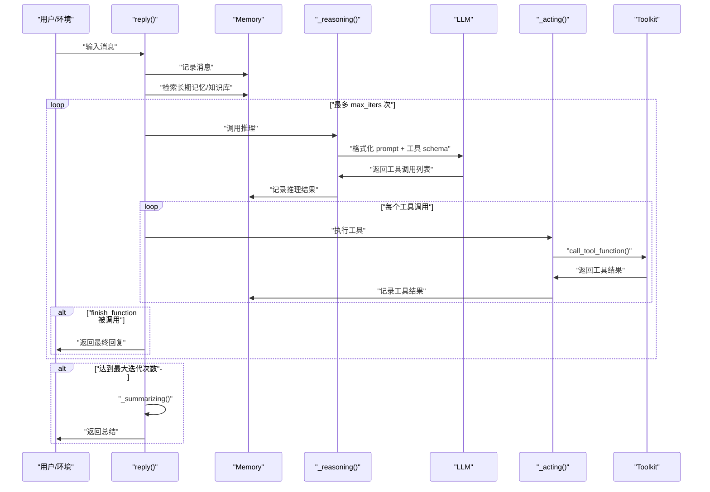

# ReActAgent 底层如何实现 ReAct 框架

ReAct 框架的核心是将推理和行动分离,通过循环迭代的方式让智能体完成复杂任务。

## 核心架构设计

ReActAgent 的实现基于三层架构 :

1. **`AgentBase`** - 提供基础的 `reply`、`observe`、`print` 方法
2. **`ReActAgentBase`** - 扩展 `AgentBase`,定义 `_reasoning` 和 `_acting` 两个抽象方法
3. **`ReActAgent`** - 具体实现类,实现完整的 ReAct 循环逻辑

### 元类机制实现钩子系统

ReAct 框架的扩展性通过元类 `_ReActAgentMeta` 实现。该元类自动为 `_reasoning` 和 `_acting` 方法包装前置和后置钩子,使得开发者可以在推理和行动的前后插入自定义逻辑 。

## ReAct 循环的核心实现

### 1. reply 方法 - 主循环入口

`reply` 方法是 ReAct 循环的入口:

核心循环逻辑:

- 每次迭代先调用 `_reasoning()` 获取工具调用
- 然后对每个工具调用执行 `_acting()`
- 如果 `finish_function` 被调用,循环结束
- 否则继续下一轮推理-行动循环

### 2. _reasoning 方法 - 推理阶段

`_reasoning` 方法实现推理逻辑:

**关键步骤:**

1. **构建提示词** : 将系统提示、记忆历史、推理提示组合成完整 prompt
2. **调用 LLM** : 传入工具的 JSON schema,让模型生成工具调用
3. **处理流式输出**  : 支持流式显示推理过程
4. **转换纯文本为工具调用** : 如果模型返回纯文本而非工具调用,自动转换为 `finish_function` 调用

**中断处理** : 当用户中断时,为所有工具调用生成假的工具结果,避免状态不一致。

### 3. _acting 方法 - 行动阶段

`_acting` 方法执行单个工具调用 :

**执行流程:**

1. **调用工具** [: 通过 `toolkit.call_tool_function()` 执行
2. **处理流式结果** : 支持工具的流式输出
3. **检测完成信号** : 如果是 `finish_function` 且成功,返回最终消息
4. **记录结果**  : 将工具结果添加到记忆中

### 4. 并行工具调用支持

ReAct 框架支持并行执行多个工具调用 :

- 当 `parallel_tool_calls=True` 时,使用 `asyncio.gather()` 并行执行
- 否则顺序执行每个工具调用

## 特殊机制

### finish_function - 终止机制

`finish_function` 是 ReAct 框架的终止机制  。该函数在初始化时自动注册到工具集:

- 当模型决定完成任务时,调用此函数
- `_acting` 检测到此函数被成功调用后,返回最终消息
- 循环终止,返回结果给用户

### _summarizing - 兜底机制

当达到最大迭代次数仍未完成时,调用 `_summarizing` 方法 :

- 添加提示让模型直接总结当前情况
- 不再调用工具,直接生成文本回复
- 确保智能体总能给出响应

## 状态管理

ReAct 框架通过记忆系统维护状态  :

- **短期记忆 (memory)**: 存储对话历史和工具调用结果
- **长期记忆 (long_term_memory)**: 可选,支持跨会话的信息检索和存储
- **推理提示记忆 (_reasoning_hint_msgs)**: 临时存储单次推理的提示信息  

## Notes

- ReAct 框架的核心是将 LLM 的推理能力与工具的执行能力解耦,通过循环迭代实现复杂任务
- 元类机制使得钩子系统对开发者透明,无需修改核心代码即可扩展功能
- `finish_function` 的设计巧妙地将"决定何时结束"的控制权交给了 LLM,而非硬编码规则
- 完整的中断处理和兜底机制确保了系统的鲁棒性

