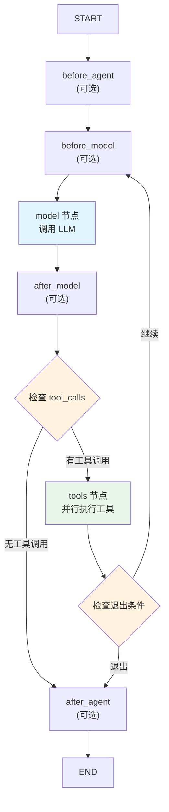

## 图结构概览
`create_agent` 构建一个 `StateGraph`,包含以下核心节点: 

1. **model 节点**: 调用 LLM 生成响应
2. **tools 节点**: 执行工具调用(如果有工具)
3. **中间件节点**: `before_agent`, `before_model`, `after_model`, `after_agent`

**File:** libs/langchain_v1/langchain/agents/factory.py (L1096-1101)

```python
    # Use sync or async based on model capabilities
    graph.add_node("model", RunnableCallable(model_node, amodel_node, trace=False))

    # Only add tools node if we have tools
    if tool_node is not None:
        graph.add_node("tools", tool_node)
```

****

## 节点添加逻辑
### 1. Model 节点
Model 节点使用 `RunnableCallable` 包装同步和异步函数: 

这允许图同时支持同步和异步执行。

**File:** libs/langchain_v1/langchain/agents/factory.py (L1096-1097)

```python
    # Use sync or async based on model capabilities
    graph.add_node("model", RunnableCallable(model_node, amodel_node, trace=False))
```

### 2. Tools 节点
只有在提供了工具时才添加 tools 节点: 

**File:** libs/langchain_v1/langchain/agents/factory.py (L1099-1101)

```python
    # Only add tools node if we have tools
    if tool_node is not None:
        graph.add_node("tools", tool_node)
```

### 3. 中间件节点
对于每个中间件,如果它重写了相应的钩子方法,就会添加对应的节点。例如 `before_model` 节点: 

这个逻辑检查中间件类是否重写了基类的方法,只有重写了才创建节点。

**File:** libs/langchain_v1/langchain/agents/factory.py (L1124-1141)

```python
        if (
            m.__class__.before_model is not AgentMiddleware.before_model
            or m.__class__.abefore_model is not AgentMiddleware.abefore_model
        ):
            # Use RunnableCallable to support both sync and async
            # Pass None for sync if not overridden to avoid signature conflicts
            sync_before = (
                m.before_model
                if m.__class__.before_model is not AgentMiddleware.before_model
                else None
            )
            async_before = (
                m.abefore_model
                if m.__class__.abefore_model is not AgentMiddleware.abefore_model
                else None
            )
            before_node = RunnableCallable(sync_before, async_before, trace=False)
            graph.add_node(f"{m.name}.before_model", before_node, input_schema=state_schema)
```

****

## 边的连接逻辑
### 1. 确定关键节点
代码首先确定四个关键节点: 

+ **entry_node**: 图的入口(首次执行)
+ **loop_entry_node**: 循环入口(工具执行后返回这里)
+ **loop_exit_node**: 循环出口(每次迭代结束)
+ **exit_node**: 图的最终出口
+ **File:** libs/langchain_v1/langchain/agents/factory.py (L1181-1207)

```python
    # Determine the entry node (runs once at start): before_agent -> before_model -> model
    if middleware_w_before_agent:
        entry_node = f"{middleware_w_before_agent[0].name}.before_agent"
    elif middleware_w_before_model:
        entry_node = f"{middleware_w_before_model[0].name}.before_model"
    else:
        entry_node = "model"

    # Determine the loop entry node (beginning of agent loop, excludes before_agent)
    # This is where tools will loop back to for the next iteration
    if middleware_w_before_model:
        loop_entry_node = f"{middleware_w_before_model[0].name}.before_model"
    else:
        loop_entry_node = "model"

    # Determine the loop exit node (end of each iteration, can run multiple times)
    # This is after_model or model, but NOT after_agent
    if middleware_w_after_model:
        loop_exit_node = f"{middleware_w_after_model[0].name}.after_model"
    else:
        loop_exit_node = "model"

    # Determine the exit node (runs once at end): after_agent or END
    if middleware_w_after_agent:
        exit_node = f"{middleware_w_after_agent[-1].name}.after_agent"
    else:
        exit_node = END
```

### 2. START 边
从 START 连接到 entry_node: 

**File:** libs/langchain_v1/langchain/agents/factory.py (L1209-1209)

```python
    graph.add_edge(START, entry_node)
```

### 3. 条件边 - Tools 到 Model
如果有工具,添加从 tools 到 model 的条件边: 


**File:** libs/langchain_v1/langchain/agents/factory.py (L1211-1221)

```python
    if tool_node is not None:
        graph.add_conditional_edges(
            "tools",
            _make_tools_to_model_edge(
                tool_node=tool_node,
                model_destination=loop_entry_node,
                structured_output_tools=structured_output_tools,
                end_destination=exit_node,
            ),
            [loop_entry_node, exit_node],
        )
```


`_make_tools_to_model_edge` 函数决定工具执行后的路由: 

**File:** libs/langchain_v1/langchain/agents/factory.py (L1474-1501)

```python
def _make_tools_to_model_edge(
    *,
    tool_node: _ToolNode,
    model_destination: str,
    structured_output_tools: dict[str, OutputToolBinding],
    end_destination: str,
) -> Callable[[dict[str, Any]], str | None]:
    def tools_to_model(state: dict[str, Any]) -> str | None:
        last_ai_message, tool_messages = _fetch_last_ai_and_tool_messages(state["messages"])

        # 1. Exit condition: All executed tools have return_direct=True
        if all(
            tool_node.tools_by_name[c["name"]].return_direct
            for c in last_ai_message.tool_calls
            if c["name"] in tool_node.tools_by_name
        ):
            return end_destination

        # 2. Exit condition: A structured output tool was executed
        if any(t.name in structured_output_tools for t in tool_messages):
            return end_destination

        # 3. Default: Continue the loop
        #    Tool execution completed successfully, route back to the model
        #    so it can process the tool results and decide the next action.
        return model_destination

    return tools_to_model
```


**路由逻辑**:

1. 如果所有工具都设置了 `return_direct=True`,直接退出
2. 如果执行了结构化输出工具,退出
3. 默认返回 model 继续处理工具结果

### 4. 条件边 - Model 到 Tools
从 loop_exit_node 到 tools 的条件边: 

**File:** libs/langchain_v1/langchain/agents/factory.py (L1223-1241)

```python
        # base destinations are tools and exit_node
        # we add the loop_entry node to edge destinations if:
        # - there is an after model hook(s) -- allows jump_to to model
        #   potentially artificially injected tool messages, ex HITL
        # - there is a response format -- to allow for jumping to model to handle
        #   regenerating structured output tool calls
        model_to_tools_destinations = ["tools", exit_node]
        if response_format or loop_exit_node != "model":
            model_to_tools_destinations.append(loop_entry_node)

        graph.add_conditional_edges(
            loop_exit_node,
            _make_model_to_tools_edge(
                model_destination=loop_entry_node,
                structured_output_tools=structured_output_tools,
                end_destination=exit_node,
            ),
            model_to_tools_destinations,
        )
```


`_make_model_to_tools_edge` 函数决定模型响应后的路由: 

**File:** libs/langchain_v1/langchain/agents/factory.py (L1391-1444)

```python
def _make_model_to_tools_edge(
    *,
    model_destination: str,
    structured_output_tools: dict[str, OutputToolBinding],
    end_destination: str,
) -> Callable[[dict[str, Any]], str | list[Send] | None]:
    def model_to_tools(
        state: dict[str, Any],
    ) -> str | list[Send] | None:
        # 1. if there's an explicit jump_to in the state, use it
        if jump_to := state.get("jump_to"):
            return _resolve_jump(
                jump_to,
                model_destination=model_destination,
                end_destination=end_destination,
            )

        last_ai_message, tool_messages = _fetch_last_ai_and_tool_messages(state["messages"])
        tool_message_ids = [m.tool_call_id for m in tool_messages]

        # 2. if the model hasn't called any tools, exit the loop
        # this is the classic exit condition for an agent loop
        if len(last_ai_message.tool_calls) == 0:
            return end_destination

        pending_tool_calls = [
            c
            for c in last_ai_message.tool_calls
            if c["id"] not in tool_message_ids and c["name"] not in structured_output_tools
        ]

        # 3. if there are pending tool calls, jump to the tool node
        if pending_tool_calls:
            return [
                Send(
                    "tools",
                    ToolCallWithContext(
                        __type="tool_call_with_context",
                        tool_call=tool_call,
                        state=state,
                    ),
                )
                for tool_call in pending_tool_calls
            ]

        # 4. if there is a structured response, exit the loop
        if "structured_response" in state:
            return end_destination

        # 5. AIMessage has tool calls, but there are no pending tool calls
        # which suggests the injection of artificial tool messages. jump to the model node
        return model_destination

    return model_to_tools
```


**路由逻辑**:

1. **优先级最高**: 检查 `jump_to` 指令(中间件可以设置)
2. **退出条件**: 如果模型没有调用任何工具,退出循环
3. **执行工具**: 如果有待执行的工具调用,使用 `Send` 并行执行
4. **结构化响应**: 如果生成了结构化响应,退出
5. **人工注入**: 如果有工具调用但没有待执行的(说明是人工注入的 ToolMessage),返回 model

### 5. 中间件边的连接
中间件节点按顺序链接。例如 `before_model` 中间件: 

**File:** libs/langchain_v1/langchain/agents/factory.py (L1286-1305)

```python
    # Add before_model middleware edges
    if middleware_w_before_model:
        for m1, m2 in itertools.pairwise(middleware_w_before_model):
            _add_middleware_edge(
                graph,
                name=f"{m1.name}.before_model",
                default_destination=f"{m2.name}.before_model",
                model_destination=loop_entry_node,
                end_destination=exit_node,
                can_jump_to=_get_can_jump_to(m1, "before_model"),
            )
        # Go directly to model after the last before_model
        _add_middleware_edge(
            graph,
            name=f"{middleware_w_before_model[-1].name}.before_model",
            default_destination="model",
            model_destination=loop_entry_node,
            end_destination=exit_node,
            can_jump_to=_get_can_jump_to(middleware_w_before_model[-1], "before_model"),
        )
```

使用 `itertools.pairwise` 将相邻的中间件连接起来,最后一个连接到 model 节点。

### 6. 中间件的条件跳转
`_add_middleware_edge` 函数处理中间件的条件跳转: 

**File:** libs/langchain_v1/langchain/agents/factory.py (L1504-1547)

```python
def _add_middleware_edge(
    graph: StateGraph[AgentState, ContextT, PublicAgentState, PublicAgentState],
    *,
    name: str,
    default_destination: str,
    model_destination: str,
    end_destination: str,
    can_jump_to: list[JumpTo] | None,
) -> None:
    """Add an edge to the graph for a middleware node.

    Args:
        graph: The graph to add the edge to.
        name: The name of the middleware node.
        default_destination: The default destination for the edge.
        model_destination: The destination for the edge to the model.
        end_destination: The destination for the edge to the end.
        can_jump_to: The conditionally jumpable destinations for the edge.
    """
    if can_jump_to:

        def jump_edge(state: dict[str, Any]) -> str:
            return (
                _resolve_jump(
                    state.get("jump_to"),
                    model_destination=model_destination,
                    end_destination=end_destination,
                )
                or default_destination
            )

        destinations = [default_destination]

        if "end" in can_jump_to:
            destinations.append(end_destination)
        if "tools" in can_jump_to:
            destinations.append("tools")
        if "model" in can_jump_to and name != model_destination:
            destinations.append(model_destination)

        graph.add_conditional_edges(name, jump_edge, destinations)

    else:
        graph.add_edge(name, default_destination)
```

如果中间件声明了 `can_jump_to`,会创建条件边而不是普通边。这允许中间件通过设置 `state["jump_to"]` 来控制流程。

## 循环的完整流程


## 关键设计特点
1. **灵活的入口/出口**: 根据中间件配置动态确定入口和出口节点 
2. **条件路由**: 使用条件边而不是固定边,允许运行时决策 
3. **并行工具执行**: 使用 `Send` 实现多个工具调用的并行执行 
4. **中间件控制流**: 通过 `jump_to` 机制允许中间件控制图的执行流程 

**File:** libs/langchain_v1/langchain/agents/factory.py (L1360-1372)

```python
def _resolve_jump(
    jump_to: JumpTo | None,
    *,
    model_destination: str,
    end_destination: str,
) -> str | None:
    if jump_to == "model":
        return model_destination
    if jump_to == "end":
        return end_destination
    if jump_to == "tools":
        return "tools"
    return None
```


## 总结
这个图结构的设计使得 ReAct 循环完全由图的拓扑结构控制,而不需要显式的循环代码。每次模型调用后,条件边自动决定是继续执行工具、返回模型,还是结束循环。这种声明式的设计比传统的命令式循环更容易理解和调试。

### 


