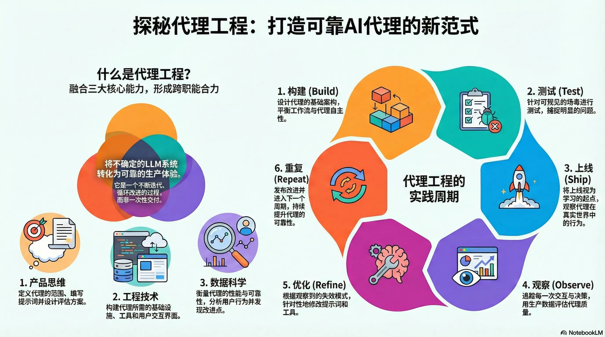
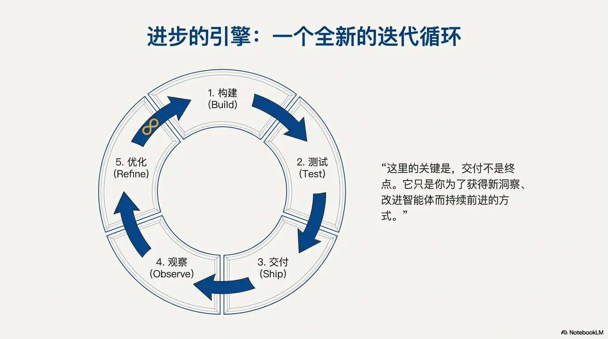

## 资料

原文： [https://blog.langchain.com/agent-engineering-a-new-discipline](https://blog.langchain.com/agent-engineering-a-new-discipline/)

## 构建可靠AI智能体的4个反直觉法则：告别传统软件开发

### 从“演示可用”到“生产可靠”的鸿沟

如果你构建过AI智能体，你一定知道从“在我的电脑上能跑”到“在生产环境中稳定运行”之间存在着巨大的鸿沟。这种挑战的根源在于其根本的不确定性：与传统软件不同，AI智能体面临的输入是无限的——用户可以说任何话——其行为空间也极其广阔。这正是智能体的强大之处，也恰恰是它们会以你意想不到的方式出问题的原因。为了驾驭这种不确定性，成功的团队如Clay、Vanta、LinkedIn和Cloudflare，并没有沿用传统的软件开发手册，而是在开创一门全新的学科：智能体工程 (
agent engineering)，旨在将强大的AI模型转化为在生产环境中值得信赖的可靠体验。

### 

### 核心观点：智能体工程带来的4个颠覆性认知

智能体工程颠覆了我们对软件开发的许多传统认知。以下四个核心法则是理解这一新范式的关键。

#### 法则一：发布不是终点，而是学习的起点

传统软件开发的理念是“先详尽测试，再发布”，力求在上线前发现所有问题。然而，智能体工程带来了一种根本性的思维转变：从“详尽测试后发布”转向“合理测试，通过发布来学习”。由于你永远无法预见用户会如何与智能体进行自然语言交互，真正的学习发生在生产环境中。

这个过程是一个持续的循环：构建、测试、发布、观察、优化、重复 (build, test, ship, observe, refine, repeat)
。你越快地完成这个循环，你的智能体就会变得越可靠。

关键在于，发布不是最终目标。它只是你为了获得新见解并改进智能体而不断前进的方式。

#### 法则二：这不是一个新职位，而是一门新学科

“智能体工程”并不是一个需要招聘的新工作头衔，而是一套由现有团队共同承担的跨领域职责。它融合了三种核心技能，形成了一门新兴的交叉学科：

• 产品思维 (Product thinking)：负责定义智能体的范围和行为。这包括编写驱动智能体的提示词（通常长达数百甚至数千行）、深刻理解智能体需要完成的工作，以及定义评估标准。

• 工程实现 (Engineering)：负责构建让智能体能够进入生产环境的基础设施。这包括为智能体编写可调用的工具、开发交互界面（包括处理流式传输和中断）以及创建能够处理持久执行、人机协作暂停和内存管理的稳健运行时环境。

• 数据科学 (Data science)：负责衡量和持续改进智能体的性能。这包括建立评估和监控系统，以及分析用户使用模式和错误。

在高效的团队中，你经常会看到软件工程师在追踪错误后，直接将分析结果交给产品经理来调整提示词；或者产品经理发现范围问题后，工程师会立即为其开发新工具。

#### 法则三：不再有“正常输入”，每个输入都是边界情况

在传统软件开发中，我们习惯于处理“边界情况 (edge case)”。但在AI智能体的世界里，这个概念已经失效。由于用户使用自然语言进行交互，任何输入都可能是不可预测的。

当用户输入“让它更出彩一点”或“像上次那样做，但要做得不一样”时，智能体需要像人一样去解读这些模糊、充满上下文的指令。因此，我们必须转变思维，将每一次交互都视为独特的、需要被理解和处理的情况。

Every input is an edge case. (每个输入都是一个边界情况。)

#### 法则四：“系统在工作”不再是一个简单的“是/否”问题

对于AI智能体，“可靠性”的定义也发生了根本性的变化。传统的衡量指标，如99.99%的在线时间，并不能反映智能体是否真的在“正常工作”。一个智能体可以有99.99%的在线时间，但其行为可能已经完全失控和崩溃。

真正重要的问题变得更加细致和复杂：

• 智能体是否做出了正确的决策？

• 它是否正确地使用了工具？

• 它是否遵循了指令背后真正的意图？

回答这些问题需要深入智能体的决策链路进行观察和评估，而不能再依赖传统的二元（是/否）系统状态指标。

### 结论：拥抱迭代，迎接新标准

成功的团队已经不再试图在发布前将智能体打磨到完美，而是将生产环境视为主要的学习工具。他们通过追踪每一次决策、进行规模化评估，并在几天而非几个季度内发布改进来不断优化系统。

智能体工程正在兴起，因为它抓住了时代的需求。AI智能体现在已经能够处理过去需要人类判断的复杂工作流，但前提是——我们必须能让它们变得足够可靠，值得信赖。这其中没有捷径，只有通过系统性的迭代工作，才能驾驭大语言模型的强大力量。

  

