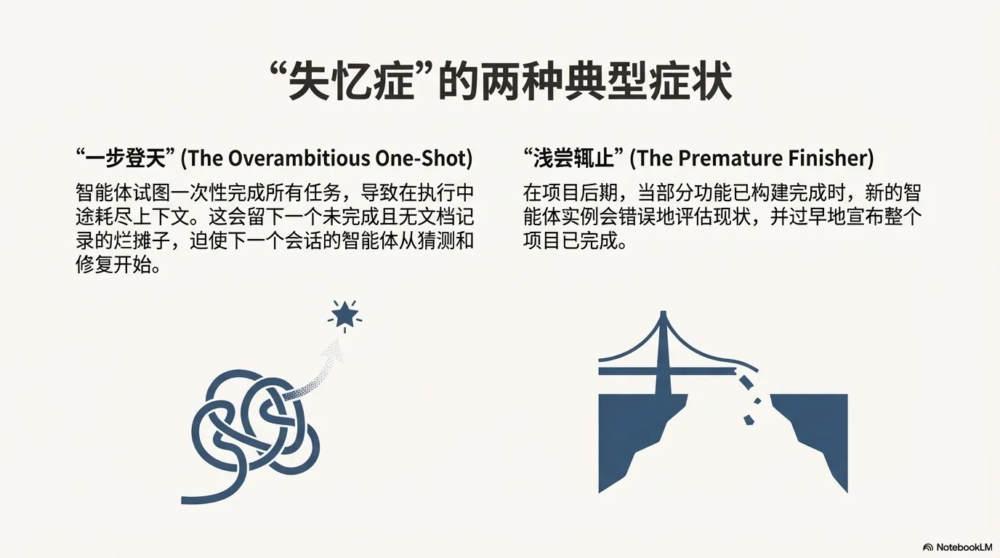
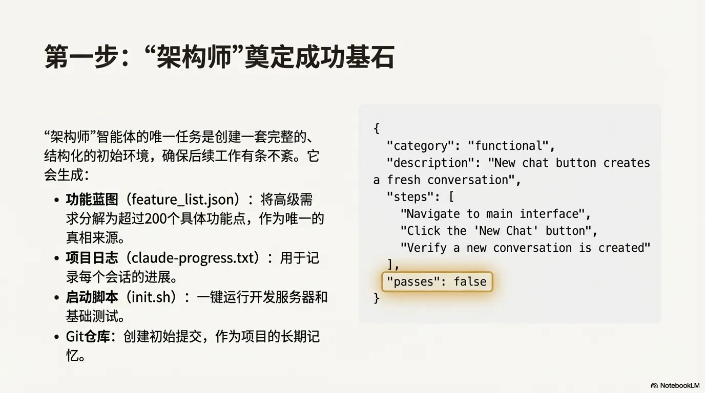
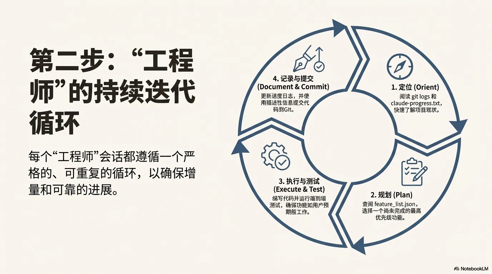
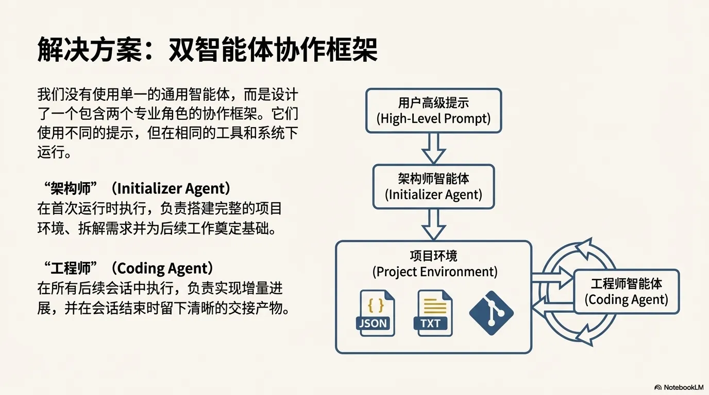
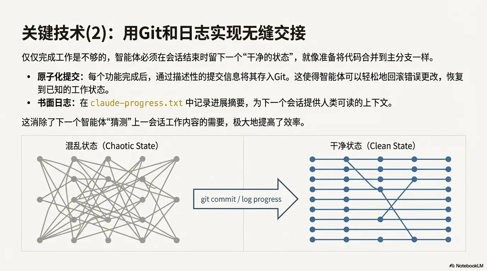
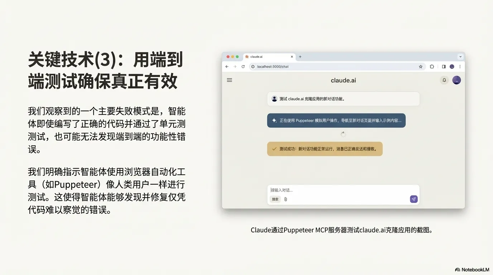

### AI Agent的崛起与困境
随着人工智能（AI）能力的指数级增长，开发者正日益要求AI 智能体,承担跨越数小时乃至数天的复杂任务。然而，在实现这一宏伟蓝图的过程中，一个根本性的架构障碍浮现出来：如何确保AI智能体在离散、不连续的工作会话中维持任务的连贯性与状态一致性。这一挑战是构建真正自主的长时程（long-horizon）智能系统的核心瓶颈。

### 核心挑战
+ **上下文限制与记忆丢失**:长期任务（如软件开发）无法在单个上下文窗口内完成。智能体必须分多次会话工作，但每次新会话开始时都会“失忆”，不知道之前的工作状态。

<!-- 这是一张图片，ocr 内容为：核心挑战:上下文窗口的"失忆症" CONTEXT CONTEXT CONTEXT CONTEXT CONTEXT WINDOW WINDOW WINDOW WINDOW WINDOW 长时程智能体的核心挑战在于,它们必须在高散的会话中工作,而每个新会话都对之前发生的事 情毫无记忆. "想象一个由轮班工程师组成的软件项目,每个新来的工程师都没有上一班的任何记忆. (NOTEBOOKLM -->

+ **常见失败模式**： 
    - **试图一次性完成（One-shotting）**：智能体倾向于一次性做太多事情，导致上下文耗尽，留下未完成且无文档的代码。
    - **过早宣布完成**：智能体在只完成部分功能时就误以为任务已全部结束。

<!-- 这是一张图片，ocr 内容为："失忆症"的两种典型症状 "一步登天"(THE OVERAMBITIOUS ONE-SHOT) "浅尝辄止"(THE PREMATURE FINISHER) 在项目后期,当部分功能已构建完成时,新的智 智能体试图一次性完成所有任务,导致在执行中 能体实例会错误地评估现状,并过早地宣布整个 途耗尽上下文.这会留下一个未完成且无文档记 项目已完成. 录的烂摊子,迫使下一个会话的智能体从猜测和 修复开始. 4 NOTEBOOKLM -->

### 解决方案：双重智能体架构
文章提出了一种将任务分解为两个阶段的解决方案，分别由不同角色的智能体负责：

+ **初始化智能体（Initializer Agent）**： 
    - **职责**：负责第一次会话。它不直接写业务代码，而是搭建环境基础。
    - **产出**：创建 `init.sh` 启动脚本、`claude-progress.txt` 进度日志文件、初始化 Git 仓库，并生成一份详细的**功能需求列表（Feature List）**。

<!-- 这是一张图片，ocr 内容为：第一步:"架构师"奠定成功基石 { "架构师"智能体的唯一任务是创建一套完整的, "CATEGORY':"FUNCTIONAL", 结构化的初始环境,确保后续工作有条不紊.它 "DESCRIPTION":"NEW CHAT BUTTON CREATES 会生成: FRESH CONVERSATION', "STEPS": 功能蓝图(FEATURE_LIST.JSON):将高级需 'NAVIGATE TO MAIN INTERFACE", 求分解为超过200个具体功能点,作为唯一的 "CLICK THE 'NEW CHAT' BUTTON", 真相来源. "VERIFY A NEW CONVERSATION IS CREATED" 项目日志(CLAUDE-PROGRESS.TXT):用于记 ]. 录每个会话的进展. "PASSES":FALSE 启动脚本(INIT.SH):一键运行开发服务器和 基础测试. GIT仓库:创建初始提交,作为项目的长期记 忆. NOTEBOOKLM -->

+ **编码智能体（Coding Agent）**： 
    - **职责**：负责后续的每一次会话。它专注于增量开发，每次只处理一个功能，并确保会话结束时环境处于“整洁”状态。

<!-- 这是一张图片，ocr 内容为：第二步:"工程 4.记录与提交 师"的持续迭代 1.定位(ORIENT) (DOCUMENT&COMMIT) 更新送度日志,并使 阅读GITLOGS和 用描述性信息提交代 CLAUDE-PROGRESS.TXT, 码别GLT. 快速了解项目驰状. 循环 每个"工程师"会话都遵循一个严 格的,可重复的循环,以确保增 3.执行与测试 量和可靠的进展. (EXECUTE & TEST) 2.规划(PLAN) 绳写代羽并运行海到端 查阅FEATURE_LIST.JSON, 测试,磁绳功能如用户预 选择一个尚未完成的最高 期船工作. 优先振功能. A NOTEBOOKLM -->
<!-- 这是一张图片，ocr 内容为：解决方案:双智能体协作框架 我们没有使用单一的通用智能体,而是设计 用户高级提示 了一个包含两个专业角色的协作框架.它们 (HIGH-LEVEL PROMPT) 使用不同的提示,但在相同的工具和系统下 运行. 架构师智能体 "架构师" (INITIALIZER AGENT) (LNITIALIZER AGENT) 在首次运行时执行,负责搭建完整的项目 环境,拆解需求并为后续工作奠定基础. 项目环境 "工程师"(CODING AGENT) (PROJECT ENVIRONMENT) 工程师智能体 在所有后续会话中执行,负责实现增量进 (CODING AGENT) 展,并在会话结束时留下清晰的交接产物. TXT JSON ANOTEBOOKLM -->

### 关键技术与最佳实践
### A. 环境管理与状态同步
+ **功能列表（Feature List）**：使用 **JSON 格式**（比 Markdown 更稳定）记录所有需求，初始状态全部标记为 `passes: false`。智能体只能在验证通过后修改此状态。这防止了智能体遗漏功能或过早结束。
+ **增量进展**：强制智能体每次只选择一个未完成的最高优先级功能进行开发。

<!-- 这是一张图片，ocr 内容为：关键技术(1): 功能A:用户登录验证[已完碗] 功能B:创建新会话[已完脱] 用功能蓝图消除臆测 功能C:消息发送功能[已完成] 功能D:会话历史加载 功能E:消息编辑 功能F:消息剔除 FEATURE_LIST.JSON'文件是解决"一步登天"和 功能G:用户设置界面 "浅尝辄止"问题的关键. 功能H:主题切换 功能I:语言选择 明确的路线图:它为智能体提供了清晰的工作 功能J:通知提醒 作大纲,使其能够逐个处理功能,而不是试图 功能K:文件上传支持 功能L:表情符号支持 一次性完成所有工作. 功能M:搜索功能 权威的完成标准:所有功能初始状态均为 功能N:数据导出 功能0:多设备同步 /"PASSES\":FALSE'.智能体被严格指示,只 功能P:API集成 有在通过严格测试后才能修改此字段,这防止 门功能Q:错误处理机制 了过早宣布项目完成. 功能R:性能优化 功能S:安全性审计 .格式稳定性:使用JSON格式(而非MARKDOWN) 功能T:用户反馈系统 可以有效防止模型意外地修改或覆盖内容. 功能U:帮助文档集成 功能V:版本更新提示 功能W:退出登录 AI NOTEBOOKLM -->

+ **保持整洁（Clean State）**：利用 **Git** 进行版本控制和回滚，利用进度文件（Progress File）记录人工可读的摘要，确保下一个接手的智能体能快速理解现状。

<!-- 这是一张图片，ocr 内容为：关键技术(2):用GIT和日志实现无缝交接 仅仅完成工作是不够的,智能体必须在会话结束时留下一个"干净的状态",就像准备将代码合并到主分支一样. 原子化提交:每个功能完成后,通过描述性的提交信息将其存入GIT.这使得智能体可以轻松地回滚错误更改,恢复 到已知的工作状态. 书面日志:在CLAUDE-PROGRESS.TXT中记录进展摘要,为下一个会话提供人类可读的上下文. 这消除了下一个智能体"猜测"上一会话工作内容的需要,极大地提高了效率. 混乱状态(CHAOTIC STATE) 干净状态(CLEAN STATE) GIT COMMIT/LOG PROGRESS A NOTEBOOKLM -->

### B. 测试与验证
+ **端到端测试**：智能体容易忽略端到端的功能验证。文章建议明确提示智能体使用浏览器自动化工具（如 Puppeteer）像人类用户一样测试应用。

<!-- 这是一张图片，ocr 内容为：关键技术(3): 用端到 I 让 TOCALHEST:3000/CHAT 端测试确保真正有效 0 CLAUDE.AI 测试 CLAUDE.AI 完耀应用的新对运功能. 我们观察到的一个主要失败模式是,智能 正在使用 PUPPETEER 提以用户操作,导航至所对返顶面并谁入示例内窃... 体即使编写了正确的代码并通过了单元测 测试,也可能无法发现端到端的功能性错 误. 测试成功:新对话功能正常运行,消息已正腾炎送和腰收. 我们明确指示智能体使用浏览器自动化工 具(如PUPPETEER)像人类用户一样进行 胸输入对语... 测试.这使得智能体能够发现并修复仅凭 美家@ 代码难以察觉的错误. CLAUDE通过PUPPETEER MCP服务器测试CLAUDE.AI克隆应用的截图. ANOTEBOOKLM -->

### 总结
通过这种架构，Anthropic 模拟了人类工程师的交接班模式：**初始化智能体**制定“项目计划书”，**编码智能体**则像轮班的工程师一样，通过阅读日志、测试环境、提交代码（Git Commit）和更新文档，在多个会话间保持工作的连续性和高质量。

这与当前的Spec范式不谋而合。但是**更强调**了git的版本控制，这样可以给AI Agent留下更多的上下文，同时给AI Agent 回溯重来的可能性更加的灵活。同时强调了端到端测试，通常我们只保证了单元测试和简单的集成测试，但实际运行起来还是会存在不少问题，Anthropic通过Mcp（tools）的方式增强了端到端测试，使Agent交付的项目进一步质量可控。

总的来说是通过工程思维加“是否可自动化思维”来使Agent运行达到更加自主交付的项目更加的符合用户需求。

### 资料
[https://www.anthropic.com/engineering/effective-harnesses-for-long-running-agents](https://www.anthropic.com/engineering/effective-harnesses-for-long-running-agents)

[https://github.com/BaqiF2/ydc_ai_dev](https://github.com/BaqiF2/ydc_ai_dev)

