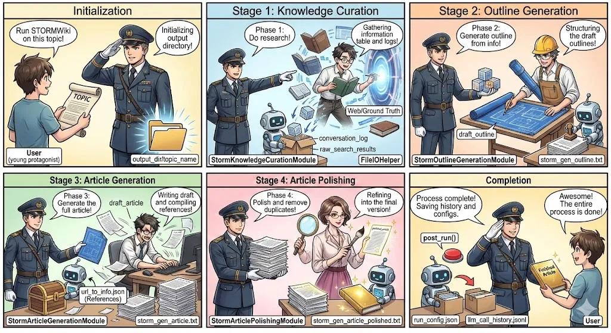
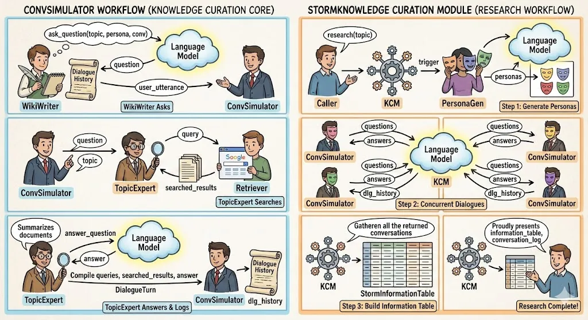
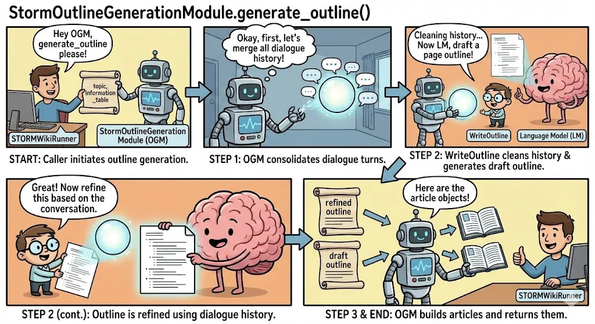
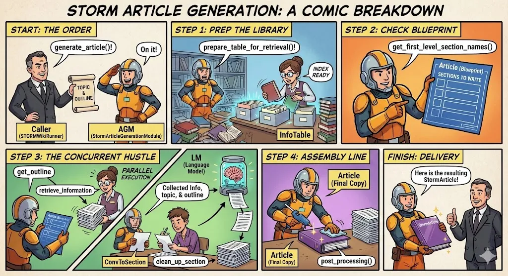
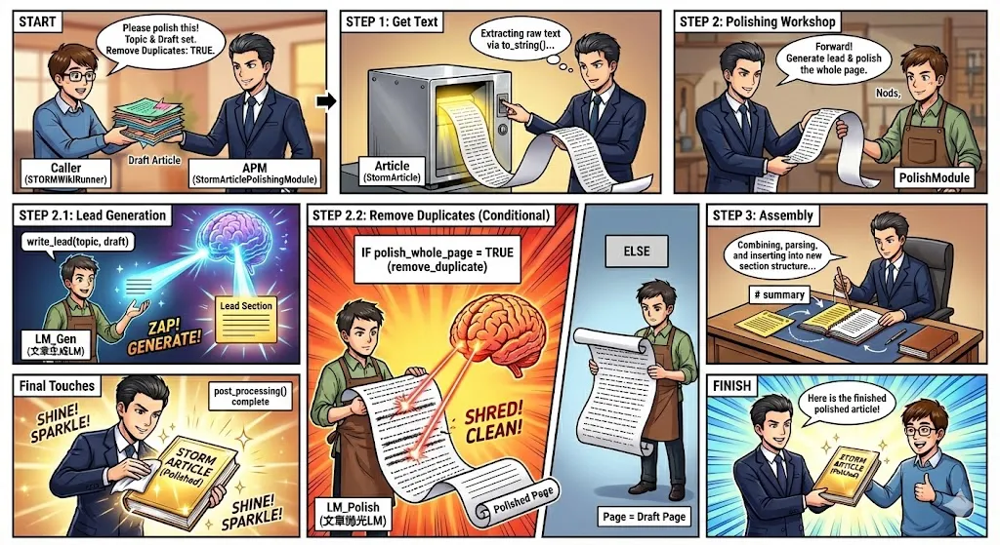

### 概要
STORM 是一个多阶段语言模型系统，能够自动完成长篇论文（含引用）的研究和写作过程。该系统通过将问题分解为两个基本阶段来解决生成全面、结构良好的内容的挑战：

1. 写作前期阶段：进行网络调研，收集参考文献，并生成层级式大纲。
2. 写作阶段：利用提纲和参考文献，撰写出包含正确引用的完整文章。

其核心创新在于视角引导式提问：STORM 并非直接提示语言模型提问，而是通过调研现有类似主题的文章来发现不同的视角，并利用这些视角来指导提问过程。问题通过模拟维基百科撰稿人和主题专家之间的对话提出，专家都由基于互联网资源的语言模型驱动。

用顺序流水线式方法，包含四个不同的阶段：知识整理、大纲生成、文章生成和文章润色。每个阶段都作为一个独立的模块实现，并具有清晰定义的接口。通过检索和多视角提问实现自动化文章生成。

  


### STORM 工作流程（4 个阶段）
  


<!-- 这是一张图片，ocr 内容为：STAGE 1:KNOWLEDGE CURATION STAGE 2:OUTLINE GENERATION INITIALIZATION PHASE   2: STRUCTURING GATHERING DPHASEARIH! INITIALIZING RUN STORMWIKI INFORMATION GENERATE OUTLINE THE DRAFT OUTPUT ON THIS TOPIC TABLE AND LOGS! FROM INFO! OUTLINES DIRECTORY! TOPIC WEB/GROUND TRUTH DRAFT OUTLINE CONVERSATION_LOG -RAW  SEARCH  RESULTS USER FILELOHELPER STORMOUTLINEGENERATIONMODULE STORMKNOWLEDGECURATIONMODULE OUTPUT DIR/TOPIC NAME STORM_GEN_OUTLINE.TXT (YOUNG PROTAGONIST) COMPLETION STAGE 4:ARTICLE POLISHING STAGE 3 :ARTICLE GENERATION WRITING DRAFT REFINING AWESOME! PHASE 3: PHASE 4 PROCESS COMPLETE! INTO THE FINAL DRAFT ARTICLE POLISH AND REMOVE) AND COMPILING THE ENTIRE GENERATE THE SAVING HISTORY AND REFERENCES DUPLICATES! VERSION FULL ARTICIE! PROCESS IS DONE! CONFIGS. POST RUN() URL_TO INFO.JSON (REFERENCES) LLM_CALL_HISTORY.JSONL STORMARTICLEPOLISHINGMODULE STOM GEN ARTICLE POLISHED.BXT STORMARTICLEGENERATIONMODULE] RUN_CONFIG JSON USER STOMM GEN_ARTICLE.TXT -->


  


### 知识整理（Knowledge Curation） - 通过模拟对话收集信息
  


<!-- 这是一张图片，ocr 内容为：STORMKNOWLEDGE CURATION MODULE (RESEARCH WORKFLOW) CONVSIMULATOR WORKFLOW(KNOWLEDGE CURATION CORE) (ASK_QUESTION(TOPIC,PERSONA,CONY)) RESEARCH(TOPIC) LANGUAGE LANGUAGE MODEL ..A MODEL QUESTION DIALOGUE PERSONAS HISTORY (USER UTTERANCE) KCM CALLER PERSONAGEN WIKIWRITER CONVSIMULATOR STEP 1:GENERATE PERSONAS WIKIWRITER ASKS QUESTIONS (QUESTIONS QUERY QUESTION ANSWERS ANSWERS LANGUAGE CONVSIMULATOR CONVSIMULATOR SOOGLE MODEL TOPIC QUESTIONS QUESTIONS ANSWERS ANSWERS KCM SEARCHED_RESULTS TOPICEXPERT RETRIEVER CONVSIMULATOR (DLG_HISTORY DLG_HISTORY) TOPICEXPERT SEARCHES CONVSIMULATOR CONVSIMULATOR STEP 2:CONCURRENT DIALOGUES] GATHEREN ALL THE RETURNED PROUDLY PRESENTS SUMMARIZES ANSWER_QUESTION INFORMATION TABLE. CONVERSATIONS DOCUMENTS LANGUAGE CONVERSATION_LOG MODEL ANSWER (DIALOGUE HISTORY COMPILE QUERIES,SEARCHED_RESULTS,ANSWER KCM KCM DIALOGUETURN STORMLNFORMATION TABLE CONVSIMULATOR DLG_HISTORY TOPICEXPERT RESEARCH COMPLETE! STEP 3:BUILD INFORMATION TABLE TOPICEXPERT ANSWERS&LOGS -->

  


### 🎯 这个方法在做什么？（核心业务）
简单说：这是一个”AI记者”在工作

+ 就像一个记者要写一篇深度报道，需要先广泛收集资料
+ 它不是简单搜索，而是模拟多个不同视角的专家进行对话，从每个角度深入挖掘信息

### 📞 完整调用链条解析
**第一层：总指挥 (run_knowledge_curation_module)**

这就像编辑部派记者出去采访

information_table, conversation_log = self.storm_knowledge_curation_module.research(…)  
作用：调用知识策展模块，开始收集资料

**第二层：采访总监 (research())**

这个方法扮演采访总监的角色：

1. 🎭 组建采访团队（生成角色）  

+ 如果不禁用多视角：调用persona_generator生成多个不同专业背景的角色  

+ 例如：要写”人工智能”文章，可能生成：技术专家、教育工作者、伦理学家、投资人等视角
1. 📋 并发派记者出去采访（_run_conversation）

记者们同时出发，各自采访

conversations = self._run_conversation(…)

```plain
- 每个角色派一个记者去深入采访  
- 多线程并发：假设有5个角色，5个记者同时工作
```

**第三层：记者深入采访 (ConvSimulator.forward)**

每个记者的工作流程（多轮对话）：

for _ in range(max_turn): # 最多对话10-20轮

```plain
问题 = WikiWriter生成问题()     # 记者提问  
  答案 = TopicExpert回答问题()    # 专家回答  
  记录对话()                      # 记录这一轮
```

🔍 每轮对话包含两个关键动作：

动作1：记者提问 (WikiWriter.forward)

记者根据对话历史生成下一个问题

conv = 准备对话历史(保留最近4轮完整内容, 早期对话省略答案, 限制2500词)  
question = 生成问题(topic, persona, conv)

+ 记者会回顾之前的对话，避免问重复问题
+ 根据自己的”角色”（视角）问专业问题

动作2：专家回答 (TopicExpert.forward)

专家需要先搜索资料再回答

1. 查询生成器将问题拆分成搜索关键词
2. 搜索引擎查找相关资料
3. 答案生成器基于搜索结果生成详细回答

**第四层：专家的搜索回答流程**

Step 1：问题拆解 (QuestionToQuery)

“人工智能如何改变教育？”

拆解为多个搜索查询：

+ “AI education applications”
+ “artificial intelligence classroom technology”
+ “machine learning personalized learning”

Step 2：信息检索 (Retriever.retrieve)

+ 调用Bing/Google等搜索API
+ 返回top-k个相关网页
+ 排除ground_truth_url：避免直接抄袭参考文章

Step 3：答案生成 (AnswerQuestion)

基于搜索到的多个信息源，生成综合答案

answer = 生成答案(topic, question, 搜索结果)

确保每句话都有依据，不胡编乱造

**第五层：信息整合**

记者采访回来后：

1. 清理对话：去掉引用标记等格式
2. 构建信息表：  
information_table = StormInformationTable(conversations)  

+ 把所有对话内容整理成结构化数据  

+ 每个信息都有来源URL，方便后续引用
1. 保存档案：  

+ conversation_log.json：完整对话记录（便于分析AI是怎么想的）  

+ raw_search_results.json：搜索到的原始资料

### 🎨 整体业务逻辑（用比喻）
就像一个团队写研究报告：

1. 主编（run_knowledge_curation）：布置任务，说”我们要写关于X的文章”
2. 采访总监（research）：组建多个记者团队，说”从技术、商业、社会等角度去采访”
3. 专业记者（ConvSimulator）：每个记者模拟特定角色深入采访
4. 记者提问（WikiWriter）：根据对话历史问出好问题
5. 专家搜索（TopicExpert）：专家会先查资料再回答，确保准确

最终产出：

+ 一份结构化的信息表（包含所有收集到的知识和来源）
+ 一份对话日志（记录整个思考过程）

### 大纲生成（Outline Generation） - 创建结构化文章大纲
  


<!-- 这是一张图片，ocr 内容为：STORMOUTLINEGENERATIONMODULE.GENERATE_OUTLINE() HEY OGM, CLEANING HISTORY... OKAY,FIRST,LET'S GENERATE_OUTLINE NOW LM,DRAFT A MERGE ALL DIALOGUE PLEASE! PAGE OUTLINE ! HISTORY! TOPIC, INFERMATION .TABLE STORMOUTLINEGENERATION WRITEOUTLINE LANGUAGE MODEL(LM)) STORMWIKIRUNNER MODULE(OGM) STEP 2:WRITEOUTLINE CLEANS HISTORY & STEP 1:OGM CONSOLIDATES DIALOGUE TURNS. START: CALLER INITIATES OUTLINE GENERATION. GENERATES DRAFT OUTLINE. GREAT! NOW REFINE HERE ARE THE THIS BASED ON THE ARTICLE OBJECTS! REFINED CONVERSATION. OUTLINE DRAFT OUTLINE STORMWIKIRUNNER STEP 2(CONT.):OUTLINE IS REFINED USING DIALOGUE HISTORY. STEP 3& END:OGM BUILDS ARTICLES AND RETURNS THEM. -->


### 🎯 这个阶段在做什么？（核心业务）
简单说：这是一个”文章架构师”在工作

+ 就像写书前，编辑会先搭建章节目录结构
+ 它基于前面收集的大量资料，提炼出清晰的逻辑脉络
+ 产出：一个有层次、有逻辑的文章大纲（就像建房子的框架）

### 📞 完整调用链条解析
**第一层：总指挥（STORM.run方法）**

这就像项目经理决定：”现在进入第二阶段”

if do_generate_outline:

outline = self.run_outline_generation_module(...)

作用：检查是否需要执行大纲生成阶段

**第二层：资料管理员（_load_information_table_from_local_fs）**

如果没有执行知识策展阶段：

“资料仓库在哪里？去把之前的采访资料搬出来”

information_table = self._load_information_table_from_local_fs(

os.path.join(self.article_output_dir, "conversation_log.json")

)

这个步骤的作用：

+ 检查本地是否有conversation_log.json文件
+ 如果没有，报错提示需要先执行–do-research
+ 如果有，从文件重建StormInformationTable对象

**第三层：大纲生成专家（run_outline_generation_module）**

“根据这些资料，设计文章结构”

outline, draft_outline = self.storm_outline_generation_module.generate_outline(

```plain
topic=self.topic,  
  information_table=information_table,  
  return_draft_outline=True,  # 同时返回草稿大纲  
  callback_handler=callback_handler,
```

)

这个方法调用StormOutlineGenerationModule模块执行核心逻辑：

步骤1：合并对话历史

+ 将所有角色的对话内容拼接成完整的对话历史
+ 为后续生成提供完整的上下文

步骤2：生成两个版本的大纲

+ 草稿版本：直接基于主题生成初步大纲
+ 优化版本：结合对话历史信息，优化大纲结构

步骤3：构建文章对象

+ 将文本大纲转换为结构化的StormArticle对象
+ 方便后续文章生成阶段使用

**第四层：文件存储系统**

“把设计图纸（大纲）保存起来”

outline.dump_outline_to_file(

os.path.join(self.article_output_dir, "storm_gen_outline.txt")

)  
draft_outline.dump_outline_to_file(

os.path.join(self.article_output_dir, "storm_gen_outline_draft.txt")

)

保存两个文件：

+ storm_gen_outline.txt：优化后的大纲（主要使用）
+ storm_gen_outline_draft.txt：原始草稿（对比参考）

**第五层：回调通知系统**

“报告总部：第二阶段完成！”

callback_handler.on_outline_generation_end(…)

+ 通知前端界面：大纲已生成
+ 提供进度反馈
+ 传递生成的大纲内容用于实时显示

### 🔍 核心业务逻辑解析
为什么需要两个版本的大纲？

1. 草稿大纲（draft_outline） 
    - 生成方式：直接根据主题生成，没有利用对话信息
    - 作用：作为对照组，验证STORM多角色对话的价值
    - 特点：结构可能较简单，信息可能不够深入

2. 优化大纲（outline） 

    - 生成方式：结合对话历史中的深度信息
    - 作用：作为正式的文章结构指导
    - 特点：更全面、更深入、更有针对性

🎨 整体业务逻辑（用比喻）

就像写一本书的过程：

1. 总编（STORM.run）：决定”现在开始设计目录”
2. 资料员（_load_information_table）：从仓库搬出之前收集的所有材料
3. 架构师（run_outline_generation_module）：仔细阅读材料，设计章节目录
4. 设计师（StormOutlineGenerationModule）：画两张设计图 
    - 一张是灵感突现的草图
    - 一张是深思熟虑的正式图

5.档案员（dump_outline_to_file）：把设计图存档，方便后续使用

6. 秘书（callback_handler）：通知大家”目录设计完成”

最终产出：

+ 一个结构化的文章大纲（StormArticle对象）
+ 两个大纲文件（优化版和草稿版）
+ 为第三阶段（文章生成）提供清晰的结构指导

### 文章生成（Article Generation） - 基于大纲和参考资料生成完整文章
  


<!-- 这是一张图片，ocr 内容为：STORM ARTICLE GENERATION: A COMIC BREAKDOWN STEP 2:CHECK BLUEPRINT START:THE ORDER STEP 1:PREP THE LIBRARY (PREPARE_TABLE_FOR_RETRIEVAL()! (GET_FIRST_LEVEL_SECTION_NAMES()) GENERATE_ARTICLE()! ON IT! ARTICLE(8LUEPRINT) INDEX SECTIONS TO WRITE READY TOPIC OUTLINE AGM CALLER INFOTABLE (STORMARTICLEGENERATIONMODULE) (STORMWIKIRUNNER) STEP 4: ASSEMBLY LINE STEP 3:THE CONCURRENT HUSTLE FINISH:DELIVERY LM (LANGUAGE PARALLEL MODEL) GET_OUTLINE HERE IS THE RESULTING ARTICLE EXECUTION STORMARTICLE! (FINAL COPY) COLLECTED INFO, RETRIEVE INFORMATION TOPIC,&OUTLINE ARTICLE POST_PROCESSING() (CLEAN_UP_SECTION CONVTOSECTION (FINAL COPY) -->


  


### 🎯 这个阶段在做什么？（核心业务）
简单说：这是一个”文章写手”在工作

+ 就像根据编辑提供的章节目录和采访资料，撰写完整的文章
+ 它基于前面两个阶段的成果：信息表 + 大纲
+ 产出：一篇结构完整、内容丰富的维基百科式文章

### 📞 完整调用链条解析
**第一层：总指挥（STORM.run方法）**

这就像项目经理决定：”现在进入第三阶段”  
if do_generate_article:

draft_article = self.run_article_generation_module(...)

作用：检查是否需要执行文章生成阶段

**第二层：资料管理员（_load_information_table_from_local_fs）**

如果没有执行知识策展阶段：  
“之前的采访记录在哪里？去把资料库搬出来”  
if information_table is None:

```plain
information_table = self._load_information_table_from_local_fs(  
    os.path.join(self.article_output_dir, "conversation_log.json")  
)
```

这个步骤的作用：

+ 检查本地是否有conversation_log.json文件
+ 如果没有，报错提示需要先执行–do-research
+ 如果有，从文件重建StormInformationTable对象

---

**第三层：大纲管理员（_load_outline_from_local_fs）**

如果没有执行大纲生成阶段：

“目录设计图在哪里？去把结构图找出来”  
if outline is None:

```plain
outline = self._load_outline_from_local_fs(  
    topic=topic,  
    outline_local_path=os.path.join(  
        self.article_output_dir, "storm_gen_outline.txt"  
    ),  
)
```

这个步骤的作用：

+ 检查本地是否有storm_gen_outline.txt文件
+ 如果没有，报错提示需要先执行–do-generate-outline
+ 如果有，从文件重建StormArticle对象（包含大纲结构）

**第四层：文章生成专家（run_article_generation_module）**

“根据资料和目录，开始写文章”  
draft_article = self.run_article_generation_module(

```plain
outline=outline,  
information_table=information_table,  
callback_handler=callback_handler,
```

)

这个方法调用StormArticleGenerationModule模块执行核心逻辑：

**步骤1：准备信息表**

+ 调用information_table.prepare_table_for_retrieval()
+ 将收集的信息转换为可检索的格式

**步骤2：获取章节列表**

+ 从大纲中提取一级章节：sections_to_write = article_with_outline.get_first_level_section_names()

**步骤3：并行生成章节（关键优化点）**

+ 使用ThreadPoolExecutor创建线程池
+ 为每个章节分配独立的生成任务
+ 跳过特殊章节：introduction（通常自动生成）和conclusion/summary

**步骤4：构建章节查询**

+ 基于大纲结构生成查询关键词
+ 使用两种格式：有标签（用于构建大纲）和无标签（用于检索）

步**骤5：收集并行结果**

+ 使用as_completed()等待所有任务完成
+ 按完成顺序收集各章节的生成结果

**步骤6：整合文章内容**

+ 深拷贝原始大纲对象
+ 逐个更新各章节的内容
+ 整合引用信息和章节内容

**步骤7：后处理**

+ 调用article.post_processing()
+ 清理格式、统一引用样式、检查完整性

**第五层：并行生成引擎（ConvToSection）**

每个章节的生成过程：

**步骤1：信息检索**

+ 根据章节查询从信息表检索相关内容
+ 限制返回数量：retrieve_top_k（默认5条）

**步骤2：信息格式化**

+ 为每个信息片段添加编号[1], [2], [3]…
+ 限制总长度：1500字符（保留换行符）

**步骤3：语言模型生成**

+ 使用DSPy框架调用大语言模型
+ 基于提示模板WriteSection生成章节内容
+ 应用格式化要求：# 标题、## 小节标题、内联引用[1][2]

**步骤4：内容清理**

+ 调用ArticleTextProcessing.clean_up_section()
+ 移除多余空格、统一格式、标准化引用

**第六层：回调通知系统**

“报告总部：文章已生成完成！”  
callback_handler.on_article_generation_end(…)

+ 通知前端界面：文章已生成
+ 提供进度反馈
+ 传递生成的完整文章内容用于实时显示

### 🔍 核心业务逻辑解析
+ 为什么需要并行生成？

性能优化：

```plain
- 每个章节可以独立生成
- 使用多线程充分利用CPU资源
- 显著减少总体生成时间（从线性时间到近似并行时间）
```

+ 为什么跳过introduction和conclusion？

智能处理：

```plain
- introduction：通常基于整体内容自动生成，不需要单独处理
- conclusion/summary：可以在文章完成后统一生成，保持一致性
```

+ 信息整合策略

“如何将收集的信息转化为文章内容？”

```plain
1. 检索相关：根据章节查询从信息表检索相关内容
2. 格式化：为每个信息片段编号，建立引用关系
3. 生成：基于格式化的信息和章节要求生成内容
4. 整合：将生成的内容和引用信息整合到文章对象中
```

### 🎨 整体业务逻辑（用比喻）
就像写一本书的过程：

1. 总编（STORM.run）：决定”现在开始撰写正文”
2. 资料员（_load_information_table）：从仓库搬出之前收集的所有材料
3. 档案员（_load_outline_from_local_fs）：从档案室取出章节目录设计图
4. 写作团队（ThreadPoolExecutor）：分配多个写手同时工作 
    - 每个写手负责一个章节
    - 大家基于同一份材料和目录各自撰写

5.编辑（ConvToSection）：每个写手的工作流程 

    - 阅读相关材料
    - 撰写章节内容
    - 标注引用来源

6. 统筹（run_article_generation_module）：协调所有写手的工作 

    - 收集各章节稿件
    - 整合成完整书籍
    - 统一格式和风格

  


1. 秘书（callback_handler）：通知大家”书稿完成”

最终产出：

+ 一个完整的StormArticle对象（包含：主题、大纲、各章节内容、引用列表）
+ 为第四阶段（文章润色）提供完整的待优化内容

### 文章润色（Article Polishing） - 优化和改进文章质量
  


<!-- 这是一张图片，ocr 内容为：START STEP 1:GET TEXT STEP 2:POLISHING WORKSHOP PLEASE POLISH THIS EXTRACTING RAW TEXT TOPIC & DRAFT SET VIA TO_STRING0... FORWARDL REMOVE DUPLICATES:TRUE. GENERATE LEAD &POLISH THE WHOLE PAGE. NODS, DRAFT ARTICLE ARTICLE CALLER APM POLISHMODULE (STOMARTICLE) (STORMWIKIRUNNER) (STORMARTICLEPOLISHINGMODULE) STEP 2.1:LEAD GENERATION STEP 3 :ASSEMBLY STEP 2.2:REMOVE DUPLICATES(CONDITIONAL) WRITE_LEAD(TOPIC,DRAFT) COMBINING,PARSING. ELSE IF POLISH_WHOLE_PAGE TRUE AND INSERTING INTO NEW SECTION STRUCTURE... (REMOVE_DUPLICATE) F SUMMARY LEAD SECTION ZAP! LM_GEN GENERATE! (文章车.ASLM) FINISH FINAL TOUCHES POST_PROCESSINGL HERE IS THE FINISHED COMPLETE POLISHED ARTICLE SHRED! SHINE! CLEAN! SPARKLE! STORM ARTICLE (POLLAHOD) LM_POLISH INIHS POLISHED PEGE PAGE DRAFT PAGE (文章抛光LM) SPARKLE -->


  


### 🎯 这个阶段在做什么？（核心业务）
简单说：这是一个”文字编辑”在工作

+ 就像对写好的文章进行最后一轮精修，添加摘要和删除冗余
+ 它基于第三阶段生成的草稿文章，进行质量优化
+ 产出：一篇格式规范、无重复内容、带有摘要的完整文章

### 📞 完整调用链条解析
**第一层：总指挥（STORM.run方法）**

这就像主编决定：”现在进入最后阶段，进行文章润色”  
if do_polish_article:

self.run_article_polishing_module(...)

作用：检查是否需要执行文章润色阶段

**第二层：草稿加载管理员（_load_draft_article_from_local_fs）**

如果没有执行文章生成阶段：  
“之前的文章草稿在哪里？去把成品仓库搬出来”  
if draft_article is None:

```plain
draft_article_path = os.path.join(  
    self.article_output_dir, "storm_gen_article.txt"  
)  
url_to_info_path = os.path.join(  
    self.article_output_dir, "url_to_info.json"  
)  
draft_article = self._load_draft_article_from_local_fs(...)
```

这个步骤的作用：

+ 检查本地是否有storm_gen_article.txt文件（文章内容）
+ 检查本地是否有url_to_info.json文件（引用映射）
+ 如果文件不存在，报错提示需要先执行–do-generate-article
+ 如果文件存在，从文件重建完整的StormArticle对象（包含文章内容和引用信息）

**第三层：文章润色专家（run_article_polishing_module）**

“对草稿进行最终润色处理”  
self.run_article_polishing_module(

draft_article=draft_article, remove_duplicate=remove_duplicate

)

这个方法调用StormArticlePolishingModule模块执行核心逻辑：

**步骤1：文章文本化**

+ 调用draft_article.to_string()
+ 将结构化的StormArticle对象转换为纯文本格式
+ 方便后续语言模型处理

**步骤2：双重处理策略**

+ 同时生成摘要部分（lead section）和处理正文内容
+ 使用两个不同的语言模型： 
    - write_lead_engine：专门负责摘要生成（通常使用与文章生成相同的模型）
    - polish_engine：专门负责内容润色（可以使用更小的模型以节省成本）

**步骤3：摘要生成（关键功能）**

+ 调用WriteLeadSection Signature
+ 生成原则： 
    - 独立成篇：摘要应能独立概括整个文章
    - 识别主题：明确定义文章讨论的核心内容
    - 建立上下文：提供必要的背景信息
    - 解释重要性：说明主题为什么值得关注
    - 总结要点：提炼最重要的信息点
    - 限制长度：不超过4个精心组织的段落
    - 添加引用：在必要时添加内联引用[1][3]

**步骤4：重复内容清理（可选）**  
根据remove_duplicate标志决定是否执行：

+ 如果为True：调用PolishPage进行重复内容检测和删除
+ 如果为False：跳过清理，保持原始内容

重复清理的具体过程：

+ 检测：扫描文章找出重复的信息片段
+ 删除：移除重复内容，保留最相关的一个版本
+ 保留：保持所有内联引用和章节结构（#、##等标记）
+ 不删除：任何非重复的内容

**步骤5：内容整合**

+ 构建摘要格式：f”# summary\n{polish_result.lead_section}”
+ 组合摘要和正文：使用双换行符(“\n\n”)分隔
+ 解析为结构化数据：调用ArticleTextProcessing.parse_article_into_dict()
+ 深拷贝原始对象：避免修改原始草稿
+ 插入章节内容：调用insert_or_create_section()

**步骤6：最终后处理**

+ 调用article.post_processing()
+ 清理格式：统一空格、换行等
+ 统一引用样式：确保所有引用格式一致
+ 检查完整性：验证文章结构是否完整

**第四层：摘要生成引擎（WriteLeadSection）**

摘要部分的生成过程：

**步骤1：上下文设置**

+ 使用write_lead_engine（通常是文章生成使用的同一个LM）
+ 设置show_guidelines=False提高兼容性

**步骤2：提示构建**

+ 输入参数：topic（主题）+ draft_page（草稿页面）
+ 基于模板生成摘要内容

**步骤3：输出清理**

+ 检测是否包含提示前缀：”The lead section:”
+ 如果有，提取实际摘要内容
+ 移除多余空白和格式标记

**第五层：重复清理引擎（PolishPage）**

重复内容清理的详细过程：

**步骤1：重复检测**

+ 分析整篇文章的内容
+ 识别在多个地方出现的相同或高度相似的信息

**步骤2：智能删除**

+ 保留首次出现的完整内容
+ 删除后续的重复信息
+ 保留所有相关的内联引用

**步骤3：结构保护**

+ 保持原有的章节结构（#、##、###等）
+ 保留所有内联引用格式
+ 维护文章的逻辑顺序

**第六层：回调通知系统**

“报告总部：文章润色完成！”  
callback_handler.on_article_polishing_end(…)

+ 通知前端界面：文章已润色完成
+ 提供进度反馈
+ 传递润色后的完整文章内容

### 🔍 核心业务逻辑解析
为什么需要摘要部分？

维基百科标准：

+ 摘要（lead section）是维基百科文章的必需部分
+ 位于文章开头，独立成篇
+ 为读者提供快速了解文章核心内容的入口

信息浓缩：

+ 提炼文章最重要的信息
+ 帮助读者决定是否继续阅读全文
+ 提高信息获取效率

为什么提供remove_duplicate选项？

性能与质量的权衡：

+ True：使用额外一次LM调用清理重复内容（更高质量，但更耗时）
+ False：跳过清理，直接使用原始内容（更快，但可能有重复）

应用场景：

+ True：最终交付版本，需要最高质量
+ False：快速预览或迭代开发阶段

双重文件策略

为什么需要两个文件？

+ storm_gen_article.txt：存储文章的主要文本内容
+ url_to_info.json：存储引用URL到信息对象的映射关系

好处：

+ 分离关注点：内容与元数据分离
+ 易于调试：可以独立查看和修改
+ 空间效率：避免重复存储相同信息

### 🎨 整体业务逻辑（用比喻）
就像出版一本书的最后环节：

1. 总编（STORM.run）：决定”现在开始最终润色”
2. 档案员（_load_draft_article_from_local_fs）：从成品仓库取出打印好的草稿 
    - 一个文件是正文内容
    - 另一个文件是引用来源清单

3. 文案编辑（WriteLeadSection）：在封面内页写内容摘要 

    - 独立成篇，能让读者快速了解全书内容
    - 提炼最关键的要点
    - 标注重要引用来源

4. 校对员（PolishPage）：仔细检查全书删除重复内容 

    - 确保没有重复段落
    - 保留所有引用标记
    - 保持章节结构完整

5. 排版师（polish_article）：整合摘要和正文 

    - 将摘要放在开头
    - 统一格式和引用样式
    - 最终质量检查

6. 秘书（callback_handler）：通知大家”书籍已准备好出版”

最终产出：

+ 一个完整的StormArticle对象（包含：摘要、润色后的章节内容、引用列表）
+ 符合维基百科格式标准的文章
+ 支持断点续传：可以跳过前置阶段，直接从保存的文件加载中间结果
+ 可选的重复内容清理，提高文章质量

### 总结
STORM完成DeepResearch的哲学思想体现主要是在第一步，通过角色模拟的方式来生成多个维度的问题范围（广度），然后通过记者专家的多次问答（深度）。这种以角色展开的方式，能够让LLM更加集中在某个领域的知识，不断的去提问从而使研究报告更加的精准。相较于Open deep research的工作流+反思的方式，STORM的设计思想更符合人类的思维，未来在构建agent的时候，不妨考虑下这种方案。

### 相关资料
+ 更多博客

[https://github.com/BaqiF2/ydc_ai_dev](https://github.com/BaqiF2/ydc_ai_dev)

+ 代码

[https://github.com/BaqiF2/storm-research](https://github.com/BaqiF2/storm-research)

可以替换为deepseek运行

